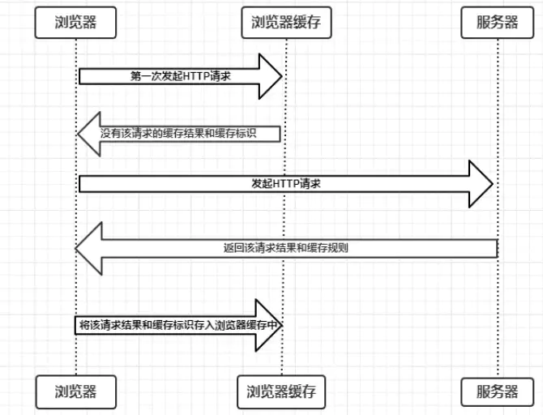
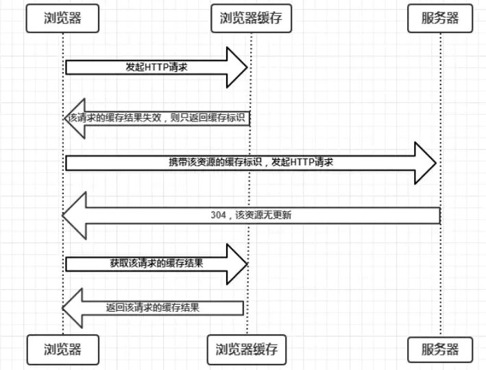

# 浏览器的缓存机制

## 一、前言

缓存--性能优化中简单高效的一种优化方式

优秀的缓存策略作用：

- 缩短网页请求资源的距离，减少延迟
- 缓存文件可以重复利用，减少带宽，降低网络负荷。

数据请求步骤：网络请求、后端处理、浏览器响应


## 二、缓存位置

从缓存位置上来说分为四种，并且各自有优先级，当依次查找缓存且都没有命中的时候，才会去请求网络。

- Service Worker
- Memory Cache
- Disk Cache
- Push Cache

### 1.Service Worker

运行在浏览器背后的独立线程，一般可以用来实现缓存功能。

运行时传输协议必须为 HTTPS， Service Worker 中涉及到请求拦截，必须使用 HTTPS 协议来保障安全。

**Service Worker 的缓存与浏览器其他内建的缓存机制不同，它可以让我们自由控制缓存哪些文件、如何匹配缓存、如何读取缓存，并且缓存是持续性的**。

Service Worker 实现缓存功能步骤：

- 注册 Service Worker
- 监听 install 事件
- 缓存需要的文件，下次访问时可以通过拦截请求的方式查询是否存在缓存，存在缓存的话就直接读取缓存文件，否则就去请求数据。

当 Service Worker 没有命中缓存的时候，我们需要去调用 fetch 函数获取数据。也就是说，如果我们没有在 Service Worker 命中缓存的话，会根据缓存查找优先级去查找数据。但是不管我们是从 Memory Cache 中还是从网络请求中获取的数据，浏览器都会显示我们是从 Service Worker 中获取的内容。

### 2.Memory Cache

内存中的缓存 -- 包含的是当前中页面中已经抓取到的资源,例如样式、脚本、图片等。

读取内存中的数据比磁盘快,内存缓存读取高效，但持续性很短，会随着进程的释放而释放。 **一旦关闭 Tab 页面，内存中的缓存也就被释放了**。

> **那么既然内存缓存这么高效，我们是不是能让数据都存放在内存中呢？**
>
> 这是不可能的。计算机中的内存一定比硬盘容量小得多，操作系统需要精打细算内存的使用，所以能让我们使用的内存必然不多。
>
> 当我们访问过页面以后，再次刷新页面，可以发现很多数据都来自于内存缓存

注意：**内存缓存在缓存资源时并不关心返回资源的HTTP缓存头Cache-Control是什么值，同时资源的匹配也并非仅仅是对URL做匹配，还可能会对Content-Type，CORS等其他特征做校验**。

### 3.Disk Cache

Disk Cache --存储在硬盘中的缓存

特点：读取速度慢点，存储量大，存储时间长

**比之 Memory Cache 胜在容量和存储时效性上**。

在所有浏览器缓存中，Disk Cache 覆盖面基本是最大的。根据 HTTP Herder 中的字段判断资源是否需要缓存、是否能直接使用、是否过期需要重新请求

> **浏览器会把哪些文件丢进内存中？哪些丢进硬盘中？**
>
> 关于这点，网上说法不一，不过以下观点比较靠得住：
>
> - 对于大文件来说，大概率是不存储在内存中的，反之优先
> - 当前系统内存使用率高的话，文件优先存储进硬盘

### 4.Push Cache

Push Cache（推送缓存）是 HTTP/2 中的内容，当以上三种缓存都没有命中时，它才会被使用

**它只在会话（Session）中存在，一旦会话结束就被释放，并且缓存时间也很短暂**，在Chrome浏览器中只有5分钟左右，同时它也并非严格执行HTTP头中的缓存指令。


如果以上四种缓存都没有命中的话，那么只能发起请求来获取资源了。

那么为了性能上的考虑，大部分的接口都应该选择好缓存策略，**通常浏览器缓存策略分为两种：强缓存和协商缓存，并且缓存策略都是通过设置 HTTP Header 来实现的**。


## 三、缓存过程分析

浏览器与服务器通信的方式为应答模式，即是：浏览器发起HTTP请求 – 服务器响应该请求

缓存过程



特点：

- 浏览器每次发起请求，都会先在浏览器缓存中查找该请求的结果以及缓存标识
- 浏览器每次拿到返回的请求结果都会将该结果和缓存标识存入浏览器缓存中

## 四、强缓存

**强缓存：不会向服务器发送请求，直接从缓存中读取资源。**

**在chrome控制台的Network选项中可以看到该请求返回200的状态码，并且Size显示from disk cache或from memory cache。**

**强缓存可以通过设置两种 HTTP Header 实现：Expires 和 Cache-Control。**

### 1.Expires

**缓存过期时间，用来指定资源到期的时间，是服务器端的具体的时间点**。也就是说，Expires=max-age + 请求时间，需要和Last-modified结合使用。

Expires是Web服务器响应消息头字段，在响应http请求时告诉浏览器在过期时间前浏览器可以直接从浏览器缓存取数据，而无需再次请求。

### 2.Cache-Control

在HTTP/1.1中，Cache-Control是最重要的规则，主要用于控制网页缓存。比如当`Cache-Control:max-age=300`时，则代表在这个请求正确返回时间（浏览器也会记录下来）的5分钟内再次加载资源，就会命中强缓存。

Cache-Control 可以在请求头或者响应头中设置，并且可以组合使用多种指令：


### 3.Expires和Cache-Control两者对比

这两者差别不大，区别就在于 Expires 是http1.0的产物，Cache-Control是http1.1的产物，**两者同时存在的话，Cache-Control优先级高于Expires**；在某些不支持HTTP1.1的环境下，Expires就会发挥用处。所以Expires其实是过时的产物，现阶段它的存在只是一种兼容性的写法。


## 五、协商缓存

**协商缓存就是强制缓存失效后，浏览器携带缓存标识向服务器发起请求，由服务器根据缓存标识决定是否使用缓存的过程，主要有以下两种情况**：

- 协商缓存生效，返回304和Not Modified



- 协商缓存失效，返回200和请求结果


协商缓存可以通过设置两种 HTTP Header 实现：Last-Modified 和 ETag 。

### 1.Last-Modified和If-Modified-Since

浏览器在第一次访问资源时，服务器返回资源的同时，在response header中添加 Last-Modified的header，值是这个资源在服务器上的最后修改时间，浏览器接收后缓存文件和header；

```
Last-Modified: Fri, 22 Jul 2016 01:47:00 GMT
```

浏览器下一次请求这个资源，浏览器检测到有 Last-Modified这个header，于是添加If-Modified-Since这个header，值就是Last-Modified中的值；服务器再次收到这个资源请求，会根据 If-Modified-Since 中的值与服务器中这个资源的最后修改时间对比，如果没有变化，返回304和空的响应体，直接从缓存读取，如果If-Modified-Since的时间小于服务器中这个资源的最后修改时间，说明文件有更新，于是返回新的资源文件和200


#### 弊端：

- 如果本地打开缓存文件，即使没有对文件进行修改，但还是会造成 Last-Modified 被修改，服务端不能命中缓存导致发送相同的资源
- 因为 Last-Modified 只能以秒计时，如果在不可感知的时间内修改完成文件，那么服务端会认为资源还是命中了，不会返回正确的资源

### 2.ETag和If-None-Match

**Etag是服务器响应请求时，返回当前资源文件的一个唯一标识(由服务器生成)，只要资源有变化，Etag就会重新生成**。

浏览器在下一次加载资源向服务器发送请求时，会将上一次返回的Etag值放到request header里的If-None-Match里，服务器只需要比较客户端传来的If-None-Match跟自己服务器上该资源的ETag是否一致，就能很好地判断资源相对客户端而言是否被修改过了。如果服务器发现ETag匹配不上，那么直接以常规GET 200回包形式将新的资源（当然也包括了新的ETag）发给客户端；如果ETag是一致的，则直接返回304知会客户端直接使用本地缓存即可。


### 3.两者之间对比：

- 首先在精确度上，Etag要优于Last-Modified。

Last-Modified的时间单位是秒，如果某个文件在1秒内改变了多次，那么他们的Last-Modified其实并没有体现出来修改，但是Etag每次都会改变确保了精度；如果是负载均衡的服务器，各个服务器生成的Last-Modified也有可能不一致。

- 第二在性能上，Etag要逊于Last-Modified，毕竟Last-Modified只需要记录时间，而Etag需要服务器通过算法来计算出一个hash值。
- 第三在优先级上，服务器校验优先考虑Etag


## 六、缓存机制

**强制缓存优先于协商缓存进行**

若强制缓存(Expires和Cache-Control)生效则直接使用缓存，若不生效则进行协商缓存。

协商缓存由服务器决定是否使用缓存，若协商缓存失效，那么代表该请求的缓存失效，返回200，重新返回资源和缓存标识，再存入浏览器缓存中；生效则返回304，继续使用缓存


> **如果什么缓存策略都没设置，那么浏览器会怎么处理？**
>
> 对于这种情况，浏览器会采用一个启发式的算法，通常会取响应头中的 Date 减去 Last-Modified 值的 10% 作为缓存时间。

## 七、实际场景应用缓存策略

### 1.频繁变动的资源

> Cache-Control: no-cache

对于频繁变动的资源，首先需要使用`Cache-Control: no-cache` 使浏览器每次都请求服务器，然后配合 ETag 或者 Last-Modified 来验证资源是否有效。这样的做法虽然不能节省请求数量，但是能显著减少响应数据大小。

### 2.不常变化的资源

> Cache-Control: max-age=31536000

通常在处理这类资源时，给它们的 Cache-Control 配置一个很大的 `max-age=31536000` (一年)，这样浏览器之后请求相同的 URL 会命中强制缓存。而为了解决更新的问题，就需要在文件名(或者路径)中添加 hash， 版本号等动态字符，之后更改动态字符，从而达到更改引用 URL 的目的，让之前的强制缓存失效 (其实并未立即失效，只是不再使用了而已)。

## 八、用户行为对浏览器缓存的影响

所谓用户行为对浏览器缓存的影响，指的就是用户在浏览器如何操作时，会触发怎样的缓存策略。主要有 3 种：

- 打开网页，地址栏输入地址： 查找 disk cache 中是否有匹配。如有则使用；如没有则发送网络请求。
- 普通刷新 (F5)：因为 TAB 并没有关闭，因此 memory cache 是可用的，会被优先使用(如果匹配的话)。其次才是 disk cache。
- 强制刷新 (Ctrl + F5)：浏览器不使用缓存，因此发送的请求头部均带有 `Cache-control: no-cache`(为了兼容，还带了 `Pragma: no-cache`),服务器直接返回 200 和最新内容。


原文来源：[深入理解浏览器的缓存机制](https://www.jianshu.com/p/54cc04190252)