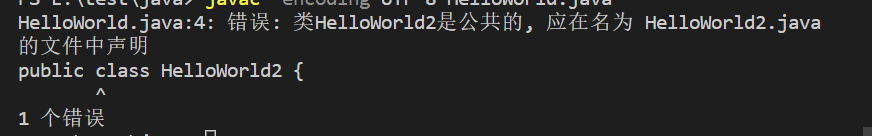

# Java概况

## 三个体系

- JavaSE（J2SE）（Java2 Platform Standard Edition，java平台标准版）
- JavaEE(J2EE)(Java 2 Platform,Enterprise Edition，java平台企业版)
- JavaME(J2ME)(Java 2 Platform Micro Edition，java平台微型版)。

## 主要特性

- **简单的**

  底层原理为C++，但是去除了C++中少用的、难用的的特性，不使用指针，并提供自动分配和垃圾回收功能。

- **面向对象的**

  Java 语言提供类、接口和继承等面向对象的特性

- **分布式的**

- **健壮的**

  Java 的强类型机制、异常处理、垃圾的自动收集等是 Java 程序健壮性的重要保证。

- **安全的**

- **体系结构中立的**

  Java 程序（后缀为 java 的文件）在 Java 平台上被编译为体系结构中立的字节码格式（后缀为 class 的文件），然后可以在实现这个 Java 平台的任何系统中运行。这种途径适合于异构的网络环境和软件的分发。

- **可移植的**

- **解释型的**

- **高性能的**

- **多线程的**

- **动态的**


## 关键术语

- JDK【Java开发工具箱】
- JRE【Java的运行时环境】
- JVM【Java虚拟机】

三者之间的关系：JDK 中包含JRE，JRE中包含JVM。


## 加载与执行

Java开发的整个生命周期，包括两个重要的阶段，分别是：编译阶段和运行阶段。

编译和运行可以在不同的操作系统中完成。

编译生成的程序被称为：字节码程序。编译生成的文件是：xxx.class文件

### 编译阶段

1. 创建java源文件，并编写符合java语法的源程序。

2. 使用JDK中自带的javac.exe命令对以上的java源程序进行编译

   编译语法：javac 源文件路径

   ```java
   // 正常编译
   javac HelloWorld.java
   
   // 字符串转译编译
   javac -encoding UTF-8 HelloWorld.java
   ```

   编译结果：

     编译通过： 说明语法没有问题 -- 在硬盘上生成一个或者多个字节码文件【xxx.class

     编译失败：源程序某个位置不符合java语法格式。

### 运行阶段

在命令窗口中使用java.exe命令运行java程序

  语法格式： java 类名

### 执行过程：

- javac命令将java源文件转化为字节码文件

- java.exe命令执行会启动：`JVM(虚拟机)`
- JVM启动之后，马上启动“类加载器-Class Loader”
- ClassLoader负责去硬盘的“某个位置”上搜索“类名.class”字节码文件。
- 找不到这个.class文件，一定会出现程序异常现象。
- 找到了这个.class文件之后将.class文件转换成"二进制"，操作系统可以直接识别二进制，
- 操作系统执行二进制码和底层的硬件平台进行交互。


## 基础代码注释

```java
// public -- 修饰符 代表全局的含义
// class -- 用来定义一个类
// HelloWorld -- 类名，注意大小写
// 注意： 对于所有的类来说，类名的首字母应该大写。如果类名由若干单词组成，那么每个单词的首字母应该大写
public class HelloWorld {
    // 类体
    // 类体中不能直接编写java语句【除声明变量之外】


    /**
    * public -- 修饰符， 代表全局
    * static -- 关键字 代表静态
    * void -- 空，在定义方法的时候用来代表返回值类型，没有返回值则用void代表为空
    * main -- 方法名，main为主方法，是入口方法
    */
    // 所有的方法名都应该以小写字母开头。如果方法名含有若干单词，则后面的每个单词首字母大写。
    public static void main(String[] args) {
        // 主方法是程序的入口，固定写法，SUN规定的,如果没有主方法就直接执行该类，会报错

        // 方法体


        // 一个java语句必须以“;”结束
        System.out.println("Hello World");
        // 方法体中可以编写多条java语句
        System.out.println("Test");
    }
}
```

## **public class** **和** **class** **的区别**

类的定义有两种方式：

- public class 类名
- class 类名

区别：

- 一个java源文件当中可以定义多个class

- 一个java源文件当中public的class不是必须的
- 一个class会定义生成一个xxx.class字节码文件
- 一个java源文件当中定义公开的类的话，只能有一个，并且该类名称必须和java源文件名称一致。
- 每一个class当中都可以编写main方法，都可以设定程序的入口，想执行B.class中的main方法：java B，
  想执行X.class当中的main方法：java X
  - 注意：当在命令窗口中执行java Hello，那么要求Hello.class当中必须有主方法。没有主方法会出现运行阶段的错误：



## 标识符

Java 所有的组成部分都需要名字。类名、变量名以及方法名都被称为标识符。

### 注意点：

- 所有的标识符都应该以字母（A-Z 或者 a-z）,美元符（$）、或者下划线（_）开始
- 首字符之后可以是字母（A-Z 或者 a-z）,美元符（$）、下划线（_）或数字的任何字符组合
- 关键字不能用作标识符
- 标识符是大小写敏感的
- 合法标识符举例：age、$salary、_value、__1_value
- 非法标识符举例：123abc、-salary

### 命名规范：

- 见名知意
- 遵守驼峰命名方式
- 类名、接口名： 首字母大写，后续每个单词首字母大写。
- 变量名、方法名： 首字母小写，后续每个单词首字母大写。
- 常量名：全部大写

