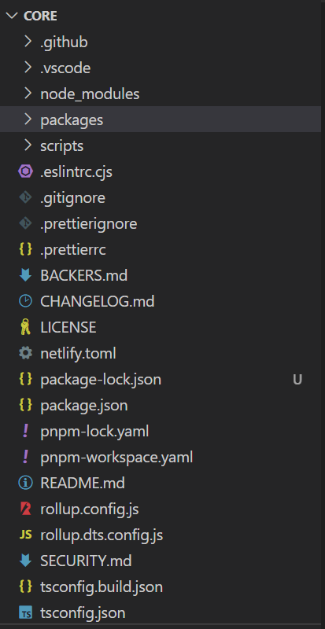
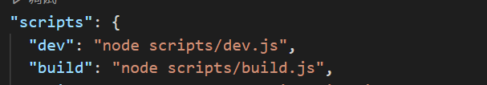
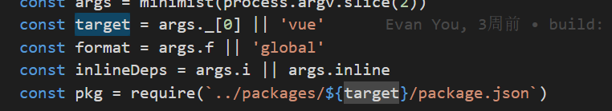
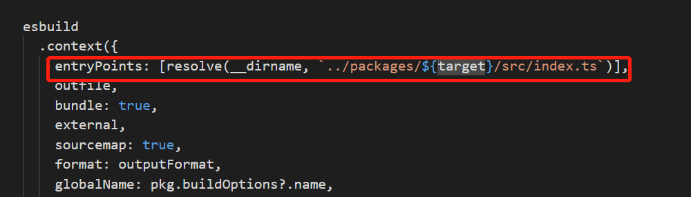

# 全局概览

## 目录结构



重点关注 `package` 目录，整个结构如下

```js
.
├── compiler-core // 顾名思义，核心中的核心，抽象语法树和渲染桥接实现
├── compiler-dom // Dom的实现
├── compiler-sfc // Vue单文件组件(.vue)的实现
├── compiler-ssr
├── global.d.ts
├── reactivity
├── runtime-core
├── runtime-dom
├── runtime-test
├── server-renderer // 服务端渲染实现
├── shared  // package 之间共享的工具库
├── size-check
├── template-explorer
└── vue
```


## 如何找到文件入口

在`core/package.json`中， dev环境的配置文件位于`scripts/dev.js`中




`scripts/dev.js`文件





由上图可以，当dev环境执行的时候，默认的入口文件是`core/packages/vue/scr/index.ts`

`core/packages/vue/scr/index.ts` 文件

```tsx
// This entry is the "full-build" that includes both the runtime
// and the compiler, and supports on-the-fly compilation of the template option.
import { initDev } from './dev'
import { compile, CompilerOptions, CompilerError } from '@vue/compiler-dom'
import { registerRuntimeCompiler, RenderFunction, warn } from '@vue/runtime-dom'
import * as runtimeDom from '@vue/runtime-dom'
import { isString, NOOP, generateCodeFrame, extend } from '@vue/shared'
import { InternalRenderFunction } from 'packages/runtime-core/src/component'

if (__DEV__) {
  // 实际上主要就是这个函数初始化
  initDev()
}

const compileCache: Record<string, RenderFunction> = Object.create(null)

function compileToFunction(
  template: string | HTMLElement,
  options?: CompilerOptions
): RenderFunction {
   ... 
}
registerRuntimeCompiler(compileToFunction)

export { compileToFunction as compile }
export * from '@vue/runtime-dom'

```

 实际上该文件主要就是通过`initDev`这个函数初始化的，然后看下这函数的来源

```ts
import { initCustomFormatter } from '@vue/runtime-dom'

export function initDev() {
  if (__BROWSER__) {
    /* istanbul ignore if */
    if (!__ESM_BUNDLER__) {
      console.info(
        `You are running a development build of Vue.\n` +
          `Make sure to use the production build (*.prod.js) when deploying for production.`
      )
    }
   
    initCustomFormatter()
  }
}

```

可以看到具体的实现函数都是由`runtime-dom`文件中导出的

## 如何调试

1. 通过`yarn`来安装依赖

   ```
   yarn --ignore-scripts
   ```

2. 通过`npm run dev`来构建`dev`测试包

   比较常见的是构建出来的`Vue`会有`vue.global.js`或者`vue.runtime.global.js`两种版本，他们分别表示：

   - `vue.global.js`：是包含编译器和运行时的“完整”构建版本，因此它支持动态编译模板。
   - `vue.runtime.global.js`：只包含运行时，并且需要在构建步骤期间预编译模板。

3. 引用`vue.global.js`进行调试

   ```html
   <!DOCTYPE html>
   <html lang="en">
   
   <head>
       <meta charset="UTF-8">
       <meta http-equiv="X-UA-Compatible" content="IE=edge">
       <meta name="viewport" content="width=device-width, initial-scale=1.0">
       <script src="vue.global.js"></script>
       <title>Vue3.0源码解析</title>
   </head>
   
   <body>
       <div id="hello-vue">
           {{ message }}
       </div>
       <script>
           const HelloVueApp = {
               data() {
                   return {
                       message: 'Hello Vue!'
                   }
               }
           }
           Vue.createApp(HelloVueApp).mount('#hello-vue')
       </script>
   </body>
   </html>
   ```

   

