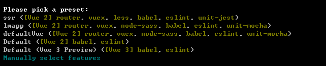
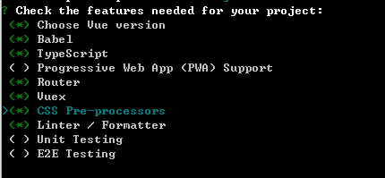
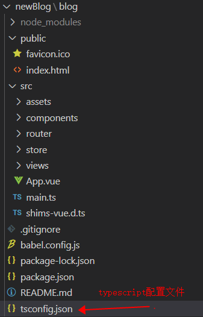
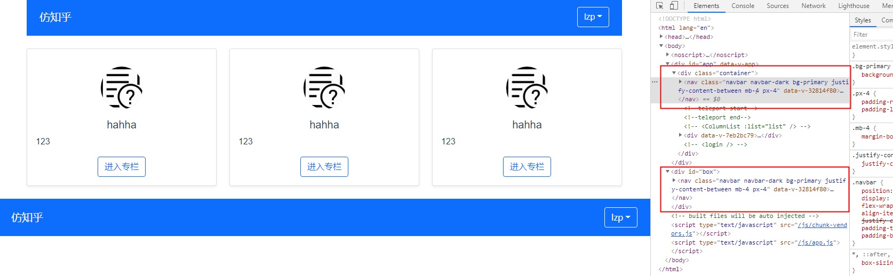

# vue3.0知识点

## 1.手脚架

### 1.1 Vite 

​		Vite 是一个固执的 web 开发构建工具，在开发过程中通过本地 ES Module 导入为代码提供服务，并将其与 Rollup 捆绑在一起用于生产。

优点：

- 闪电般快速冷启动服务器
- 即时热模块更换(HMR)
- 真正的按需编译

运行代码如下（必须安装node.js） --尤大大推荐

```npm
$ npm init vite-app <project-name>
$ cd <project-name>
$ npm install
$ npm run dev
```

### 1.2 vue-cli

经典的vue手脚架，目前vite还是开发测试过程中，因此我还是使用vue-cli创建项目

```
npm install -g @vue/cli # OR yarn global add @vue/cli
vue create hello-vue3
```

开始



先择自选模板



由于vue3.0兼容了typescript,同时vue3.0已经用Typescript编写了，那么这么好的东西怎么能不用呢？

选择vue3.0 的项目创建方式


嗯，这样就ok了，剩下的和vue2.0的步骤是一样的

直接yes就行也可以

创建后的目录



接下来就是相关知识点了


## 2.vue3.0知识点

### 	setup

​	关键中的关键，vue3.0使用setup整合了所有的api。同时在只执行一次，并且是在生命周期函数执行开始之前执行，因此在setup上是不能访问this的。

#### 	结构

```javascript
export default {

  setup() {
    //定义变量 --ref稍后再说
      const str = ref('')
      let fn = ()=>{
          console.log(666)
      }
    return{
        //返回出去使用的参数
        str,
        fn
    }
  }
}
```


#### 	参数

1. props
2. context


##### 	`props`

​	`setup` 函数中的第一个参数是 `props`。正如在一个标准组件中所期望的那样，`setup` 函数中的 `props` 是响应式的，当传入新的 prop 时，它将被更新。

```js
export default {
  props: {
    title: String
  },
  setup(props) {
      //因为 props 是响应式的，你不能使用 ES6 解构，因为它会消除 prop 的响应性。
    console.log(props.title)
      //要想结构prop就需要使用toRefs来实现
      const  {title} = toRefs(props)
      // const title = toRef(props, 'title')
      console.log(title.value)
  }
}
```

如果 title 是可选的 prop，则传入的 props 中可能没有 title 。在这种情况下，toRefs 将不会为 title 创建一个 ref 。需要使用 toRef 替代它

```js
import { toRef } from 'vue'
setup(props) {
  const title = toRef(props, 'title')
  console.log(title.value)
}
```


##### 	`context`

传递给 `setup` 函数的第二个参数是 `context`。`context` 是一个普通的 JavaScript 对象，它暴露其他在setup中有用的值：

```js
export default {
  setup(props, context) {
    // Attribute (非响应式对象)
    console.log(context.attrs)

    // 插槽 (非响应式对象)
    console.log(context.slots)

    // 触发事件 (方法)
    console.log(context.emit)
    // 暴露公共 property (函数)
    console.log(context.expose)
  }
}
```

它不是响应式的，这意味着你可以安全地对 context 使用 ES6 解构。

```js
export default {
  setup(props, { attrs, slots, emit }) {
    ...
  }
}
```


### ref、reactive

#### 	`ref` 

接受一个内部值并返回一个响应式且可变的 ref 对象。ref 对象具有指向内部值的单个 property `.value`。

```typescript
const count = ref(0)
console.log(count.value) // 0

count.value++
console.log(count.value) // 1
//在使用了typescript后，我们可以给数据进行类型声明了
interface checkNumber{
    id:numner,
    name?:string
}
 let user = ref<checkNumber>({
     id:0,
     name:'666'
 })
 //或则
 const foo = ref<string | number>('foo') 
```

#### 	`reactive`

返回对象的响应式副本，对复杂数据进行响应式处理，它的返回值是一个 proxy 对象，在 setup 函数中返回时，可以用 toRefs 对 proxy 对象进行结构，方便在 template 中使用

```js
import { reactive, toRefs } from 'vue'
export default {
  setup() {
      const obj = reactive({ count: 0 })
      obj.count.value = 1
	return{
        obj:toRefs(obj)
    }
  }
}
```

注意点：

`reactive()` 返回的是一个原始对象的 `Proxy`，它和原始对象是不相等的:

```js
const raw = {}
const proxy = reactive(raw)

// 代理对象和原始对象不是全等的
console.log(proxy === raw) // false

// 为保证访问代理的一致性，对同一个原始对象调用 reactive() 会总是返回同样的代理对象，而对一个已存在的代理对象调用 reactive() 会返回其本身

// 在同一个对象上调用 reactive() 会返回相同的代理
console.log(reactive(raw) === proxy) // true

// 在一个代理上调用 reactive() 会返回它自己
console.log(reactive(proxy) === proxy) // true
```

只有代理对象是响应式的，，更改原始对象不会触发更新。因此，使用 Vue 的响应式系统的最佳实践是 **仅使用你声明对象的代理版本**。

##### 局限性：

1.仅对对象有效（对象、数组和 `Map`、`Set` 这样的[集合类型](https://developer.mozilla.org/zh-CN/docs/Web/JavaScript/Reference/Global_Objects#使用键的集合对象)），而对 `string`、`number` 和 `boolean` 这样的 [原始类型](https://developer.mozilla.org/zh-CN/docs/Glossary/Primitive) 无效。

2.因为 Vue 的响应式系统是通过属性访问进行追踪的，因此我们必须始终保持对该响应式对象的相同引用。这意味着我们不可以随意地“替换”一个响应式对象，因为这将导致对初始引用的响应性连接丢失：

```js
let state = reactive({ count: 0 })

// 上面的引用 ({ count: 0 }) 将不再被追踪（响应性连接已丢失！）
state = reactive({ count: 1 })


// n 是一个局部变量，同 state.count
// 失去响应性连接
let n = state.count
// 不影响原始的 state
n++

// count 也和 state.count 失去了响应性连接
let { count } = state
// 不会影响原始的 state
count++

// 该函数接收一个普通数字，并且
// 将无法跟踪 state.count 的变化
callSomeFunction(state.count)
```


#### `toRefs`

将响应式对象转换为普通对象，其中结果对象的每个 property 都是指向原始对象相应 property 的ref

```js
const state = reactive({
  foo: 1,
  bar: 2
})

const stateAsRefs = toRefs(state)
/*
Type of stateAsRefs:

{
  foo: Ref<number>,
  bar: Ref<number>
}
*/

// ref 和 原始property “链接”
state.foo++
console.log(stateAsRefs.foo.value) // 2
//便于使用
stateAsRefs.foo.value++
console.log(state.foo) // 3
```


### `watch` 响应式更改

监听函数

#### 		参数

- 一个**响应式引用**或我们想要侦听的 getter 函数
- 一个回调
- 可选的配置选项

```js
import { ref, watch } from 'vue'

const counter = ref(0)
watch(counter, (newValue, oldValue) => {
    //回掉
  console.log('The new counter value is: ' + counter.value)
},{
    //可选的配置选项
    deep:true
})
```

### `computed` 属性

与 `ref` 和 `watch` 类似，也可以使用从 Vue 导入的 `computed` 函数在 Vue 组件外部创建计算属性。

```js
import { ref, computed } from 'vue'

const counter = ref(0)
const twiceTheCounter = computed(() => counter.value * 2)

counter.value++
console.log(counter.value) // 1
console.log(twiceTheCounter.value) // 2
```


### 生命周期钩子

| 选项式 API        | Hook inside `setup` |
| ----------------- | ------------------- |
| `beforeCreate`    | Not needed*         |
| `created`         | Not needed*         |
| `beforeMount`     | `onBeforeMount`     |
| `mounted`         | `onMounted`         |
| `beforeUpdate`    | `onBeforeUpdate`    |
| `updated`         | `onUpdated`         |
| `beforeUnmount`   | `onBeforeUnmount`   |
| `unmounted`       | `onUnmounted`       |
| `errorCaptured`   | `onErrorCaptured`   |
| `renderTracked`   | `onRenderTracked`   |
| `renderTriggered` | `onRenderTriggered` |

因为 `setup` 是围绕 `beforeCreate` 和 `created` 生命周期钩子运行的，所以不需要显式地定义它们。换句话说，在这些钩子中编写的任何代码都应该直接在 `setup` 函数中编写。

```js
export default {
  setup() {
     //beforeMount
     onBeforeMount(()=>{
          //挂载前
     })
    // mounted
    onMounted(() => {
        //挂载后
      console.log('Component is mounted!')
    })
     //beforeUpdate
    onBeforeUpdate(() => {
        //更新前
    })
    //updated
    onUpdated(() => {
        //更新后
    })
      //beforeUnmount
     onBeforeUnmount(() => {
        //。。。。
    }) 
  }
}
```


### Provide/Inject

#### 作用：

主要为高阶插件/组件库提供用例

#### 场景：

**由于vue有$parent属性可以让子组件访问父组件。但孙组件想要访问祖先组件就比较困难。通过provide/inject可以轻松实现跨级访问祖先组件的数据**

#### vue2.0用法

##### 语法：

provide: Object | () => Object

inject: Array<string> | { [key: string]: string | Symbol | Object }

##### 例子：

```js
const app = Vue.createApp({})
// 父组件
app.component('todo-list', {
  data() {
    return {
      todos: ['Feed a cat', 'Buy tickets']
    }
  },
  provide: {
    user: 'John Doe'
  },
  template: `
    <div>
      {{ todos.length }}
      <!-- 模板的其余部分 -->
    </div>
  `
})
// 子组件 
app.component('todo-list-statistics', {
  inject: ['user'],
  created() {
    console.log(`Injected property: ${this.user}`) // > 注入的 property: John Doe
  }
})
```

#### vue 3.0 用法

##### 语法：

###### provide(name, value)

1. name (`<String>` 类型)
2. value

###### inject(name, value)

1. 要 inject 的 property 的 name
2. 默认值 (**可选**)

##### 例子：


```vue
// 父组件
setup() {
    provide('location', 'North Pole')
    provide('geolocation', {
      longitude: 90,
      latitude: 135
    })
  }
```

```vue
// 子组件
setup() {
    const userLocation = inject('location', 'The Universe')
    const userGeolocation = inject('geolocation')

    return {
      userLocation,
      userGeolocation
    }
  }
```


##### 只读 readonly

确保通过 `provide` 传递的数据不会被 inject 的组件更改

```vue
import { provide, reactive, readonly, ref } from 'vue'

setup() {
    const location = ref('North Pole')
    const geolocation = reactive({
      longitude: 90,
      latitude: 135
    })

    const updateLocation = () => {
      location.value = 'South Pole'
    }

    provide('location', readonly(location))
    provide('geolocation', readonly(geolocation))
    provide('updateLocation', updateLocation)
  }
```


### Teleport

将组件挂载到其他地方上，比如有2个组件A，B,在A上有个模块可以通过使用Teleport将其挂载到B组件上

```vue
<template>
  <div class="container">
     
    <GlobalHeader :user="user" />
       
    <teleport to="#box"> <GlobalHeader :user="user" /></teleport>
    <!-- <ColumnList :list="list" /> -->
    <router-view></router-view>
    <!-- <login /> -->
  </div>
</template>
```

同样的一个子组件 GlobalHeader,但是一个使用了Teleport功能后，在不同的位置渲染出来了



Teleport 提供了一种干净的方法，允许我们控制在 DOM 中哪个父节点下呈现 HTML，而不必求助于全局状态或将其拆分为两个组件。


## 3.vuex知识点变迁

使用 useStore 来获取 store 对象 从 vuex 中取值时，要注意必须使用 computed 进行包装，这样 vuex 中状态修改后才能在页面中响应

```js
import { createApp } from 'vue'
import { createStore } from 'vuex'
//创建vuex
// Create a new store instance.
const store = createStore({
  state () {
    return {
      count: 0
    }
  },
  mutations: {
    increment (state) {
      state.count++
    }
  }
})
const app = createApp({ /* your root component */ })
//挂载vuex
app.use(store)
```

```js
//使用vuex
import {useStore} from 'vuex'

setup(){
  const store = useStore() // 相当于 vue2 中的 this.$store
  store.dispatch() // 通过 store 对象来 dispatch 派发异步任务
  store.commit() // commit 修改 store 数据
    
  let category = computed(() => store.state.home.currentCagegory
  return { category }
}
```

## 4.router知识点变迁

```js
import { createRouter, createWebHistory } from "vue-router";
//常见history路由
const routerHistory = createWebHistory();
//创建路由
const router = createRouter({
  history: routerHistory,
  routes: [
    {
      path: "/",
      name: "home",
      component: () => import("@/views/home.vue"),
    },
    {
      path: "/login",
      name: "login",
      component: () => import("@/views/login.vue"),
    },
  ],
});
export default router;

```

```js
import { createApp } from "vue";
import App from "./App.vue";
import router from "./router";
//挂载router
createApp(App)
  .use(router)
  .mount("#app");

```

```js
//使用路由
import {useRoute, useRouter} from 'vue-router'

const route = useRoute() // 相当于 vue2 中的 this.$route
const router = useRouter() // 相当于 vue2 中的 this.$router

route   用于获取当前路由数据
router  用于路由跳转
```

