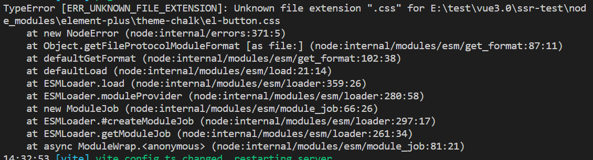

1. Unknown file extension ".css"

   出现场景：在使用element-plus的时候，通过按需加载引入element-plus组件，在实现服务器渲染的时候，会出现

   场景截图：

   

   解决方法：在`vite.config.js`配置`ssr`

   ```js
   ssr: {
       noExternal: ['element-plus']
     }
   ```

   

