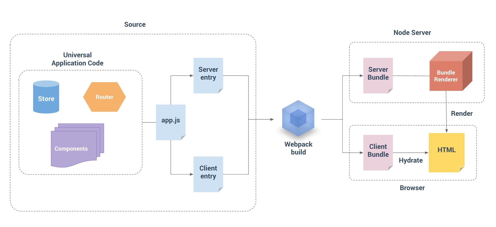

##	服务器渲染

###什么是服务器渲染？

Vue.js 是构建客户端应用程序的框架。默认情况下，可以在浏览器中输出 Vue 组件，进行生成 DOM 和操作 DOM。然而，也可以将同一个组件渲染为服务器端的 HTML 字符串，将它们直接发送到浏览器，最后将这些静态标记"激活"为客户端上完全可交互的应用程序。

服务器渲染的 Vue.js 应用程序也可以被认为是"同构"或"通用"，因为应用程序的大部分代码都可以在**服务器**和**客户端**上运行。

### 为什么要用服务器渲染

- 更好的 SEO
- 更快的内容到达时间 (time-to-content)

### 基本用法

关键依赖 -- `vue-server-renderer`

#### 注意

- 推荐使用 Node.js 版本 6+。
- `vue-server-renderer` 和 `vue` 必须匹配版本。
- `vue-server-renderer` 依赖一些 Node.js 原生模块，因此只能在 Node.js 中使用。我们可能会提供一个更简单的构建，可以在将来在其他「JavaScript 运行时(runtime)」运行。

#### 初步实现一个服务器渲染

```javascript
// server.js
const Vue = require('vue')
const exp = require('express')
const express = exp()
const { createRenderer } = require('vue-server-renderer')
// 创建一个 Vue 实例
const app = new Vue({
    template: '<div>哈哈哈哈哈</div>'
})
// 创建一个 renderer
const renderer = createRenderer()
express.get('*', (req, res) => {
  // 将 Vue 实例渲染为 HTML
  renderer.renderToString(app, (err, html) => {
    if (err) return res.status(500).end('运行错误')
    res.send(`
    <!DOCTYPE html>
    <html>
      <head>
        <meta charset="utf-8">
        <meta name="viewport" content="width=device-width,initial-scale=1.0">
        <title>ssr-project</title>
      </head>
      <body>
        ${html}
      </body>
    </html>
    
    `)
  })
})
express.listen(8888, () => {
  console.log('服务器已启动')
})
```

上述就是一个最基本的服务器渲染的代码，后续的代码都是以上述代码为核心展开的。

当代码运行后可以看到页面是由服务器返回的


为了页面的效果，服务器渲染一般分为服务器端和客户端两部份



  对于客户端应用程序和服务器应用程序，我们都要使用 webpack 打包 - 服务器需要「服务器 bundle」然后用于服务器端渲染(SSR)，而「客户端 bundle」会发送给浏览器，用于混合静态标记。

```bash
src
├── components
│   ├── Foo.vue
│   ├── Bar.vue
│   └── Baz.vue
├── router
    ├── index.js
├── store
    ├── index.js
├── App.vue
├── main.js # 通用 entry(universal entry)
├── entry-client.js # 仅运行于浏览器
└── entry-server.js # 仅运行于服务器
```

##### 避免状态单例

  Node.js 服务器是一个长期运行的进程。当代码进入该进程时，它将进行一次取值并留存在内存中。这意味着如果创建一个单例对象，它将在每个传入的请求之间共享。为了避免交叉请求状态污染 (cross-request state pollution)，我们不应该直接创建一个应用程序实例，而是应该暴露一个可以重复执行的工厂函数，为每个请求创建新的应用程序实例，因此需求对`router、store、main.js`页面进行工厂函数的修改

在`main.js`导出`createAPP`工厂函数：

```vue
// main.js
import Vue from 'vue'
import App from './App'
import {createRouter} from './router'
import {createStore} from './store'

Vue.config.productionTip = false

// 导出一个工厂函数，用于创建新的
// 应用程序、router 和 store 实例
export function createApp () {
  // 创建 router 实例
  const router = createRouter()
  // 创建 store 实例
  const store = createStore()
  let app = new Vue({
    // el: '#app',
    router,
    store,
    components: { App },
    template: '<App/>'
  })
  return {
    app
  }
}
```

在`router/index.js`导出`createRouter`工厂函数：

```js
import Vue from 'vue'
import Router from 'vue-router'
import home from '@/components/home.vue'
import about from '@/components/about.vue'

Vue.use(Router)

export function createRouter() {
  return new Router({
    mode: 'history',
    routes: [
      {
        path: '/',
        name: 'home',
        component: home
      },
      {
        path: '/about',
        name: 'about',
        component: about
      }
    ]
  })
}
```

在`store/index.js`导出`createStore`工厂函数

```js
import Vue from "vue";
import Vuex from 'vuex'
import axios from 'axios'
Vue.use(Vuex)
export function createStore() {
  let store = new Vuex.Store({
      state: {
         userInfo: {}
      },
      actions: {
        getUserInfo ({commit}) {
          return axios('http://localhost:8888/api/getUser').then(res => {
            commit('setUserInfo', res.data)
          })
        }
      },
      mutations: {
          setUserInfo (state, data) {
             state.userInfo = data
          }
      }
  })
  return store
}
```

  注意：`vuex`必须与`vue`的版本对应，`vuex@4`以上的对应`vue3`,`vuex@3`对应`vue2`

####服务器端编写

```js
import {
  createApp
} from "./main";

export default context => {
  // 因为有可能会是异步路由钩子函数或组件，所以我们将返回一个 Promise，
  // 以便服务器能够等待所有的内容在渲染前，
  // 就已经准备就绪。
  return new Promise((resolve, reject) => {
    const {
      app
    } = createApp()
    const router = app.$router
    const store = app.$store
    // 获取当期地址
    const {
      url
    } = context
    // 获取全路径
    const {
      fullPath
    } = router.resolve(url).route
    if (fullPath !== url) {
      return reject({
        url: fullPath
      })
    }
    // 设置服务器端 router 的位置
    router.push(url)
    // 等到 router 将可能的异步组件和钩子函数解析完
    router.onReady(() => {
      // 获取匹配路由的组件
      const matchedComponents = router.getMatchedComponents()
      // 匹配不到的路由，执行 reject 函数，并返回 404
      if (!matchedComponents.length) {
        return reject({
          computed: {
            code: 404
          }
        })
      }
      // Promise 应该 resolve 应用程序实例，以便它可以渲染
      resolve(app)
    }, reject)
  })
}
```

上述代码是基本的服务器端渲染的代码，但是这只是一个入口文件，需要通过`webpack`打包后才能给`server.js`使用, 因此需要修改一下`package.json`，同时在`build`文件夹下创建对应的打包文件`webpack.server.config.js`

```js
// package.json
"scripts": {
    "dev": "webpack-dev-server --inline --progress --config build/webpack.dev.conf.js",
    "start": "npm run dev",
    "e2e": "node test/e2e/runner.js",
    "test": "npm run e2e",
    "lint": "eslint --ext .js,.vue src test/e2e/specs",
    "build": "node build/build.js",
    "server": "webpack --config build/webpack.server.conf.js" // 添加这一段
  },
```

##### 服务器配置 (Server Config)

```js
// webpack.server.config.js
const merge = require('webpack-merge')
const baseConf = require('./webpack.base.conf')

module.exports = merge(baseConf, {
  // 这允许 webpack 以 Node 适用方式(Node-appropriate fashion)处理动态导入(dynamic import)，
  // 并且还会在编译 Vue 组件时，
  // 告知 `vue-loader` 输送面向服务器代码(server-oriented code)。
  target: 'node',
  // 入口文件
  entry: './src/entry-server.js',
  // 出口文件
  output: {
    filename: 'bundle.server.js',
     // 此处告知 server bundle 使用 Node 风格导出模块(Node-style exports)
    libraryTarget: 'commonjs2'
  },
  plugins:[]
})
```

由于入口文件的变更，因此`webpack.base.conf.js`也需求稍微修改


到目前为止，服务器端的`bundle`算是基本配置完成了，接下来要修改`server.js`

```js
// server.js
const exp = require('express')
const express = exp()
const {
  createRenderer
} = require('vue-server-renderer')

const createApp = require('./dist/bundle.server.js')['default']

// 创建一个 renderer
const renderer = createRenderer()
express.get('*', (req, res) => {
  const context = {
    url: req.url
  }
  // 创建实例
  createApp(context).then(app => {
    // 将 Vue 实例渲染为 HTML
    renderer.renderToString(app, (err, html) => {
      if (err) return res.status(500).end('运行错误')
      res.send(`
        <!DOCTYPE html>
        <html>
        <head>
            <meta charset="utf-8">
            <meta name="viewport" content="width=device-width,initial-scale=1.0">
            <title>ssr-project</title>
        </head>
        <body>
            ${html}
        </body>
        </html>
    `)
    })
  })
})
express.listen(8888, () => {
  console.log('服务器已启动')
})
```

现在已经可以实现将vue项目进行服务器渲染了，但是还有个问题，由于页面是被解析上去，因此vue的单页面是根本没有效果的，每次切换页面的时候都会请求一遍接口，这与我们的期望有所出入，因此就需要引入客户端的bundle


#### 客户端编写

  其实客户端的作用只有一个，就是Vue 在浏览器端接管由服务端发送的静态 HTML，使其变为由 Vue 管理的动态 DOM 

  实现起来也很简单，就是将创建出来的vue实例挂载到DOM节点上，因此需要编写一个入口文件`entry-client.js`

```js
// entry-client.js
import {
  createApp
} from "./main";

const {app} = createApp()
// 客户端 entry 只需创建应用程序，并且将其挂载到 DOM 中：
window.onload = function() {
  app.$mount('#app')
}
```

创建一个`webpack.client.conf.js`来打包

```js
const path = require('path')
const merge = require('webpack-merge')
const baseConf = require('./webpack.base.conf')

module.exports = merge(baseConf, {
  // 入口文件
  entry: './src/entry-client.js',
  // 出口文件
  output: {
    filename: 'bundle.client.js',
    path: path.resolve(__dirname, '../dist'),
    publicPath: '/dist/'
  }
})
```

修改`server.js`来引入客户端

```js
const exp = require('express')
const express = exp()
const {
  createRenderer
} = require('vue-server-renderer')

const createApp = require('./dist/bundle.server.js')['default']

express.use('/', exp.static(__dirname + '/dist'))

const clientBundleUrl = '/bundle.client.js'

// 创建一个 renderer
const renderer = createRenderer()
express.get('*', (req, res) => {
  const context = {
    url: req.url
  }
  createApp(context).then(app => {
    // 将 Vue 实例渲染为 HTML
    renderer.renderToString(app, (err, html) => {
      if (err) return res.status(500).end('运行错误')
      res.send(`
        <!DOCTYPE html>
        <html>
        <head>
            <meta charset="utf-8">
            <meta name="viewport" content="width=device-width,initial-scale=1.0">
            <title>ssr-project</title>
            <script src='${clientBundleUrl}'></script>
        </head>
        <body>
            ${html}
        </body>
        </html>
    `)
    })
  })
})
express.listen(8888, () => {
  console.log('服务器已启动')
})

```

现在就基本实现服务器渲染了


#### 问题

##### 首页数据交互问题

  在服务器端渲染(SSR)期间，我们本质上是在渲染我们应用程序的"快照"，所以如果应用程序依赖于一些异步数据，**那么在开始渲染过程之前，需要先预取和解析好这些数据**。

  另一个需要关注的问题是在客户端，在挂载 (mount) 到客户端应用程序之前，需要获取到与服务器端应用程序完全相同的数据 - 否则，客户端应用程序会因为使用与服务器端应用程序不同的状态，然后导致混合失败。

  因此就需要数据预取存储容器(data store)或"状态容器(state container)"来实现数据的存储与交互

首先，在服务器端，我们可以在渲染之前预取数据，并将数据填充到 store 中。

例如：

```js
// entry-server.js
import {
  createApp
} from "./main";

export default context => {
  // 因为有可能会是异步路由钩子函数或组件，所以我们将返回一个 Promise，
  // 以便服务器能够等待所有的内容在渲染前，
  // 就已经准备就绪。
  return new Promise((resolve, reject) => {
    const {
      app
    } = createApp()
    const router = app.$router
    const store = app.$store
    // 获取当期地址
    const {
      url
    } = context
    // 获取全路径
    const {
      fullPath
    } = router.resolve(url).route
    if (fullPath !== url) {
      return reject({
        url: fullPath
      })
    }
    // 设置服务器端 router 的位置
    router.push(url)
    // 等到 router 将可能的异步组件和钩子函数解析完
    router.onReady(() => {
      // 获取匹配路由的组件
      const matchedComponents = router.getMatchedComponents()
      // 匹配不到的路由，执行 reject 函数，并返回 404
      if (!matchedComponents.length) {
        return reject({
          computed: {
            code: 404
          }
        })
      }
      Promise.all(matchedComponents.map(component => {
        // 判断是否由接口请求
        if (component.serverRequest) {
            return component.serverRequest(store)
        }
      })).then(() => {
        // Promise 应该 resolve 应用程序实例，以便它可以渲染
        context.state = store.state
        resolve(app)
      }).catch(reject)
    }, reject)
  })
}
```

```js
//entry-client.js
import {
  createApp
} from "./main";

const {app} = createApp()
// 获取请求数据
if (window.__INITIAL_STATE__) {
  app.$store.replaceState(window.__INITIAL_STATE__)
}

window.onload = function() {
  app.$mount('#app')
}

```

```js
// server.js
const exp = require('express')
const express = exp()
const {
  createRenderer
} = require('vue-server-renderer')

const createApp = require('./dist/bundle.server.js')['default']

express.use('/', exp.static(__dirname + '/dist'))

const clientBundleUrl = '/bundle.client.js'

express.get('/api/getUser', (req, res) => {
  res.send('数据请求')
})

// 创建一个 renderer
const renderer = createRenderer()
express.get('*', (req, res) => {
  const context = {
    url: req.url
  }
  createApp(context).then(app => {
    // 将获取到的数据插入window中
    let state = JSON.stringify(context.state)
    // 将 Vue 实例渲染为 HTML
    renderer.renderToString(app, (err, html) => {
      if (err) return res.status(500).end('运行错误')
      res.send(`
        <!DOCTYPE html>
        <html>
        <head>
            <meta charset="utf-8">
            <meta name="viewport" content="width=device-width,initial-scale=1.0">
            <title>ssr-project</title>
            <script>window.__INITIAL_STATE__=${state}</script>
            <script src='${clientBundleUrl}'></script>
        </head>
        <body>
            ${html}
        </body>
        </html>
    `)
    })
  })
})
express.listen(8888, () => {
  console.log('服务器已启动')
})

```

