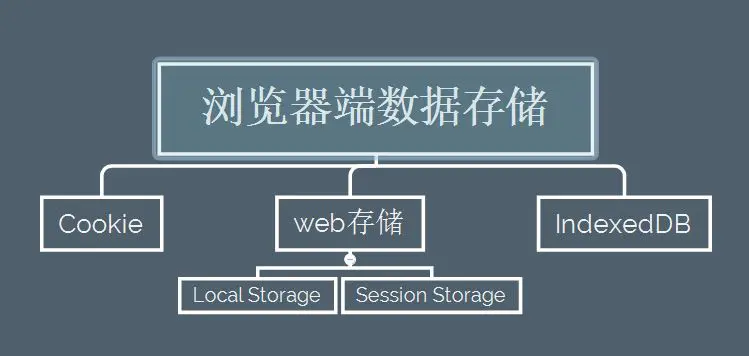

# 浏览器存储

## 前言

在浏览器端存储数据相当于赋予浏览器记忆的功能，可以纪录用户的所有状态信息，增强用户体验。比如当纪录用户的登陆状态时，可以让用户能够更快的进行访问，而不是每次登陆时都需要去进行繁琐的操作。

总的来说,现在市面上最常见的数据存储方案是以下三种：

- Cookie
- web存储 (localStorage和seesionStorage)
- IndexedDB



## Cookie

Cookie--称是HTTP Cookie，最初是在客户端用于存储会话信息，从底层来看，它作为HTTP协议的一种扩展实现，Cookie数据会自动在web浏览器和web服务器之间传输，因此在服务器端脚本就可以读写存储的cookie的值，因此Cookie通常用于存储一些通用的数据，比如用户的登陆状态，首选项等。虽然随着时代的进步，HTML5所提供的web存储机制已经逐步替代了Cookie，但有些较为老的浏览器还是不兼容web存储机制，因此正处于这个老旧更替阶段的我们对于它还是要了解了解的。

### 优点：

兼容性强，几乎兼容所有的主流浏览器

### 缺点：

- 存储量小。虽不同浏览器的存储量不同，但基本上都是在4kb左右。
- 影响性能。由于Cookie会由浏览器作为请求头发送，因此当Cookie存储信息过多时，会影响特定域的资源获取的效率，增加文档传输的负载。
- 只能储存字符串。
- 安全问题。存储在Cookie的任何数据可以被他人访问，因此不能在Cookie中储存重要的信息。
- 由于第三方Cookie的滥用，所以很多老司机在浏览网页时会禁用Cookie，所以我们不得不测试用户是否支持Cookie，这也是很麻烦的一件事。


## web存储

web存储机制最初作为HTML5的一部分被定义成API的形式，但又由于其本身的独特性与其他的一些原因而剥离了出来，成为独立的一个标准。

web存储标准的API包括locaStorage对象和seesionStorage对象。

它所产生的主要原因主要出于以下两个原因：

- 人们希望有一种在cookie之外存储回话数据的途径。
- 人们希望有一种存储大量可以跨会话存在的数据的机制。

### localStorage

相较于cookie，localStorage的优势：

- 提供了简单明了的API来进行操作
- 更加安全
- 可储存的数据量更大

#### 基本语法

```js
// 使用方法存储数据
localStorage.setItem("name", "Srtian")
// 使用属性存储数据
localStorage.say = "Hello world"
// 使用方法读取数据
const name = localStorage.getItem("name")
// 使用属性读取数据
const say = localStorage.say
// 删除数据
localStorage.removeItem("name")
```

注意点：只能存储字符串格式

#### 有效期

永不过期，除非我们使用removeItem来删除或者用户通过设置浏览器配置来删除

#### 作用域

localStorage的作用域限定在文档源级别的（意思就是同源的才能共享），同源的文档间会共享localStorage的数据，他们可以互相读取对方的数据，甚至有时会覆盖对方的数据。当然，localStorage的作用域同样也受浏览器的限制。

### sessionStorage

web存储机制的另一大对象，sessionStorage 属性允许我们去访问一个 session Storage 对象。

与localStorage区别：数据有时效性，关闭当前会话页或浏览器时，数据才会被清除

#### 基本语法

```js
// 保存数据到sessionStorage
sessionStorage.setItem('name', 'Srtian');

// 从sessionStorage获取数据
var data = sessionStorage.getItem('name');

// 从sessionStorage删除保存的数据
sessionStorage.removeItem('name');

// 从sessionStorage删除所有保存的数据
sessionStorage.clear();
```

## IndexedDB

由HTML5所提供的一种本地存储，用于在浏览器中储存较大数据结构的 Web API，并提供索引功能以实现高性能查找。一般用于保存大量用户数据并要求数据之间有搜索需要的场景，当网络断开时，用户就可以做一些离线的操作。它较之SQL更为方便，不需要写一些特定的语法对数据进行操作，数据格式是JSON。

### 基本语法

1、创建数据库，并指定这个数据库的版本号

```js
// 注意数据库的版本号只能是整数
const request = IndexedDB.open(databasename, version)
```

2、生成处理函数

> onupgradeneeded 是唯一可以修改数据库结构的地方。在这里面，可以创建和删除对象存储空间以及构建和删除索引

```js
request.onerror = function() {
    // 创建数据库失败时的回调函数
}
request.onsuccess = function() {
    // 创建数据库成功时的回调函数
}
request.onupgradeneededd = function(e) {
     // 当数据库改变时的回调函数
}
```

3、建立对象存储空间

对象存储空间仅调用createObjectStore()就可以创建

```js
//这个方法使用存储空间的名称，和一个对象参数。
//即便这个参数对象是可选的，它还是非常重要的，因为它可以让我们定义重要的可选属性和完善你希望创建的对象存储空间的类型。

request.onupgradeneeded = function(event) {
    const db = event.target.result
    const objectStore = db.createObjectStore('name', { keyPath:'id' })
}
```

### 操作

#### 添加数据

```js
addData: function(db, storename, data) {
    const store = store = db.transaction(storename,'readwrite').objectStore(storename)
    for(let i = 0; i < data.length; i++) {
        const request = store.add(data[i])
        request.onerror = function() {
            console.error('添加数据失败')
        }
        request.onsuccess = function() {
            console.log('添加数据成功')
        }
    }
}
```

#### 修改数据

```js
putData: function(db, storename, data) {
    const store = store = db.transaction(storename,'readwrite').objectStore(storename)
    for(let i = 0; i < data.length; i++) {
        const request = store.put(data[i])
        request.onerror = function() {
            console.error('修改数据失败')
        }
        request.onsuccess = function() {
            console.log('修改数据成功')
        }
    }
}
```

#### 获取数据

```js
getDataByKey: function(db, storename, key) {
    const store = store = db.transaction(storename,'readwrite').objectStore(storename)
    const request = store.get(key)
    request.onerror = function() {
        console.error('获取数据失败')
    }
    request.onsuccess = function(e) {
        const result = e.target.result
        console.log(result)
    }
}
```

#### 删除数据

```js
deleteDate: function(db, storename, key) {
    const store = store = db.transaction(storename, 'readwrite').objectStore(storename)
    store.delete(key)
    console.log('已删除存储空间' + storename + '中的' + key + '纪录')
}
```

#### 关闭数据库

```js
db.close
```

### 优点

- 拥有更大的储存空间
- 能够处理更为复杂和结构化的数据
- 拥有更多的交互控制
- 每个'database'中可以拥有多个'database'和'table'

### 局限性

#### 1. 存储空间限制

#### 2. 兼容性问题

部分浏览器不兼容，在使用时要考虑版本兼容

#### 3. indexedDB受同源策略的限制

它把存储空间绑定到了创建它的站点的源（典型情况下，就是站点的域或是子域），所以它不能被任何其他源访问。要着重指出的一点是 IndexedDB 不适用于从另一个站点加载进框架的内容 (不管是 <frame> 还是 <iframe>。


原文来源:[聊一聊常见的浏览器端数据存储方案](https://www.jianshu.com/p/072e17112759)