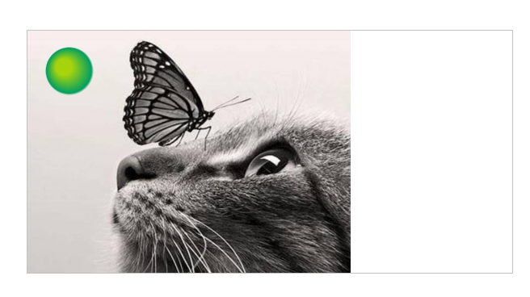
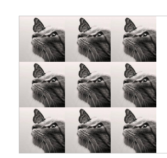

# Canvas--图像

canvas有一项特性是图像操作能力。可以用于动态的图像合成或者作为图形的背景，以及游戏界面（Sprites）等等。

步骤

1. 获得一个指向[`HTMLImageElement`](https://developer.mozilla.org/zh-CN/docs/Web/API/HTMLImageElement)的对象或者另一个canvas元素的引用作为源，也可以通过提供一个URL的方式来使用图片

2. 使用`drawImage()`函数将图片绘制到画布上

   

### 绘制图片

当我们获取到乐乐源图对象后，我们可以通过`drawImge`方法将它渲染到canvas中

值得一提的是drawImge方法有三种状态

**`drawImage(image, x, y)`**

​	其中 `image` 是 image 或者 canvas 对象，`x` 和 `y 是其在目标 canvas 里的起始坐标。`

​	示例

```javascript
 var img = new Image();
    img.onload = function(){
      ctx.drawImage(img,0,0);
        //在上面画个球
        var  radgrad = ctx.createRadialGradient(45,45,10,52,50,30)
        radgrad.addColorStop(0,'#A7D30C')
        radgrad.addColorStop(0.9, '#019F62')
        radgrad.addColorStop(1, 'rgba(1,159,98,0)');
        ctx.fillStyle = radgrad;
        ctx.fillRect(0,0,300,300);
    }
    img.src = './html+css+js有趣的示例/image/lzp.png'
```

结果



### 缩放 Scaling

**`drawImage(image, x, y，width,height)`**

​	第二种用法，通过传入width和height来控制图片的大小

```javascript
var img = new Image();
  img.onload = function(){
    for (var i=0;i<4;i++){
      for (var j=0;j<3;j++){
        ctx.drawImage(img,j*100,i*100,100,100);
      }
    }
  };
  img.src = './html+css+js有趣的示例/image/lzp.png'
```

结果



 如图所示，通过循环改变每个图片的定位，将图片大小设置为100*100，因此可以使图片平铺开来


### 切片 Slicing

`drawImage` 方法的第三个也是最后一个变种有8个新参数，用于控制做切片显示的。

**drawImage(image, sx, sy, sWidth, sHeight, dx, dy, dWidth, dHeight)**

参数：

image：绘制到上下文的元素

sx(可选)：需要绘制到目标上下文中的，`image`的矩形（裁剪）选择框的左上角 X 轴坐标。

sy(可选)：需要绘制到目标上下文中的，`image`的矩形（裁剪）选择框的左上角 Y 轴坐标。

sWidth(可选):需要绘制到目标上下文中的，`image`的矩形（裁剪）选择框的宽度。如果不说明，整个矩形（裁剪）从坐标的`sx`和`sy`开始，到`image`的右下角结束。

sHeight(可选):需要绘制到目标上下文中的，`image`的矩形（裁剪）选择框的高度。

dx：`image`的左上角在目标canvas上 X 轴坐标。

dy：`image`的左上角在目标canvas上 Y 轴坐标。

dWidth(可选)：`image`在目标canvas上绘制的宽度。 允许对绘制的`image`进行缩放。 如果不说明， 在绘制时`image`宽度不会缩放。

dHeight(可选):`image`在目标canvas上绘制的高度。 允许对绘制的`image`进行缩放。 如果不说明， 在绘制时`image`高度不会缩放。


这个有点搞不懂


### 控制图像的缩放行为

```javascript
cx.mozImageSmoothingEnabled = false;
```

