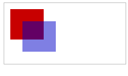

# Canvas--基本用法

### canvas元素

基本语法：

```html
<canvas id="tutorial" width="150" height="150"></canvas>
```

属性：

width：控制画布的宽度---默认300px

height：控制画布的高度--默认150px

注意：在通过css改变画布大小时要注意尺寸的比例，如果css的尺寸和初始画布的比例不一致的话，会出现扭曲现象


### 替换内容

`<canvas>`元素与``元素不同，它能在标签内定义一些替换内容。由于某些浏览器不兼容canvas标签，因而在这些浏览器上，能通过替代内容来实现展现效果

```html
<canvas id="stockGraph" width="150" height="150">
  current stock price: $3.15 +0.15
</canvas>

<canvas id="clock" width="150" height="150">
  
</canvas>
```


### 渲染上下文(The rendering context)

`canvas`元素创造了一个固定大小的画布，它公开了一个或多个**渲染上下文**，其可以用来绘制和处理要展示的内容。

canvas起初是空白的。为了展示，首先脚本需要找到渲染上下文，然后在它的上面绘制。`canvas`元素有一个叫做 `getContext()`的方法，这个方法是用来获得渲染上下文和它的绘画功能。

```javascript
var canvas = document.getElementById('tutorial');
//格式化画布，获得渲染上下文
var ctx = canvas.getContext('2d');
```

简单示例：

```html
<html>
 <head>
  <script type="application/javascript">
    function draw() {
      var canvas = document.getElementById("canvas");
      if (canvas.getContext) {
        var ctx = canvas.getContext("2d");
		//设置填充颜色
        ctx.fillStyle = "rgb(200,0,0)";
        //控制创建盒子的大小 和位置  ctx.fillRect(l,t,w,h)
          //l--距离画布左边的距离
          //t--距离画布顶部的距离
          //w--盒子的宽度
          //h--盒子的高度
        ctx.fillRect (10, 10, 55, 50);

        ctx.fillStyle = "rgba(0, 0, 200, 0.5)";
        ctx.fillRect (30, 30, 55, 50);
      }
    }
  </script>
 </head>
 <body onload="draw();">
   <canvas id="canvas" width="150" height="150"></canvas>
 </body>
</html>
```

效果



到目前为止，上述所说的是canvas的基本创建和使用，接下来要说的是如何通过canvas绘制各种图案了


### 栅格

 在绘制图案之前，首先要了解画布的布局--栅格(canvas grid)以及坐标空间。canvas元素默认被网格所覆盖。通常来说网格中的一个单元相当于canvas元素中的一像素。栅格的起点为左上角（坐标为（0,0））。所有元素的位置都相对于原点定位。所以图中蓝色方形左上角的坐标为距离左边（X轴）x像素，距离上边（Y轴）y像素（坐标为（x,y））


### 绘制矩形

目前，在`<canvas>`只支持两种形式的图画绘制：矩形和路径，其他的图形都是通过一条或多条路径组合而成。

当前canvas提供三种绘制矩形的方法：

1、fillRect(x,y,width,height) ---绘制一个填充的矩形

2、strokeRect(x,y,width,height) ---绘制一个矩形边框

3、clearRect(x,y,width,height) -- 清除指定矩形区域，让清除部分完全透明

参数：

x/y----指定了在canvas画布上所绘制的矩形的左上角（相对于原点）的坐标

width/height---设置矩形的尺寸。


```javascript
 var c = document.getElementById("myCanvas");
 var ctx = c.getContext("2d");
 // 湖一个红色正方形
 // fillStyle设置颜色
 ctx.fillStyle = "rgb(200,0,0)";
 // fillRect设置坐标和大小
 // ctx.fillRect(10, 10, 55, 50);
 ctx.fillRect(25, 25, 100, 100);
 ctx.clearRect(45, 45, 60, 60);
 ctx.strokeRect(50, 50, 50, 50);
```

结果


### 绘制路径

图形的基本元素是路径。路径是通过不同颜色和宽度的线段或曲线相连形成的不同形状的点的集合。一个路径，甚至一个子路径，都是闭合的。使用路径绘制图形需要一些额外的步骤。

1. 首先，你需要创建路径起始点。
2. 然后你使用画图命令去画出路径。
3. 之后你把路径封闭。
4. 一旦路径生成，你就能通过描边或填充路径区域来渲染图形。

常用函数

**beginPath()**：新建一条路径，生成之后，图形绘制命令被指向到路径上生成路径。

**closePath()**：闭合路径之后图形绘制命令又重新指向到上下文中。

**stroke()**：通过线条来绘制图形轮廓。

**fill()**：通过填充路径的内容区域生成实心的图形。


实现步骤：

第一步叫做beginPath()。本质上，路径是由很多子路径构成，这些子路径都是在一个列表中，所有的子路径（线、弧形、等等）构成图形。而每次这个方法调用之后，列表清空重置，然后我们就可以重新绘制新的图形。

> **注意：当前路径为空，即调用beginPath()之后，或者canvas刚建的时候，第一条路径构造命令通常被视为是moveTo（），无论实际上是什么。出于这个原因，你几乎总是要在设置路径之后专门指定你的起始位置。**

第二步就是调用函数指定绘制路径，本文稍后我们就能看到了

第三，就是闭合路径closePath(),不是必需的。这个方法会通过绘制一条从当前点到开始点的直线来闭合图形。如果图形是已经闭合了的，即当前点为开始点，该函数什么也不做。

> **注意：当你调用fill()函数时，所有没有闭合的形状都会自动闭合，所以你不需要调用closePath()函数。但是调用stroke()时不会自动闭合**。

简单示例：

```javascript
ctx.beginPath();
ctx.moveTo(75, 50);
ctx.lineTo(100, 75);
ctx.lineTo(100, 25);
ctx.fill();
```


### 移动笔触

moveTo()--一个非常有用的函数，但该函数不能画出任何东西，它的作用只有一个，相当于现实中画画一般，将笔移动，但不在画布上作画

moveTo(x,y) --将笔触移动到指定的坐标x以及y上

当canvas初始化或者`beginPath()`调用后，你通常会使用`moveTo()`函数设置起点。我们也能够使用`moveTo()`绘制一些不连续的路径。

```javascript
	ctx.beginPath();
	//画出一个大圆形
    ctx.arc(75,75,50,0,Math.PI*2,true); // 绘制
	//移动笔触
    ctx.moveTo(110,75);
	//画一个半圆
    ctx.arc(75,75,35,0,Math.PI,false);   // 口(顺时针)
	//移动笔触
    ctx.moveTo(65,65);
    ctx.arc(60,65,5,0,Math.PI*2,true);  // 左眼
    ctx.moveTo(95,65);
    ctx.arc(90,65,5,0,Math.PI*2,true);  // 右眼
    ctx.stroke();
```

实现效果：


### 绘制线

绘制直线，需要用到的方法`lineTo()`。

lineTo(x，y)---绘制一条从当前位置到指定x以及y位置的直线。

```javascript
// 填充三角形
 ctx.beginPath();
 ctx.moveTo(25,25);
 ctx.lineTo(105,25);
 ctx.lineTo(25,105);
 ctx.fill();

 // 描边三角形
 ctx.beginPath();
 ctx.moveTo(125,125);
 ctx.lineTo(125,45);
 ctx.lineTo(45,125);
 ctx.closePath();
 ctx.stroke();
```

结果


### 绘制圆弧

绘制圆弧有两种方法

1、ctx.arc(x, y, radius, startAngle, endAngle, anticlockwise); --推荐

​	参数：

​		x--圆弧中心（圆心）的 x 轴坐标。

​		y--圆弧中心（圆心）的 y 轴坐标。

​		radius--圆弧的半径。

​		startAngle--圆弧的起始点， x轴方向开始计算，单位以弧度表示。

​		anticlockwise (可选)--可选的Boolean值 ，如果为 `true`，逆时针绘制圆弧，反之，顺时针绘制


2、ctx.arcTo(x1, y1, x2, y2, radius); ---不推荐

​	参数：

​		x1--第一个控制点的 x 轴坐标。

​		y1--第一个控制点的 y 轴坐标。

​		x2--第二个控制点的 x 轴坐标。

​		y2--第二个控制点的 y 轴坐标。

​		radius--圆弧的半径。


> **注意：`arc()`函数中表示角的单位是弧度，不是角度。角度与弧度的js表达式:**
>
> **弧度=(Math.PI/180)\*角度。**


### 二次贝塞尔曲线及三次贝塞尔曲线

二次及三次贝塞尔曲线都十分有用，一般用来绘制复杂有规律的图形

**quadraticCurveTo(cp1x, cp1y, x, y)**---绘制二次贝塞尔曲线，`cp1x,cp1y`为一个控制点，`x,y为`结束点。

**bezierCurveTo(cp1x, cp1y, cp2x, cp2y, x, y)**---绘制三次贝塞尔曲线，`cp1x,cp1y`为控制点一，`cp2x,cp2y`为控制点二，`x,y`为结束点

使用二次以及三次贝塞尔曲线是有一定的难度的，因为不同于像Adobe Illustrators这样的矢量软件，我们所绘制的曲线没有给我们提供直接的视觉反馈。这让绘制复杂的图形变得十分困难。


原文来自：[使用canvas来绘制图形](https://developer.mozilla.org/zh-CN/docs/Web/API/Canvas_API/Tutorial/Drawing_shapes)

