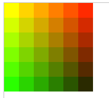
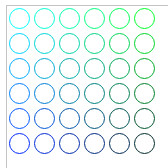
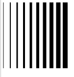
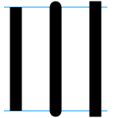
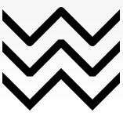
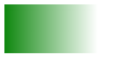
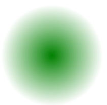
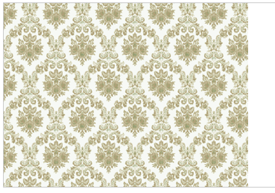
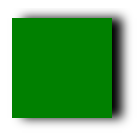
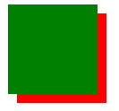

# Canvas--样式和颜色

### 色彩 Colors

目前能修改图像颜色有2种方法

​	fillStyle = color  设置图形的填充颜色。

​	strokeStyle = color 设置图形轮廓的颜色。

`color` 可以是表示 CSS 颜色值的字符串，渐变对象或者图案对象。我们迟些再回头探讨渐变和图案对象。默认情况下，线条和填充颜色都是黑色（CSS 颜色值 `#000000`）

fillStyle演示

```javascript
var ctx = document.getElementById('canvas').getContext('2d');
  for (var i=0;i<6;i++){
    for (var j=0;j<6;j++){
      ctx.fillStyle = 'rgb(' + Math.floor(255-42.5*i) + ',' + 
                       Math.floor(255-42.5*j) + ',0)';
      ctx.fillRect(j*25,i*25,25,25);
    }
  }
```

结果




strokeStyle示例

```javascript
var ctx = document.getElementById('canvas').getContext('2d');
for (var i=0;i<6;i++){
      for (var j=0;j<6;j++){
        ctx.strokeStyle = 'rgb(0,' + Math.floor(255-42.5*i) + ',' + 
                         Math.floor(255-42.5*j) + ')';
        ctx.beginPath();
        ctx.arc(12.5+j*25,12.5+i*25,10,0,Math.PI*2,true);
        ctx.stroke();
      }
    }
```

结果




### 透明度 Transparency

通过globalAlpha 设置图形的透明度

globalAlpha = transparencyValue

​	这个属性影响到 canvas 里所有图形的透明度，有效的值范围是 0.0 （完全透明）到 1.0（完全不透明），默认是 1.0。

globalAlpha 这属性通常用于多个图像都拥有相同的透明度，假如只有少量的图像，并且透明度不同，则大多数通过strokeStyle/fillStyle来设置透明度


### 线型 Line styles

可以通过一系列属性来设置线的样式。

1、lineWidth = value ---设置线条宽度。属性值必须为正数。默认值是1.0。

实例：

```javascript
var ctx = document.getElementById('canvas').getContext('2d');
  for (var i = 0; i < 10; i++){
    ctx.lineWidth = 1+i;
    ctx.beginPath();
    ctx.moveTo(5+i*14,5);
    ctx.lineTo(5+i*14,140);
    ctx.stroke();
  }
```

结果：



2、lineCap = type ---设置线条末端样式。

​	属性 `lineCap` 的值决定了线段端点显示的样子。它可以为下面的三种的其中之一：`butt`，`round` 和 `square`。默认是 `butt。`

示例

```javascript
var ctx = document.getElementById('canvas').getContext('2d');
  var lineCap = ['butt','round','square'];

  // 创建路径
  ctx.strokeStyle = '#09f';
  ctx.beginPath();
  ctx.moveTo(10,10);
  ctx.lineTo(140,10);
  ctx.moveTo(10,140);
  ctx.lineTo(140,140);
  ctx.stroke();

  // 画线条
  ctx.strokeStyle = 'black';
  for (var i=0;i<lineCap.length;i++){
    ctx.lineWidth = 15;
    ctx.lineCap = lineCap[i];
    ctx.beginPath();
    ctx.moveTo(25+i*50,10);
    ctx.lineTo(25+i*50,140);
    ctx.stroke();
  }
```




最左边的线用了默认的 `butt` 。可以注意到它是与辅助线齐平的。中间的是 `round` 的效果，端点处加上了半径为一半线宽的半圆。右边的是 `square` 的效果，端点处加上了等宽且高度为一半线宽的方块。

3、lineJoin =type ---设定线条与线条间接合处的样式。

lineJoin的属性值决定了图形中两线段连接处所显示的样子。它可以是这三种之一：`round`, `bevel` 和 `miter。`默认是 miter

```javascript
var ctx = document.getElementById('canvas').getContext('2d');
  var lineJoin = ['round', 'bevel', 'miter'];
  ctx.lineWidth = 10;
  for (var i = 0; i < lineJoin.length; i++) {
    ctx.lineJoin = lineJoin[i];
    ctx.beginPath();
    ctx.moveTo(-5, 5 + i * 40);
    ctx.lineTo(35, 45 + i * 40);
    ctx.lineTo(75, 5 + i * 40);
    ctx.lineTo(115, 45 + i * 40);
    ctx.lineTo(155, 5 + i * 40);
    ctx.stroke();
  }
```



​	最上面一条是 `round` 的效果，边角处被磨圆了，圆的半径等于线宽。中间和最下面一条分别是 bevel 和 miter 的效果。当值是 `miter `的时候，线段会在连接处外侧延伸直至交于一点，延伸效果受到下面将要介绍的 `miterLimit` 属性的制约。

4、miterLimit = value ---限制当两条线相交时交接处最大长度；所谓交接处长度（斜接长度）是指线条交接处内角顶点到外角顶点的长度。

5、getLineDash() ---返回一个包含当前虚线样式，长度为非负偶数的数组。

6、setLineDash(segments) ---设置当前虚线样式。

7、lineDashOffset = value ---设置虚线样式的起始偏移量。

最后5、6、7都是对线进行操作的，用 `setLineDash` 方法和 `lineDashOffset` 属性来制定虚线样式. `setLineDash` 方法接受一个数组，来指定线段与间隙的交替；`lineDashOffset `属性设置起始偏移量.


### 渐变 Gradients

好像一般的绘图软件一样，我们可以用线性或者径向的渐变来填充或描边。我们用下面的方法新建一个 `canvasGradient` 对象，并且赋给图形的 `fillStyle` 或 `strokeStyle` 属性。

**`CanvasRenderingContext2D.createLinearGradient()`**方法创建一个沿参数坐标指定的直线的渐变。该方法返回一个线性 CanvasGradient对象

```javascript
ctx.createLinearGradient(x0, y0, x1, y1);
```

参数：

x0---起点的 x 轴坐标。

y0---起点的 y 轴坐标。

x1---终点的 x 轴坐标。

y1---终点的 y 轴坐标。

返回值：一个根据指定线路初始化的线性 CanvasGradient 对象

```javascript
var gradient = ctx.createLinearGradient(0,0,200,0);
gradient.addColorStop(0,"green");
gradient.addColorStop(1,"white");
ctx.fillStyle = gradient;
ctx.fillRect(10,10,200,100);
```




**`CanvasRenderingContext2D.createRadialGradient()`** 是 Canvas 2D API 根据参数确定两个圆的坐标，绘制放射性渐变的方法。这个方法返回 `CanvasGradient`

```javascript
 ctx.createRadialGradient(x0, y0, r0, x1, y1, r1);
```

参数：

x0---开始圆形的 x 轴坐标。

y0---开始圆形的 y 轴坐标。

r0---开始圆形的半径。

x1---结束圆形的 x 轴坐标。

y1---结束圆形的 y 轴坐标。

r1---结束圆形的半径。

返回值：由两个指定的圆初始化的放射性 `CanvasGradient` 对象。

```javascript
var gradient = ctx.createRadialGradient(100,100,100,100,100,0);
gradient.addColorStop(0,"white");
gradient.addColorStop(1,"green");
ctx.fillStyle = gradient;
ctx.fillRect(0,0,200,200);
```




`**CanvasGradient**`**`.addColorStop()`** 方法添加一个由**`偏移值`**和**`颜色值`**指定的断点到渐变。如果偏移值不在`0`到`1`之间，将抛出`INDEX_SIZE_ERR`错误，如果颜色值不能被解析为有效的CSS颜色值 `<color>`，将抛出SYNTAX_ERR错误。

```javascript
void gradient.addColorStop(offset, color);
```

参数：

**offset**---`0`到`1`之间的值，超出范围将抛出`INDEX_SIZE_ERR`错误

**color**---CSS颜色值 `<color>`。如果颜色值不能被解析为有效的CSS颜色值 `<color>`，将抛出`SYNTAX_ERR`错误。


## 图案样式 Patterns

`CanvasRenderingContext2D`**`.createPattern() `**是 Canvas 2D API 使用指定的图像 (CanvasImageSource)创建模式的方法。 它通过repetition参数在指定的方向上重复元图像。此方法返回一个CanvasPattern对象。

```javascript
CanvasPattern ctx.createPattern(image, repetition);
```

参数：

image---重复的图像

repetition---指定如何重复图像。允许的值有：

​	1、`"repeat"` (both directions),    默认值

​	2、`"repeat-x"` (horizontal only),

​	3、`"repeat-y"` (vertical only), 

​	4、`"no-repeat"` (neither).

示例

```javascript
var img = new Image();
img.src = 'https://mdn.mozillademos.org/files/222/Canvas_createpattern.png';
img.onload = function() {
  var pattern = ctx.createPattern(img, 'repeat');
  ctx.fillStyle = pattern;
  ctx.fillRect(0,0,400,400);
};
```

结果




## 阴影 Shadows

#### 1、**`shadowOffsetX`**/**`shadowOffsety`**

`shadowOffsetX` 和 `shadowOffsetY `用来设定阴影在 X 和 Y 轴的延伸距离，它们是不受变换矩阵所影响的。负值表示阴影会往上或左延伸，正值则表示会往下或右延伸，它们默认都为 `0`。

```javascript
ctx.shadowOffsetX = offset;
ctx.shadowOffsety = offset;
```

示例

```javascript
ctx.shadowColor = "black";
ctx.shadowOffsetX = 10;
ctx.shadowBlur = 10;

ctx.fillStyle = "green";
ctx.fillRect(10, 10, 100, 100);
```



#### 2、**`shadowBlur`** 

`**CanvasRenderingContext2D**`**`.shadowBlur`** 是 Canvas 2D API 描述模糊效果程度的属性； 它既不对应像素值也不受当前转换矩阵的影响。 默认值是 0。

```javascript
ctx.shadowBlur = level;
```

参数

level---描述模糊效果程度的，float 类型的值。默认值是 0。 负数、 Infinity 或者 NaN都会被忽略。

```javascript
ctx.shadowColor = "black";
ctx.shadowBlur = 10;

ctx.fillStyle = "white";
ctx.fillRect(10, 10, 100, 100);
```

结果：


#### 3、**`shadowColor`** 

`CanvasRenderingContext2D`**`.shadowColor`** 是 Canvas 2D API 描述阴影颜色的属性。

```javascript
ctx.shadowColor = color
```

参数

color---可以转换成 CSS `<color>`值得DOMString字符串。 默认值是 fully-transparent black.

示例

```
ctx.shadowColor = "red";
ctx.shadowOffsetY = 10;
ctx.shadowOffsetX = 10;

ctx.fillStyle = "green"
ctx.fillRect(10, 10, 100, 100);
```

结果：




原文来源：[使用样式和颜色](https://developer.mozilla.org/zh-CN/docs/Web/API/Canvas_API/Tutorial/Applying_styles_and_colors)

