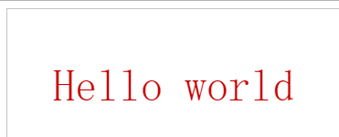
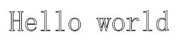
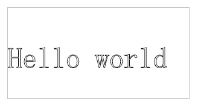

# 绘制文本

canvas提供两种方法来渲染文本

1.`fillText`

`CanvasRenderingContext2D`**`.fillText()`** 是 Canvas 2D API 在 *(x, y)*位置填充文本的方法。如果选项的第四个参数提供了最大宽度，文本会进行缩放以适应最大宽度。

```javascript
ctx.fillText(text, x, y [, maxWidth]);
```

参数

text---文本内容

x---文本起点的 x 轴坐标

y---文本起点的 y 轴坐标。

maxWidth(可选)---绘制的最大宽度。如果指定了值，并且经过计算字符串的值比最大宽度还要宽，字体为了适应会水平缩放（如果通过水平缩放当前字体，可以进行有效的或者合理可读的处理）或者使用小号的字体。

示例

```javascript
ctx.font = "48px serif";
ctx.fillText("Hello world", 50, 100);
```

结果




2、**`strokeText`**

`CanvasRenderingContext2D`**`.strokeText()`** 是 Canvas 2D API 在给定的 *(x, y)* 位置绘制文本的方法。如果提供了表示最大值的第四个参数，文本将会缩放适应宽度。

```javascript
void ctx.strokeText(text, x, y [, maxWidth]);
```

参数

text----文本

x----文本起始点的 x 轴坐标

y----文本起始点的 y 轴坐标

maxWidth(可选)---需要绘制的最大宽度。如果指定了值，并且经过计算字符串的宽度比最大宽度还要宽，字体为了适应会使用一个水平缩小的字体（如果通过水平缩放当前的字体，可以进行有效的或者合理可读的处理）或者小号的字体。

示例

```javascript
ctx.font = "48px serif";
ctx.strokeText("Hello world", 50, 100);
```

结果




### 文本样式

1、font 

`CanvasRenderingContext2D`**`.font`** 是 Canvas 2D API 描述绘制文字时，当前字体样式的属性

```javascript
ctx.font = value;
```

参数

value---字体大小，例如10px


2、textAlign 

`CanvasRenderingContext2D`**`.textAlign`** 是 Canvas 2D API 描述绘制文本时，文本的对齐方式的属性。注意，该对齐是基于CanvasRenderingContext2D.fillText方法的x的值。所以如果textAlign="center"，那么该文本将画在 x-50%*width

```javascript
ctx.textAlign = "left" || "right" || "center" || "start" || "end";
```

参数

left---文本左对齐。

right--文本右对齐。

center---文本居中对齐。

start---（默认值）文本对齐界线开始的地方 （左对齐指本地从左向右，右对齐指本地从右向左）。

end---文本对齐界线结束的地方 （左对齐指本地从左向右，右对齐指本地从右向左）。

```javascript
ctx.font = "48px serif";
ctx.textAlign = "left";
ctx.strokeText("Hello world", 0, 100);
```




3、textBaseline

`CanvasRenderingContext2D`**`.textBaseline`** 是 Canvas 2D API 描述绘制文本时，当前文本基线的属性，决定文字垂直方向的对齐方式

```
ctx.textBaseline = "top" || "hanging" || "middle" || "alphabetic" || "ideographic" || "bottom";
```

参数：

- top

  文本基线在文本块的顶部。

- hanging

  文本基线是悬挂基线。

- middle

  文本基线在文本块的中间。

- alphabetic

  文本基线是标准的字母基线。

- ideographic

  文字基线是表意字基线；如果字符本身超出了alphabetic 基线，那么ideograhpic基线位置在字符本身的底部。

- bottom

  文本基线在文本块的底部。 与 ideographic 基线的区别在于 ideographic 基线不需要考虑下行字母。

默认值是 `alphabetic。`


### 预测量文本宽度

你需要获得更多的文本细节时，下面的方法可以给你测量文本的方法

measureText---方法返回一个关于被测量文本[`TextMetrics`](https://developer.mozilla.org/zh-CN/docs/Web/API/TextMetrics) 对象包含的信息（例如它的宽度）

```javascript
ctx.measureText(text);
```

参数

text----需要测量的String 。

返回值---[`TextMetrics`](https://developer.mozilla.org/zh-CN/docs/Web/API/TextMetrics) 对象

示例

```javascript
var text = ctx.measureText("foo"); // TextMetrics object
text.width; // 16;
```


原文来源:[绘制文本](https://developer.mozilla.org/zh-CN/docs/Web/API/Canvas_API/Tutorial/Drawing_text)

