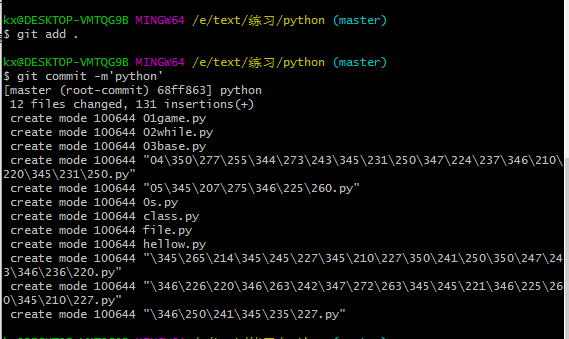

### 创建版本库

通过**git init**命令把目录变成Git可以管理的创库


**.git** 目录，这目录是默认隐藏的，可以通过显示隐藏文件来查看**.git**

### 把文件添加到版本库

第一步，用命令**git add**把文件添加到仓库中：

```
git add 文件名字
```

当执行上面的命令，若没有任何显示就证明添加成功

第二部，用命令**git commit**告诉Git，把文件提交到仓库

```
git commit -m'注释内容'
```

`git commit`命令，`-m`后面输入的是本次提交的说明，可以输入任意内容，当然最好是有意义的，这样就能从历史记录里方便地找到改动记录




小结：

初始化一个Git仓库，使用`git init`命令。

添加文件到Git仓库，分两步：

1. 使用命令`git add <file> ` ，注意，可反复多次使用，添加多个文件；
2. 使用命令`git commit -m<message> `，完成。

