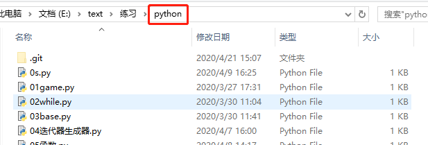

### 工作区和暂存区

#### 工作区（Working Directory）

工作区就是能看到的目录

就是这个python文件夹

#### 版本库（Repository）

工作区有一个隐藏目录`.git`，这个是Git的版本库

Git的版本库里存了很多东西，其中最重要的就是称为stage（或者叫index）的暂存区，还有Git为我们自动创建的第一个分支`master`，以及指向`master`的一个指针叫`HEAD`。

当我们把文件往Git版本库里添加的时候，是分两步执行的：

第一步：用`git add `把文件添加进去，实际上就是把文件修改添加到暂存区

第二步：用`git commit`提交更改，实际上就是把暂存区的所有内容提交到当前分支中

