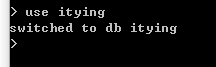

# MongoDB 使用


## 一、连接数据库

直接使用命令行`mongo`


查看所有数据库列表

```
show dbs
```


## 二、创建、查看、删除数据库

### 1.使用数据库

```
use 数据库名字
```



如果真的想把这个数据库创建成功，那么必须插入一个数据。

数据库中不能直接插入数据，只能往集合(collections)中插入数据。

### 2.创建数据

下面命令表示给itying数据库的user表中插入数据。

```
db.user.insert({“name”:”xiaoming”});
```

### 3.查看数据库

```
show dbs
```

### 4.显示当前的数据集合

```
show collections
```


### 5.删除集合，删除指定的集合删除表

```
删除集合
db.COLLECTION_NAME.drop()

db.user.drop()
```

### 6.删除数据库

```
db.dropDatabase()
```


## 三、数据操作

### 1.添加、插入数据

插入数据，随着数据的插入，数据库创建成功了，集合也创建成功了

```
db.表名.insert({"name":"zhangsan"，"age":20});
```

### 2.查找数据

#### 1)查询所有记录

```
db.user.find()
```

#### 2)查询去掉后的当前聚集集合中的某列的重复数据

```
db.user.distinct("name");
```

会过滤掉name中的相同数据

#### 3)条件查询

```
等于 age = 22
db.user.find({"age": 22});

大于 age > 22 -- $gt
db.user.find({age: {$gt: 22}});

小于 age < 22 -- $lt
db.user.find({age: {$lt: 22}});

大于等于 age>= 22 -- $gte
db.user.find({age: {$gte: 25}});

小于等于 age < = 22 -- $lte
db.user.find({age: {$lte: 25}});

查询 age >= 23 并且 age <= 26
db.user.find({age: {$gte: 23, $lte: 26}});

模糊查询
db.user.find({name: /mongo/});

查询 name 中以 mongo 开头的
db.user.find({name: /^mongo/});

查询指定列 name、age 数据
db.user.find({}, {name: 1, age: 1});

查询指定列 name、age 数据, age > 25
db.user.find({age: {$gt: 25}}, {name: 1, age: 1});
```

#### 4)排序

```
升序：
db.user.find().sort({age: 1});

降序：
db.user.find().sort({age: -1});
```


#### 5)**查询前** **5** **条数据**

```
db.user.find().limit(5);
```

#### 6)**查询** **10** **条以后的数据**

```
db.user.find().skip(10);
```

分页：

```
pageno -- 页码 pagesize --  一个有多少数据

db.user.find().skip((pageno-1)*pagesize).limit(pagesize)
```


#### **7)查询某个结果集的记录条数** 

**统计数量**

```
db.user.find({age: {$gte: 25}}).count();
```


### **3.修改数据**

修改里面还有查询条件。你要该谁，要告诉 mongo。 

查找名字叫做小明的，把年龄更改为 16 岁： 

```
db.student.update({"name":"小明"},{$set:{"age":16}});
```

更改所有匹配项目

```
db.student.update({"sex":"男"},{$set:{"age":33}},{multi: true})
```


### **4.删除数据**

```
db.collectionsNames.remove( { "borough": "Manhattan" } ) db.users.remove({age: 132});
```


## 四、**索引**

索引是对数据库表中一列或多列的值进行排序的一种结构，可以让我们查询数据库变得 

更快。MongoDB 的索引几乎与传统的关系型数据库一模一样，这其中也包括一些基本的查 询优化技巧。

### **1.创建索引**

```
db.user.ensureIndex({"userame":1})
```

### **2.获取当前集合的索引**

```
db.user.getIndexes()
```

### **3.删除索引**

```
db.user.dropIndex({"username":1})
```

数字 1 表示 username 键的索引按升序存储，-1 表示 age 键的索引按照降序方式存储。


**复合索引**

```
db.user.ensureIndex({"username":1, "age":-1})
```

该索引被创建后，基于 username 和 age 的查询将会用到该索引，或者是基于 username 的查询也会用到该索引，**但是只是基于** **age** **的查询将不会用到该复合索引。因此可以说，** **如果想用到复合索引，必须在查询条件中包含复合索引中的前** **N** **个索引列**。


### **4.唯一索引**

在缺省情况下创建的索引均不是唯一索引。下面的示例将创建唯一索引，如：

```
db.user.ensureIndex({"userid":1},{"unique":true})
```


### 

## 五、**使用** **explain** 

explain 是非常有用的工具，会帮助你获得查询方面诸多有用的信息。只要对游标调用 该方法，就可以得到查询细节

explain 会返回查询使用的索引情况，耗时和扫描文档数的统计信息。

```
db.tablename.find().explain(  )
//查询具体的执行时间
db.tablename.find().explain( "executionStats" )
```


## 六、**高级查询** **aggregate** **聚合管道**

### 定义：

**MongoDB** **聚合管道（****Aggregation Pipeline）**--使用聚合管道可以对集合中的文档进行变换和组合。 

**实际项目：**表关联查询、数据的统计。

### **MongoDB Aggregation** **管道操作符与表达式**

#### 管道操作符

| **管道操作符** | Description                                          |
| -------------- | ---------------------------------------------------- |
| $project       | 增加、删除、重命名字段                               |
| $match         | 条件匹配。只满足条件的文档才能进入下 一阶段          |
| $limit         | 限制结果的数量                                       |
| $skip          | 跳过文档的数量                                       |
| $sort          | 条件排序                                             |
| $group         | 条件组合结果  统计                                   |
| $lookup        | $lookup 操作符 用以引入其它集合的数据 （表关联查询） |

#### **管道表达式**

管道操作符作为“键”,所对应的“值”叫做管道表达式。 

例如{$match:{status:"A"}}，$match 称为管道操作符，而 status:"A"称为管道表达式，是管道操作符的操作数(Operand)。 

每个管道表达式是一个文档结构，它是由字段名、字段值、和一些表达式操作符组成的。

| **常用表达式操作符** | **Description**        |
| -------------------- | ---------------------- |
| $addToSet            | 将文档指定字段的值去重 |
| $max                 | 文档指定字段的最大值   |
| $min                 | 文档指定字段的最小值   |
| $sum                 | 文档指定字段求和       |
| $avg                 | 文档指定字段求平均     |
| $gt                  | 大于给定值             |
| $lt                  | 小于给定值             |
| $eq                  | 等于给定值             |

