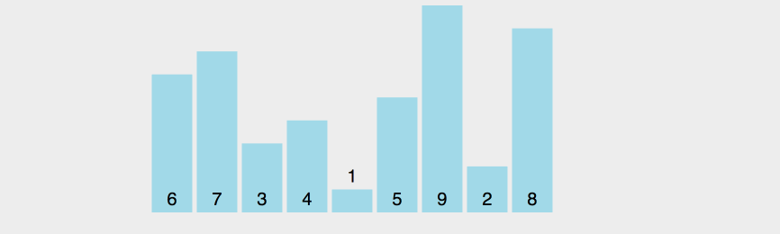

#  v8 排序

## 前言

v8 是 Chrome 的 JavaScript 引擎，其中关于数组的排序完全采用了 JavaScript 实现。

排序采用的算法跟数组的长度有关，当数组长度小于等于 10 时，采用插入排序，大于 10 的时候，采用快速排序。(当然了，这种说法并不严谨)。


## 插入排序

### 原理

将第一个元素视为有序序列，遍历数组，将之后的元素依次插入这个构建的有序序列中。

```javascript
function insertionSort(arr) {
    for (var i = 1; i < arr.length; i++) {
        var element = arr[i];
        for (var j = i - 1; j >= 0; j--) {
            var tmp = arr[j];
            var order = tmp - element;
            if (order > 0) {
                arr[j + 1] = tmp;
            } else {
                break;
            }
        }
        //j+1=0  每次数据都是放在arr[0]中
        arr[j + 1] = element;
    }
    return arr;
}

var arr = [6, 5, 4, 3, 2, 1];
console.log(insertionSort(arr));
```

过程：


## 时间复杂度

时间复杂度是指执行算法所需要的计算工作量，它考察当输入值大小趋近无穷时的情况，一般情况下，算法中基本操作重复执行的次数是问题规模 n 的某个函数

最好情况：数组升序排列，时间复杂度为：O(n)

最坏情况：数组降序排列，时间复杂度为：O(n²)


## 稳定性

稳定性，是指相同的元素在排序后是否还保持相对的位置。

要注意的是对于不稳定的排序算法，只要举出一个实例，即可说明它的不稳定性；而对于稳定的排序算法，必须对算法进行分析从而得到稳定的特性。

比如 [3, 3, 1]，排序后，还是 [3, 3, 1]，但是其实是第二个 3 在 第一个 3 前，那这就是不稳定的排序算法。

插入排序是稳定的算法

## 优势

当数组是快要排序好的状态或者问题规模比较小的时候，插入排序效率更高。这也是为什么 v8 会在数组长度小于等于 10 的时候采用插入排序。


## 快速排序

## 原理

1. 选择一个元素作为"基准"
2. 小于"基准"的元素，都移到"基准"的左边；大于"基准"的元素，都移到"基准"的右边。
3. 对"基准"左边和右边的两个子集，不断重复第一步和第二步，直到所有子集只剩下一个元素为止。

## 实现

```javascript
var quickSort = function(arr) {
　　if (arr.length <= 1) { return arr; }
    // 取数组的中间元素作为基准
　　var pivotIndex = Math.floor(arr.length / 2);
　　var pivot = arr.splice(pivotIndex, 1)[0];

　　var left = [];
　　var right = [];

　　for (var i = 0; i < arr.length; i++){
　　　　if (arr[i] < pivot) {
　　　　　　left.push(arr[i]);
　　　　} else {
　　　　　　right.push(arr[i]);
　　　　}
　　}
　　return quickSort(left).concat([pivot], quickSort(right));
};

//举个例子
//[85, 24, 63, 45, 17, 31, 96, 50] 
//取中值  45
//以45为界限将数组分成2个数组（小于45）[24,17,31](大于45)[85,63,96,50]
//在对上述的两个数组按上述步骤继续往下分
//（小于45）[]17[24,31]  (大于45) [50]62[85,96]
//24[31]  85[96]
//将所有的数据拼接
//[17,24,31,45,50,62,85,96]
```

然而这种实现方式需要额外的空间用来储存左右子集，所以还有一种原地(in-place)排序的实现方式

## in-place 实现

```javascript
function quickSort(arr) {
    // 交换元素
    function swap(arr, a, b) {
        var temp = arr[a];
        arr[a] = arr[b];
        arr[b] = temp;
    }

    function partition(arr, left, right) {
        var pivot = arr[left];
        var storeIndex = left;

        for (var i = left + 1; i <= right; i++) {
            if (arr[i] < pivot) {
                swap(arr, ++storeIndex, i);
            }
        }

        swap(arr, left, storeIndex);

        return storeIndex;
    }

    function sort(arr, left, right) {
        if (left < right) {
            var storeIndex = partition(arr, left, right);
            sort(arr, left, storeIndex - 1);
            sort(arr, storeIndex + 1, right);
        }
    }

    sort(arr, 0, arr.length - 1);

    return arr;
}

console.log(quickSort(6, 7, 3, 4, 1, 5, 9, 2, 8))
```



在这张示意图里，基准的取值规则是取最左边的元素，黄色代表当前的基准，绿色代表小于基准的元素，紫色代表大于基准的元素。

我们会发现，绿色的元素会紧挨在基准的右边，紫色的元素会被移到后面，然后交换基准和绿色的最后一个元素，此时，基准处于正确的位置，即前面的元素都小于基准值，后面的元素都大于基准值。然后再对前面的和后面的多个元素取基准，做排序。

