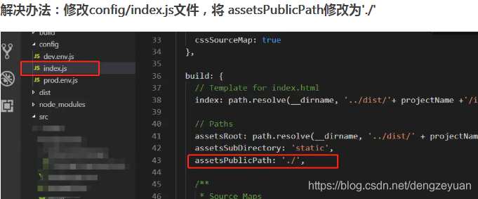
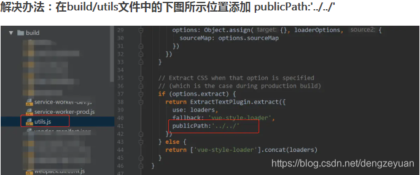

# vue打包 element-icons.woff 和element-icons.ttf 字体文件路径错误，导致icon图标显示成小方块的问题。

出现打包后icon图标变成小方块的原因只有两个

## 1.element-ui版本和element-ui/lib/theme-chalk/index.css版本不一致

解决办法：

卸载已经有的element-ui

npm uninstall element-ui

然后在安装新的

npm install element-ui

## 2.打包后的 element-icons.woff 和element-icons.ttf 字体文件路径错误

访问路径多了css/static/fonts/

结果就变成了dist/static/css/static/fonts/element-icons.535877f.woff  （错误路径）

