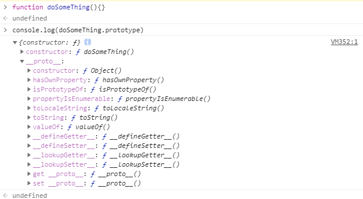

# 面向对象--原型

  javascript被称为一种基于原型的语言，每一个对象都拥有一个原型对象，每一个对象以其原型为模板，从原型继承方法和属性。每一个对象原型也可能拥有原型，从而一层一层的继承下去，形成名为原型链的关系


### 	1.使用原型

​	如图所示，每个对象或函数都有其对应的原型，在其中封装着默认的方法



​	能获取原型当然能往原型中添加一些方法或属性

```javascript
function doSomeThing(){}
//往原型上添加属性
doSomeThing.prototype.foo = 'bar'
```

​	结果如图所示：


​	在往原型中添加如属性后，在doSomeThing函数的原型中出现了名为foo的属性，然后通过new来将函数实例化，值得一提的是当函数通过new来实例化的时候，它会返回一个函数的实例化对象，因此可以往该对象上添加一些属性

```javascript
function doSomeThing(){}
doSomeThing.prototype.foo ='bar';
var showFunction = new doSomeThing();
//往对象上添加属性
showFunction.prop = 'some value'
console.log(showFunction)
```

结果如下：


这有什么用呢？

 其实这就是原型链的关键，首先说下当访问showFunction中的属性时浏览器搜索的流程

​	首先：浏览器会在showFunction中搜索是否拥有该属性，当拥有的时候返回该属性，没有则下一步

​	然后：当浏览器发现showFunction没有该属性时着会往showFunction的__proto\_\_中查找时候拥有该属性，如果拥有则返回，没有这继续往下一级的的 \_\_proto\_\_中查找

​	最后：查找到Object.prototype中，如果没有该属性这得出结论，该属性为underfined

```javascript
function doSomething(){}
doSomething.prototype.foo = "bar";
var showFunction = new doSomething();
showFunction.prop = "some value";
console.log("showFunction.prop:      " + showFunction.prop);
console.log("showFunction.foo:       " + showFunction.foo);
console.log("doSomething.prop:           " + doSomething.prop);
console.log("doSomething.foo:            " + doSomething.foo);
console.log("doSomething.prototype.prop: " + doSomething.prototype.prop);
console.log("doSomething.prototype.foo:  " + doSomething.prototype.foo);
```

​	结果如下：


​	

### 	2.理解原型对象

​		首先定义一个构造器函数

```javascript
function Person(first,last,age,gender,interests){
	this.name = first;
	this.age = age;
	this.gender = gender
	this.interests=interests
}
var person1 = new Person('Bob','Smith',32,'male',['music','game'])
```

​	浏览器将根据这个对象的可用的成员名称进行自动补全


这个列表中，可以看到定义在 `person1` 的原型对象、即 `Person()` 构造器中的成员—— `name`、`age`、`gender`、`interests`、`bio`、`greeting`。同时也有一些其他成员—— `watch`、`valueOf` 等等——这些成员定义在 `Person()` 构造器的原型对象、即 `Object` 之上。下图展示了原型链的运作机制。


 当person1调用Object中的方法是会发生什么呢

```javascript
person1.valueOf()

//返回结果
Person {name: "l", age: 24, gender: "male", interests: Array(1)}
```

这个方法仅仅返回了被调用对象的值。在这个例子中发生了如下过程：

- 浏览器首先检查，`person1` 对象是否具有可用的 `valueOf()` 方法。
- 如果没有，则浏览器检查 `person1` 对象的原型对象（即 `Person`构造函数的prototype属性所指向的对象）是否具有可用的 `valueof()` 方法。
- 如果也没有，则浏览器检查 `Person()` 构造函数的prototype属性所指向的对象的原型对象（即 `Object`构造函数的prototype属性所指向的对象）是否具有可用的 `valueOf()` 方法。这里有这个方法，于是该方法被调用。


### 	3.prototype 属性

​			prototype---继承成员被定义的地方

​			继承的属性和方法是定义在prototype属性之上的那些以**Object.prototype.**开头的属性，而并非以**Object.**开头的属性。`prototype` 属性的值是一个对象，我们希望被原型链下游的对象继承的属性和方法，都被储存在其中。

​		

​		create()

​			`create()` 实际做的是从指定原型对象创建一个新的对象。这里以 `person1` 为原型对象创建了 `person2` 对象。

​	例如

```javascript
var person2 = Object.create(person1)

person2._proto_
//获取到了person1对象
//{name: "l", age: 24, gender: "male", interests: Array(1)}
person2
//{}
person2.age
//24  -- 从person1中继承下来
```

### 	constructor 属性

​	每个实例对象都从原型中继承了一个constructor属性，该属性指向了用于构造此实例对象的构造函数

```javascript
person1.constructor
person2.constructor
```


