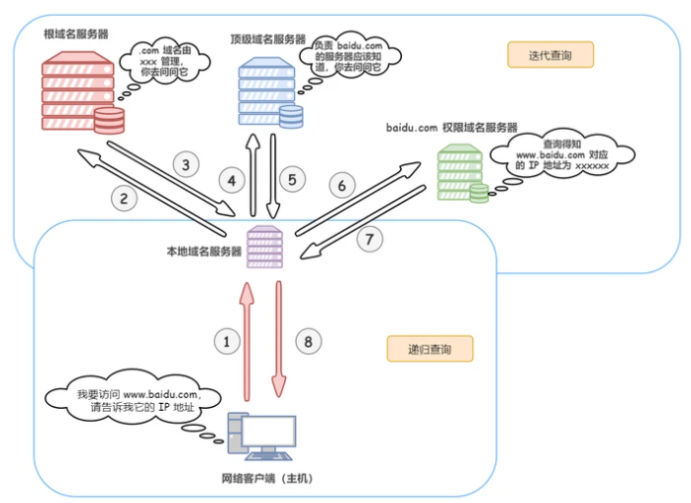
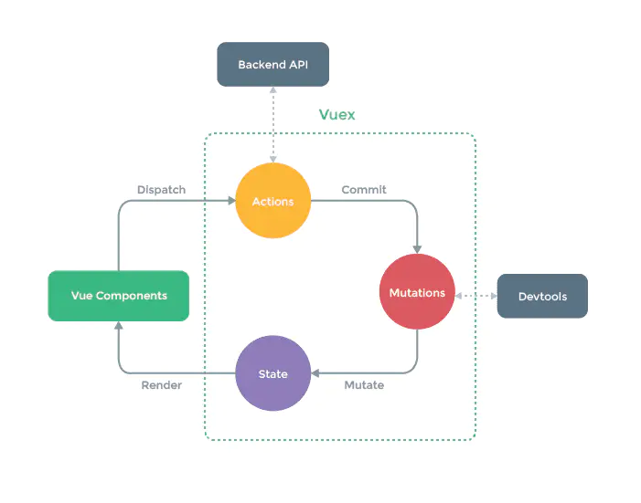

# Css篇

## 	了解盒模型吗

CSS盒模型本质上是一个盒子，封装周围的HTML元素，它包括：`外边距（margin）`、`边框（border）`、`内边距（padding）`、`实际内容（content）`四个属性。 CSS盒模型：**标准模型 + IE模型**

标准盒子模型：宽度=内容的宽度（content）+ border + padding

低版本IE盒子模型：宽度=内容宽度（content+border+padding），如何设置成 IE 盒子模型:

```css
box-sizing: border-box;
```


## 清除浮动有哪些方法？

不清楚浮动会发生高度塌陷：浮动元素父元素高度自适应（父元素不写高度时，子元素写了浮动后，父元素会发生高度塌陷）

- clear清除浮动（添加空div法）在浮动元素下方添加空div,并给该元素写css样式：{clear:both;height:0;overflow:hidden;}
- 给浮动元素父级设置高度
- 父级同时浮动（需要给父级同级元素添加浮动）
- 父级设置成inline-block，其margin: 0 auto居中方式失效
- 给父级添加overflow:hidden 清除浮动方法
- 万能清除法 after伪类 清浮动（现在主流方法，推荐使用）

```css
.float_div:after{
  content:".";
  clear:both;
  display:block;
  height:0;
  overflow:hidden;
  visibility:hidden;
}
.float_div{
  zoom:1
}
```

## CSS浮动怎么理解的

浮动的意义：设置了浮动属性的元素会脱离普通标准流的控制，移动到其父元素中指定的位置的过程，将块级元素放在一行，浮动会脱离标准流，不占位置，会影响标准流，浮动只有左右浮动，不会出现上下浮动

### **特性：**

**1、浮动的元素脱离了标准文档流，摆脱块级元素和行内元素的限制**

**2、浮动的元素存在相互贴靠的效果，当宽度不够的时候，会出现自动换行**

**3、浮动的元素虽然脱离了标准文档流，但是没有脱离文本流，出现被字包围的效果**

**4、浮动之后的元素会存在收缩的效果，当一个块级元素没有设置宽度的时，当块级元素浮动之后，就会失去高度**

**5、当父元素不设置高度的时候，多个子元素的高度和撑起了父元素的高度；当设置浮动后，子元素最高的高度撑起了父元素的高度。**


### **弊端：**

**1、高度塌陷**

**当子元素同时设置浮动后，父元素失去支撑，父元素的高度消失，缩成一条线。**

解决办法：在父元素失去高度，发生塌陷之后，可以给父元素添加高度或者设置overflow:hidden的方法进行解决高度塌陷的问题。

**2、页面结构的不稳定性，子元素浮动，导致标准文档流出现空白区域。**

解决办法：clear:both; 去进行解决，这也是称之为隔墙法。


## 绝对定位相对定位怎么理解

### 绝对定位 --absolute

脱离了标准文档流的

参照物：父元素，假如父元素没有就一直往上找，知道body

### 相对定位 --relative

没有脱离标准文档流

参照物：自身


## 块元素和行内元素什么区别

1.排布上

​	行内元素能能多个在一行显示

​	块元素独占一行

2.内容上

​	行内元素：文本或者其它行内元素 --无法包含块级元素

​	块级元素：包含行内元素和块级元素

3.属性上 -- 盒模型属性

​	行内元素设置width无效，height无效(可以设置line-height)，margin上下无效，padding上下无效


inline-block -- 行内块级元素

​	既具有 block 元素可以设置宽高的特性，同时又具有 inline 元素默认不换行的特性


## Css如何实现盒子水平垂直居中

- 利用定位+margin:auto
- 利用定位+margin:负值
- 利用定位+transform
- table布局 -- 不建议使用
- flex布局
- grid布局


## src和href的区别

**href**标识超文本引用，用在**link**和**a**等元素上，**href**是引用和页面关联，是在当前元素和引用资源之间建立联系

**src**表示引用资源，表示替换当前元素，用在**img**，**script**，**iframe**上，src是页面内容不可缺少的一部分。


## 常见的浏览器内核和前缀有哪些？微信的浏览器内核是什么

**谷歌**--以前是Webkit内核，现在是Blink内核。

**IE**--Trident内核

**火狐**--Gecko内核

**Safari** --Webkit内核

**Opera** -- 最初Presto内核，后来是Webkit，现在是Blink内核;

微信浏览器内核：X5 Blink内核

前缀：

WebKit内核   -webkit-

Gecko内核     -moz-

Trident内核     -ms-

Presto内核      -o-


## html5有哪些新特性、移除了那些元素？如何处理HTML5新标签的浏览器兼容问题？如何区分HTML和HTML5？ 

### 新特性

- 拖拽释放(Drag and drop) API 
- 语义化更好的内容标签（header,nav,footer,aside,article,section）
- 音频、视频API(audio,video)
- 画布(Canvas) API
- 地理(Geolocation) API
- 本地离线存储 localStorage 长期存储数据，浏览器关闭后数据不丢失；
- sessionStorage 的数据在浏览器关闭后自动删除
- 表单控件，calendar、date、time、email、url、search 
- 新的技术webworker, websocket, Geolocation

### 移除元素

纯表现的元素：basefont，big，center，font, s，strike，tt，u；

对可用性产生负面影响的元素：frame，frameset，noframes；

### 如何处理

支持HTML5新标签：
IE8/IE7/IE6支持通过document.createElement方法产生的标签，
可以利用这一特性让这些浏览器支持HTML5新标签，
浏览器支持新标签后，还需要添加标签默认的样式；

当然最好的方式是直接使用成熟的框架、使用最多的是html5shim框架

```html
   <!--[if lt IE 9]> 
   <script> src="http://html5shim.googlecode.com/svn/trunk/html5.js"</script> 
   <![endif]--> 
```

### 如何区分

DOCTYPE声明\新增的结构元素\功能元素

## 语义化标签、作用

语义化标签--简单明了地知道该标签的作用

作用：

1. 有利于SEO，搜索引擎根据标签来确定上下文和各个关键字的权重
2. 有利于开发和维护，语义化更具可读性，代码更好维护，与CSS3关系更和谐。
3. 易于用户阅读，样式丢失的时候能让页面呈现清晰的结构。
4. 兼容性更好，支持更多的网络设备

## Css3动画有哪些

1. transition 实现渐变动画

2. transform 转变动画

   translate：位移

   scale：缩放

   rotate：旋转

   skew：倾斜

   配合`transition`过度使用

   transform`不支持`inline`元素，使用前把它变成`block

3. animation 实现自定义动画

   通过@keyframes定义关键帧

   ```css
   
   @keyframes rotate{
       0%{
           transform: rotate(0deg);
       }
       50%{
           transform: rotate(180deg);
       }
       100%{
           transform: rotate(360deg);
       }
   }
   animation: rotate 2s;
   ```

   

## CSS预处理器

sass、less、stylus

特性：

- 变量

  ```css
  sass
  $mainColor: #0982c1;
  
  less
  @mainColor: #0982c1;
  
  Stylus
  Stylus对变量名没有任何限定但不能用@开头
  mainColor = #0982c1
  siteWidth = 1024px
  $borderStyle = dotted
  ```

- 作用域	

- 混合(Mixins)

  ```css
  sass
  @mixin error($borderWidth:2px){
    border:$borderWidth solid #f00;
    color: #f00;
  }
  /*调用error Mixins*/
  .generic-error {
    @include error();/*直接调用error mixins*/
  }
  
  less
  /*声明一个Mixin叫作“error”*/
  .error(@borderWidth:2px){
    border:@borderWidth solid #f00;
    color: #f00;
  }
  /*调用error Mixins*/
  .generic-error {
    .error();/*直接调用error mixins*/
  }
  
  Stylus
  /*声明一个Mixin叫作“error”*/
  error(borderWidth=2px){
    border:borderWidth solid #f00;
    color: #f00;
  }
  /*调用error Mixins*/
  .generic-error {
    error();/*直接调用error mixins*/
  }
  ```

- 嵌套（Nesting）


通过import导入文件

```css
@import "reset.css";
```


## CSS优化、提高性能的方法有哪些？

- 合并css文件，减少css文件数量
- 减少嵌套，最好不要大于三层
- 不在ID选择器钱进行嵌套，浪费性能
- 建立公共样式类，比如flex、清除浮动等
- 减少通配符*或者类似[hidden="true"]这类选择器的使用
- 灵活运用css的继承机制
- 拆分出公共css文件
- 不用css表达式
- 减少css的重置
- 图片使用雪碧图、精灵图等
- css压缩
- GZIP压缩

## 让Chrome支持小于12px的文字

针对chrome浏览器,加webkit前缀，用transform:scale()这个属性进行放缩.

```css
span{
    font-size: 12px;
    display: inline-block;
    -webkit-transform:scale(0.8);
}
```

## CSS3有哪些新特性

新增选择器 p:nth-child（n）{color: rgba（255, 0, 0, 0.75）}

弹性盒模型 display: flex;

多列布局 column-count: 5;

媒体查询 @media （max-width: 480px） {.box: {column-count: 1;}}

个性化字体 @font-face{font-family:BorderWeb;src:url（BORDERW0.eot）；}

颜色透明度 color: rgba（255, 0, 0, 0.75）；

圆角 border-radius: 5px;

渐变 background:linear-gradient（red, green, blue）；

阴影 box-shadow:3px 3px 3px rgba（0, 64, 128, 0.3）；

倒影 box-reflect: below 2px;

文字装饰 text-stroke-color: red;

文字溢出 text-overflow:ellipsis;

背景效果 background-size: 100px 100px;

边框效果 border-image:url（bt_blue.png） 0 10;

旋转 transform: rotate（20deg）；

倾斜 transform: skew（150deg, -10deg）；

位移 transform:translate（20px, 20px）；

缩放 transform: scale（。5）；

平滑过渡 transition: all .3s ease-in .1s;

动画 @keyframes anim-1 {50% {border-radius: 50%;}} animation: anim-1 1s;

## ::before和:after中双冒号和单冒号有什么区别

单冒号(:)用于CSS3伪类，双冒号(::)用于CSS3伪元素。

伪类是选择器的一种，它用于选择处于特定状态的元素

伪元素像往标记文本中加入全新的HTML元素一样


## 响应式布局

响应式布局（Responsive design），意在实现不同屏幕分辨率的终端上浏览网页的不同展示方式。

### 步骤

#### 1. 设置 Meta 标签

```
<meta name="viewport" content="width=device-width, initial-scale=1, maximum-scale=1, user-scalable=no">
```

#### 2. 通过媒介查询来设置样式 Media Queries

```css
@media screen and (max-width: 980px) {
  #head { … }
  #content { … }
  #footer { … }
}
```

#### 3. 设置多种试图宽度

```css
/** iPad **/
@media only screen and (min-width: 768px) and (max-width: 1024px) {}
/** iPhone **/
@media only screen and (min-width: 320px) and (max-width: 767px) {}
```


## 各种兼容性的处理方法

### **不同浏览器的标签默认的样式**

```css
*{ margin: 0; padding: 0; }
```

### **IE6 双倍边距的问题**

设置 ie6 中设置浮动，同时又设置 margin，会出现双倍边距的问题

```css
display: inline;
```

### **解决 IE9 以下浏览器不能使用 opacity**

```css
opacity: 0.5;
filter: alpha(opacity = 50);
filter: progid:DXImageTransform.Microsoft.Alpha(style = 0, opacity = 50);
```

### **图片默认有间距**

使用float属性为img布局

###  **li之间有间距**

解决方法：li 设置vertical-align:middle;


## link和@import的区别

1. link是XHTML标签，除了加载CSS外，还可以定义RSS等其他事务；@import属于CSS范畴，只能加载CSS。
2. link引用CSS时，在页面载入时同时加载；@import需要页面网页完全载入以后加载。
3. link是XHTML标签，无兼容问题；@import是在CSS2.1提出的，低版本的浏览器不支持。
4. ink支持使用Javascript控制DOM去改变样式；而@import不支持。


# JavaScript篇

##  Ajax同步和异步怎么理解的

### 区别：

ajax异步请求：异步请求就当发出请求的同时，浏览器可以继续做任何事，Ajax发送请求并不会影响页面的加载与用户的操作，相当于是在两条线上，各走各的，互不影响。

ajax同步请求：同步请求即是当前发出请求后，浏览器什么都不能做，必须得等到请求完成返回数据之后，才会执行后续的代码。

### 同步与异步适用的场景

看需要的请求的数据是否是程序继续执行必须依赖的数据


## Js面相对象是怎么理解的 

### 特性：

- 封装性
- 继承性
- [多态性]抽象


### 设计思想：

- 抽象出 Class(构造函数)
- 根据 Class(构造函数) 创建 Instance
- 指挥 Instance 得结果


### 创建对象：

#### 简单方式

直接通过 `new Object()` 创建：

```js
var person = new Object()
person.name = 'Jack'
person.age = 18

person.sayName = function () {
  console.log(this.name)
}
```

缺点：代码太过冗余，复用性低

#### 工厂函数

```js
function createPerson (name, age) {
  return {
    name: name,
    age: age,
    sayName: function () {
      console.log(this.name)
    }
  }
}
```

生成实例对象：

```js
var p1 = createPerson('Jack', 18)
var p2 = createPerson('Mike', 18)
```

缺点：却没有解决对象识别的问题

#### 构造函数

```js
function Person (name, age) {
  this.name = name
  this.age = age
  this.sayName = function () {
    console.log(this.name)
  }
}

var p1 = new Person('Jack', 18)
p1.sayName() // => Jack

var p2 = new Person('Mike', 23)
p2.sayName() // => Mike
```

缺点：耗内存

优化： 原型 ,**把所有对象实例需要共享的属性和方法**直接定义在 `prototype` 对象上


```js
function Person (name, age) {
  this.name = name
  this.age = age
}

console.log(Person.prototype)

Person.prototype.type = 'human'

Person.prototype.sayName = function () {
  console.log(this.name)
}

var p1 = new Person(...)
var p2 = new Person(...)

console.log(p1.sayName === p2.sayName) // => true

```

## apply和call的区别 

### 定义：

**重新定义函数的执行环境**，也就是`this`的指向

### 语法：

#### call()

调用一个对象的方法，**用另一个对象替换当前对象**，可以继承另外一个对象的属性

```js
Function.call(obj[, param1[, param2[, [,...paramN]]]]);
```

- `obj`：这个对象将代替`Function`类里`this`对象
- `params`：一串参数列表

#### apply()

```js
Function.apply(obj[, argArray]);
```

- `obj`：这个对象将代替`Function`类里`this`对象
- `argArray`：这个是数组，它将作为参数传给`Function`

### 不同点

**接收参数的方式不同**：

- **apply()方法**接收两个参数，一个是函数运行的作用域（`this`），另一个是参数数组。
- **call()方法**不一定接受两个参数，第一个参数也是函数运行的作用域（`this`），但是传递给函数的参数必须列举出来。


## 跨域请求是怎么理解的

同源策略是浏览器的一个安全限制，从一个源加载的文档或者脚本默认不能访问另一个源的资源。

协议(http/https)，端口(8080/8090)或者域名

解决方案：

- CORS
- jsonp跨域
- 代理服务器

## 内存泄露情况

### 垃圾回收机制

原理：垃圾收集器会定期（周期性）找出那些不在继续使用的变量，然后释放其内存

- 标记清除

  垃圾回收程序运行的时候，会标记内存中存储的所有变量。然后，它会将所有在上下文中的变量，以及被在上下文中的变量引用的变量的标记去掉

- 引用计数

  语言引擎有一张"引用表"，保存了内存里面所有的资源（通常是各种值）的引用次数。次数是`0`，就表示这个值不再用到了

### 内存泄露情况

- 全局变量
- 定时器
- 闭包
- 没有清理对`DOM`元素的引用 -- 事件监听


## 一次完整的HTTP事务是怎样的一个过程

### 简单分析

从输入 `URL`到回车后发生的行为如下：

- URL解析
- DNS 查询
- TCP 连接
- HTTP 请求
- 响应请求
- 页面渲染

### 详细分析

#### URL解析

判断你输入的是一个合法的`URL` 还是一个待搜索的关键词，并且根据你输入的内容进行对应操作

####  DNS查询



获取到了域名对应的目标服务器`IP`地址

#### TCP连接

在确定目标服务器服务器的`IP`地址后，则经历三次握手建立`TCP`连接

#### 发送 http 请求

当建立`tcp`连接之后，就可以在这基础上进行通信，浏览器发送 `http` 请求到目标服务器

请求的内容包括：

- 请求行
- 请求头
- 请求主体

#### 响应请求

当服务器接收到浏览器的请求之后，就会进行逻辑操作，处理完成之后返回一个`HTTP`响应消息，包括：

- 状态行
- 响应头
- 响应正文

#### 页面渲染

当浏览器接收到服务器响应的资源后，首先会对资源进行解析：

- 查看响应头的信息，根据不同的指示做对应处理，比如重定向，存储cookie，解压gzip，缓存资源等等
- 查看响应头的 Content-Type的值，根据不同的资源类型采用不同的解析方式

关于页面的渲染过程如下：

- 解析HTML，构建 DOM 树
- 解析 CSS ，生成 CSS 规则树
- 合并 DOM 树和 CSS 规则，生成 render 树
- 布局 render 树（ Layout / reflow ），负责各元素尺寸、位置的计算
- 绘制 render 树（ paint ），绘制页面像素信息
- 浏览器会将各层的信息发送给 GPU，GPU 会将各层合成（ composite ），显示在屏幕上


## 如何阻止事件冒泡和默认事件

### **阻止事件冒泡**

stopPropagation()

```js
md.onclick = function() {
    alert("我是中间的盒子md");
    event.stopPropagation();
};
```

IE8一下，有一个cancelBubble属性

```js
var e = window.event || event;
if(document.all) {
    e.cancelBubble = true;
}else {
    e.stopPropagation();
}
```

### **阻止默认事件**

preventDefault()方法

IE事件对象有一个属性returnValue，默认是true，当将其设置为false时，则可以取消事件默认行为

```js
function cancelHandler(event) {
    var e = window.event || event;
    if(document.all) {
        e.returnValue = false;
    }
    else {
        e.preventDefault();
    }
}

```


## 解释jsonp的原理，以及为什么不是真正的ajax

### **原理**

**动态创建script标签，回调函数**

### **为什么不是ajax**

ajax的核心是通过XmlHttpRequest获取非本页内容

jsonp的核心则是动态添加<script>标签来调用服务器提供的js脚本


## javascript实现继承的方式有哪些

1. 原型链继承；将父类的实例作为子类的原型。
2. 构造继承；使用父类的构造函数来增强子类实例。
3. 实例继承；为父类实例添加新特性，作为子类实例返回。
4. 拷贝继承。
5. 组合继承。
6. 寄生组合继承

参照：[继承的多种方式以及优缺点](E:\随手笔记\前端基本知识点\深入专题\继承的多种方式和优缺点.md)


## js创建对象的几种方式

1. `{}`
2. `new Ｏbject()`
3. 使用字面量
4. 工厂模式
5. 构造函数模式（constructor）
6. 原型模式（prototype）
7. 构造函数+原型模式

参照：[创建对象的多种方式以及优缺点](E:\随手笔记\前端基本知识点\深入专题\创建对象的多种方式以及优缺点.md)


## jQuery的优势

1. **轻量级；**

    jQuery非常轻巧，采用`UglifyJS`压缩后，大小保持在30kb左右；

2. **强大的选择器；**

   允许开发者使用从CSS1到CSS3 几乎所有的选择器，以及jQuery独创的高级而复杂的选择器。

3. **出色的DOM操作的封装；**

4. **可靠的事件处理机制；**

5. **完善的Ajax；**

   jQuery将所有的Ajax操作封装到一个函数 $.ajax() 里,无需关心复杂的浏览器兼容性和XMLHttpRequest对象的创建和使用的问题；

6. **不污染顶级变量**

    jQuery只建立一个名为jQuery的对象，其所有的函数方法都在这个对象之下。其别名$也可以随时交出控制权，绝对不会污染其他的对象。

7. **出色的浏览器兼容性；** 

   jQuery能够在IE 6.0+、FF 3.6+、Safari 5.0+、Opera 和 Chrome等浏览器下正常运行

8. **链式操作方式；** 

9. **隐式迭代；**

   jQuery里的方法都被设计成自动操作对象集合，而不是单独的对象，这使得大量的循环结构变得不再必要，从而大幅减少了代码量

10. **行为层与结构层的分离；**

11. **丰富的插件支持；**

12. **完善的文档；**

13. **开源；** 

# 原理篇：

## 怎么看待Web App 、hybrid App、Native App？

### **app的分类**

大致可以分为这3种：

- native app（原生app）
- web app
- hybrid app（混合app）

### **优缺点**

#### **native app**

 **优点：**

- 提供最佳用户体验，最优质的用户界面，流畅的交互
- 可以访问本地资源
- 可以调用移动硬件设备，比如摄像头、麦克风等

**缺点：**

- 开发成本高。每种移动操作系统都需要独立的开发项目，针对不同平台提供不同体验；
- 发布新版本慢。下载是用户控制的，很多用户不愿意下载更新（比如说，版本发布到了3.0，但还是有很多1.0的用户，你可能就得继续维护1.0版本的API）
- 应用商店发布审核周期长。安卓平台大概要1~3天，而iOS平台需要的时间更长


#### **web app**

**优点：**

- 不需要安装包，节约手机空间
- 整体量级轻，开发成本低
- 不需要用户进行手动更新，由应用开发者直接在后台更新，推送到用户面前的都是全新版本，更便于业务的开展
- 基于浏览器，可以跨平台使用

**缺点：**

- 页面跳转费力，不稳定感更强。在网速受到限制时，很多时候出现卡顿或者卡死现象，交互效果受到限制
- 安全性相对较低，数据容易泄露或者被劫持。


#### **Hybrid app**

集合了两种App各自的优势

1. 在实现更多功能的前提下，使得App安装包不至于过大。
2. 在应用内部打开Web网页，省去了跳转浏览器的麻烦。
3. 主要功能区相对稳定下，增加的功能区采用Web形式，使得迭代更加方便。
4. Web页面在用户设置不同的网络制式时会以不同的形式呈现。。


## 模块化开发如何理解的

其实就是封装细节，提供使用接口，彼此之间互不影响，每个模块都是实现某一特定的功能，同时也需要避免全局变量的污染，最初通过函数实现模块，实际上是利用了函数的局部作用域来形成模块。

### 模块化规范

#### CommonJS

根据这个规范，每个文件就是一个模块，有自己的作用域。在一个文件里面定义的变量、函数、类，都是私有的，对其他文件不可见。`CommonJS`规范规定，每个模块内部，`module`变量代表当前模块。这个变量是一个对象，它的`exports`属性是对外的接口。

`CommonJS`规范通过`require`导入，`module.exports`与`exports`进行导出。


#### AMD

`CommonJS`规范引入模块是同步加载的，这对服务端不是问题，因为其模块都存储在硬盘上，可以等待同步加载完成，但在浏览器中模块是通过网络加载的，若是同步阻塞等待模块加载完成，则可能会出现浏览器页面假死的情况

`AMD`采用异步方式加载模块，模块的加载不影响它后面语句的运行

```js
define(['moduleA', 'moduleB', 'moduleC'], function (moduleA, moduleB, moduleC){
    // do something
    return {};
});
```

#### CMD

`CMD`通用模块定义，是`SeaJS`在推广过程中对模块定义的规范化产出，也是浏览器端的模块化异步解决方案


## 对Vue的理解 

Vue.js 是一套构建用户界面的渐进式框架。与其他重量级框架不同的是，Vue 采用自底向上增量开发的设计。

渐进式 -- 阶梯式向前，vue是轻量级的，它有很多独立的功能或库，能根据不同的需求使用不同的功能

渐进式表现：声明式渲染——组件系统——客户端路由——-大数据状态管理——-构建工具

### 核心点:

- 响应式数据绑定
- 组合的视图组件


## Vuejs特点

1. 轻量级的框架

2. 双向数据绑定

3. 指令系统

4. 组件化

5. 客户端路由

6. 状态管理

## vue、angular有什么区别？

### Vue和React的区别

#### 共同点

- 数据驱动视图
- 组件化
- 都使用 `Virtual DOM`

#### 不同点

1. 核心思想不同

   vue：`灵活易用的渐进式框架，进行数据拦截/代理，它对侦测数据的变化更敏感、更精确`。

   React推崇函数式编程（纯组件），数据不可变以及单向数据流

2. 组件写法差异

   React推荐的做法是`JSX + inline style`, 也就是把 HTML 和 CSS 全都写进 JavaScript 中

   Vue 推荐的做法是 template 的单文件组件格式

3. diff算法不同

   两者流程思路上是类似的：

   - 不同的组件产生不同的 DOM 结构。当type不相同时，对应DOM操作就是直接销毁老的DOM，创建新的DOM。
   - 同一层次的一组子节点，可以通过唯一的 key 区分

4. 响应式原理不同

   Vue

   ​	Vue依赖收集，自动优化，数据可变。

   ​	Vue递归监听data的所有属性,直接修改。

   ​	当数据改变时，自动找到引用组件重新渲染。

   React

   ​	React基于状态机，手动优化，数据不可变，需要setState驱动新的state替换老的state。当数据改变时，以组件为根目录，默认全部重新渲染, 所以 React 中会需要 shouldComponentUpdate 这个生命周期函数方法来进行控制


## MVVM MVC MVP 之前的区别

### MVC 编程模式

MVC 是一种使用 MVC（Model View Controller 模型-视图-控制器）设计创建 Web 应用程序的模式

#### 组成部分

- Model（模型）表示应用程序核心（如数据库）。
- View（视图）显示效果（HTML页面）。
- Controller（控制器）处理输入（业务逻辑）。

MVC 模式同时提供了对 HTML、CSS 和 JavaScript 的完全控制。

**Model（模型）**是应用程序中用于处理应用程序数据逻辑的部分。
 　通常模型对象负责在数据库中存取数据。

**View（视图）**是应用程序中处理数据显示的部分。
 　通常视图是依据模型数据创建的。

**Controller（控制器）**是应用程序中处理用户交互的部分。
 　通常控制器负责从视图读取数据，控制用户输入，并向模型发送数据。

#### 优点

1. **耦合性低**
2. **重用性高**
3. **生命周期成本低**
4. **部署快**
5. **可维护性高**
6. **有利软件工程化管理**

#### 缺点

1. **没有明确的定义**
2. **不适合小型，中等规模的应用程序**
3. **增加系统结构和实现的复杂性**
4. **视图与控制器间的过于紧密的连接**
5. **视图对模型数据的低效率访问**
6. **一般高级的界面工具或构造器不支持模式**

### MVP模式

MVP 是从经典的模式MVC演变而来，它们的基本思想有相通的地方Controller/Presenter负责逻辑的处理，Model提供数据，View负责显示。

#### 优点

1、模型与视图完全分离，我们可以修改视图而不影响模型

2、可以更高效地使用模型，因为所有的交互都发生在一个地方——Presenter内部

3、我们可以将一个Presenter用于多个视图，而不需要改变Presenter的逻辑。这个特性非常的有用，因为视图的变化总是比模型的变化频繁。

4、如果我们把逻辑放在Presenter中，那么我们就可以脱离用户接口来测试这些逻辑（单元测试）

#### 缺点

由于对视图的渲染放在了Presenter中，所以视图和Presenter的交互会过于频繁。还有一点需要明白，如果Presenter过多地渲染了视图，往往会使得它与特定的视图的联系过于紧密。一旦视图需要变更，那么Presenter也需要变更了。比如说，原本用来呈现Html的Presenter现在也需要用于呈现Pdf了，那么视图很有可能也需要变更。

### MVVM框架

它本质上就是MVC 的改进版。MVVM 就是将其中的View 的状态和行为抽象化，让我们将视图 UI 和业务逻辑分开。

#### 组成部分

- Model：模型层，负责处理业务逻辑以及和服务器端进行交互--服务器请求
- View：视图层，负责将数据模型转化为UI展示出来，可以简单的理解为HTML页面 --视图
- ViewModel：视图模型层，用来连接Model和View，是Model和View之间的通信桥梁 -- JS、数据，对数据进行二次封装


**Model（模型）**是指代表真实状态内容的领域模型（面向对象），或指代表内容的数据访问层（以数据为中心）。

**View（视图）**就像在MVC和MVP模式中一样，视图是用户在屏幕上看到的结构、布局和外观（UI）

**ViewModel（*视图模型*）**是暴露公共属性和命令的视图的抽象。MVVM没有MVC模式的控制器，也没有MVP模式的presenter，有的是一个*绑定器*。在视图模型中，绑定器在视图和数据绑定器之间进行通信。

#### 优点

**1. 低耦合**。视图（View）可以独立于Model变化和修改，一个ViewModel可以绑定到不同的"View"上，当View变化的时候Model可以不变，当Model变化的时候View也可以不变。

**2. 可重用性**。你可以把一些视图逻辑放在一个ViewModel里面，让很多view重用这段视图逻辑。

**3. 独立开发**。开发人员可以专注于业务逻辑和数据的开发（ViewModel），设计人员可以专注于页面设计，使用Expression Blend可以很容易设计界面并生成xaml代码。

**4. 可测试**。界面素来是比较难于测试的，而现在测试可以针对ViewModel来写


## vue是如何实现响应式数据的呢？（响应式数据原理）

### VUE 2.0

通过`Object.defineProperty`重新定义data中所有的属性，简单来说就是通过遍历所有data的数据，并设置其setting和geting属性来实现监听数据的变化

但是这种方式具有极大的局限性，由于 JavaScript 的限制，Vue **不能检测**数组和对象的变化。

- 对于对象 无法监听对象的删除和添加
- 对于数组 利用索引直接设置一个数组项以及修改数组的长度时无法检测到数组的变化

不止如此，Object.defineProperty通过遍历所有的属性，当数据量一大起来，加载速度就无比的慢。

还有，由于Object.defineProperty是监听所有属性的变化，那么如果数据量巨大的话，所占的内存也会无比的多

### VUE 3.0

**Proxy** 对象用于创建一个对象的代理，从而实现基本操作的拦截和自定义（如属性查找、赋值、枚举、函数调用等）。

也就是无论访问对象的什么属性，之前定义的或是新增的属性，都会走到拦截中进行处理。这就解决了之前所无法监听的问题


## Vue的生命周期

### **什么时候被调用**

- beforeCreate ：实例初始化之后，数据观测之前调用
- created：实例创建完之后调用。实例完成：数据观测、属性和方法的运算、` watch/event` 事件回调。无` $el` .
- beforeMount：挂在开始之前被调用，相关的render函数首次被调用（虚拟DOM），实例已完成以下的配置： 编译模板，把data里面的数据和模板生成html，完成了el和data 初始化，注意此时还没有挂在html到页面上
- mounted：挂在完成，也就是模板中的HTML渲染到HTML页面中，此时一般可以做一些ajax操作，mounted只会执行一次。。
- beforeUpdate：数据更新前调用，发生在虚拟DOM重新渲染和打补丁，在这之后会调用改钩子。
- updated：由于数据更改导致的虚拟DOM重新渲染和打补丁，在这之后会调用改钩子。
- beforeDestroy：实例销毁前调用，实例仍然可用。
- destroyed：实例销毁之后调用，调用后，Vue实例指示的所有东西都会解绑，所有事件监听器和所有子实例都会被移除

### **每个生命周期内部可以做什么？**

- created：实例已经创建完成，因为他是最早触发的，所以可以进行一些数据、资源的请求。
- mounted：实例已经挂载完成，可以进行一些DOM操作。
- beforeUpdate：可以在这个钩子中进一步的更改状态，不会触发重渲染。
- updated：可以执行依赖于DOM的操作，但是要避免更改状态，可能会导致更新无线循环。
- destroyed：可以执行一些优化操作，清空计时器，解除绑定事件。

### **ajax放在哪个生命周期？**

一般放在` mounted` 中，保证逻辑统一性，因为生命周期是同步执行的，` ajax` 是异步执行的。单数服务端渲染 ` ssr` 同一放在` created` 中，因为服务端渲染不支持` mounted` 方法。

###  **什么时候使用beforeDestroy？**

当前页面使用` $on` ，需要解绑事件。清楚定时器。解除事件绑定，` scroll mousemove` 。


## Vue组件通信

### 1.prop/$emit

父组件：通过`prop`的方式向子组件传递数据

子组件：通过`$emit`可以向父组件通信。

优点：

​	传值取值方便简洁明了

缺点：

1. 由于数据是单向传递，如果子组件需要改变父组件的props值每次需要给子组件绑定对应的监听事件。
2. 如果父组件需要给孙组件传值，需要子组件进行转发，较为不便。


### 2.$parent/$children

在子组件中通过`$parent`调用了父组件的函数，并在父组件通过`$children`获取子组件实例的数组

### 3.provide/inject

父组件中通过provide来提供变量, 然后再子组件中通过inject来注入变量。这里inject注入的变量不像`$attrs`，只能向下一层；inject不论子组件嵌套有多深，都能获取到。

### 4.$attrs/$listeners

跨一级传输数据

### 5.vuex

vuex实现了单向的数据流，在全局定义了一个State对象用来存储数据，当组件要修改State中的数据时，必须通过Mutation进行操作。

### 6.$refs

用在子组件上，获取的就是组件的实例对象。获取组件实例，调用组件的属性、方法

###  7.Event Bus

跨组件通信` Event Bus` （Vue.prototype.bus = new Vue）其实基于*b**u**s*=*n**e**w**V**u**e*）其实基于on与$emit

### 常见使用场景分为以下三类:

- 父子组件通信: props; $parent/$children; provide/inject; $ref; $attrs/$listeners
- 兄弟组件通信: EventBus; Vuex
- 跨级通信: EventBus; Vuex; provide/inject; $attrs/$listeners


## diff算法

`diff` 算法是一种通过同层的树节点进行比较的高效算法

特点：

- 比较只会在同层级进行, 不会跨层级比较
- 在diff比较的过程中，循环从两边向中间比较

`diff` 算法的在很多场景下都有应用，在 `vue` 中，作用于虚拟 `dom` 渲染成真实 `dom` 的新旧 `VNode` 节点比较

### 比较方式：

深度优先，同层比较

1. 比较只会在同层级进行, 不会跨层级比较

1. 比较的过程中，循环从两边向中间收拢


## vue-router有哪几种导航钩子？

### **全局导航钩子**

- **router.beforeEach(to, from, next): 路由改变前的钩子**

- **router.beforeResolve : 在导航被确认之前，同时在所有组件内守卫和异步路由组件被解析之后，该钩子函数就被调用**

- **router.afterEach : 路由改变后的钩子**


### **路由独享钩子**

```js
cont router = new Router({
   routes: [
       {
           path: '/file',
           component: File,
           beforeEnter: (to, from ,next) => {
               // do someting
           }
       }
   ]
});
```

### **组件内的导航钩子**

**beforeRouteEnter 在进入当前组件对应的路由前调用** --不能获取组件实例 this

**beforeRouteUpdate 在当前路由改变，但是该组件被复用时调用** -- 正常获取组件实例 this

**beforeRouteLeave 在离开当前组件对应的路由前调用** -- 正常获取组件实例 this


## 自定义指令directive， 它有哪些钩子函数?

### 如何实现

全局注册注册主要是用过`Vue.directive`方法进行注册

`Vue.directive`第一个参数是指令的名字（不需要写上`v-`前缀），第二个参数可以是对象数据，也可以是一个指令函数

```js
// 注册一个全局自定义指令 `v-focus`
Vue.directive('focus', {
  // 当被绑定的元素插入到 DOM 中时……
  inserted: function (el) {
    // 聚焦元素
    el.focus()  // 页面加载完成之后自动让输入框获取到焦点的小功能
  }
})
```

```js
directives: {
  focus: {
    // 指令的定义
    inserted: function (el) {
      el.focus() // 页面加载完成之后自动让输入框获取到焦点的小功能
    }
  }
}
```

### 钩子函数：

- `bind`：只调用一次，指令第一次绑定到元素时调用。在这里可以进行一次性的初始化设置
- `inserted`：被绑定元素插入父节点时调用 (仅保证父节点存在，但不一定已被插入文档中)
- `update`：所在组件的 `VNode` 更新时调用，但是可能发生在其子 `VNode` 更新之前。指令的值可能发生了改变，也可能没有。但是你可以通过比较更新前后的值来忽略不必要的模板更新
- `componentUpdated`：指令所在组件的 `VNode` 及其子 `VNode` 全部更新后调用
- `unbind`：只调用一次，指令与元素解绑时调用

#### 参数

- `el`：指令所绑定的元素，可以用来直接操作 `DOM`
- `binding`：一个对象，包含以下`property`：
  - `name`：指令名，不包括 `v-` 前缀。
  - `value`：指令的绑定值，例如：`v-my-directive="1 + 1"` 中，绑定值为 `2`。
  - `oldValue`：指令绑定的前一个值，仅在 `update` 和 `componentUpdated` 钩子中可用。无论值是否改变都可用。
  - `expression`：字符串形式的指令表达式。例如 `v-my-directive="1 + 1"` 中，表达式为 `"1 + 1"`。
  - `arg`：传给指令的参数，可选。例如 `v-my-directive:foo` 中，参数为 `"foo"`。
  - `modifiers`：一个包含修饰符的对象。例如：`v-my-directive.foo.bar` 中，修饰符对象为 `{ foo: true, bar: true }`
- `vnode`：`Vue` 编译生成的虚拟节点
- `oldVnode`：上一个虚拟节点，仅在 `update` 和 `componentUpdated` 钩子中可用

## VueX

定义：状态管理器，统一管理和维护各个vue组件的可变化状态

五个核心概念，`state`, `getters`, `mutations`, `actions`, `modules`。

- state 存放状态

- mutations state成员操作

  `mutations`是操作`state`数据的方法的集合，比如对该数据的修改、增加、删除等等。

  ```js
   state:{
          name:'helloVueX'
      },
      mutations:{
          //es6语法，等同edit:funcion(){...}
          edit(state，payload){
              state.name = payload
          }
      }
  ```

  使用：

  ```js
  this.$store.commit('edit',"666")
  ```

- getters 加工state成员给外界

  Getters中的方法有两个默认参数

  - state 当前VueX对象中的状态对象
  - getters 当前getters对象，用于将getters下的其他getter拿来用

  ```js
  getters:{
      nameInfo(state){
          return "姓名:"+state.name
      },
      fullInfo(state,getters){
          return getters.nameInfo+'年龄:'+state.age
      }  
  }
  ```

  ```js
  this.$store.getters.fullInfo
  ```

- actions 异步操作

  两个默认参数

  - `context` 上下文(相当于箭头函数中的this)对象
  - `payload` 挂载参数

  ```js
  actions:{
      aEdit(context,payload){
          setTimeout(()=>{
              context.commit('edit',payload)
          },2000)
      }
  }
  ```

  ```js
  this.$store.dispatch('aEdit',{age:15})
  ```

- modules 模块化状态管理



### **vuex的State特性是？**

1. Vuex就是一个仓库，仓库里面放了很多对象。其中state就是数据源存放地，对应于与一般Vue对象里面的data
2. state里面存放的数据是响应式的，Vue组件从store中读取数据，若是store中的数据发生改变，依赖这个数据的组件也会发生更新
3. 它通过mapState把全局的 state 和 getters 映射到当前组件的 computed 计算属性中


### **vuex的Getter特性是？**

1. getters 可以对State进行计算操作，它就是Store的计算属
2. 虽然在组件内也可以做计算属性，但是getters 可以在多组件之间复用
3. 如果一个状态只在一个组件内使用，是可以不用getters


### **vuex的Action 特性是?**

Action 类似于 mutation，不同在于：

- Action 提交的是 mutation，而不是直接变更状态。
- Action 可以包含任意异步操作


### **Vue.js中ajax请求代码应该写在组件的methods中还是vuex的actions中**

如果请求来的数据是不是要被其他组件公用，仅仅在请求的组件内使用，就不需要放入vuex 的state里。

如果被其他地方复用，这个很大几率上是需要的，如果需要，请将请求放入action里，方便复用，并包装成promise返回，在调用处用async await处理返回的数据。如果不要复用这个请求，那么直接写在vue文件里很方便。


### **不用Vuex会带来什么问题？**

1. 可维护性会下降，你要想修改数据，你得维护三个地方
2. 可读性会下降，因为一个组件里的数据，你根本就看不出来是从哪来的
3. 增加耦合，大量的上传派发，会让耦合性大大的增加，本来Vue用Component就是为了减少耦合，现在这么用，和组件化的初衷相背。

但兄弟组件有大量通信的，建议一定要用，不管大项目和小项目，因为这样会省很多事


### 使用Vuex只需执行 `Vue.use(Vuex)`，并在Vue的配置中传入一个store对象的示例，store是如何实现注入的

`Vue.use(Vuex)` 方法执行的是install方法，它实现了Vue实例对象的init方法封装和注入，使传入的store对象被设置到Vue上下文环境的$store中。因此在Vue Component任意地方都能够通过`this.$store`访问到该store。


### state内部支持模块配置和模块嵌套，如何实现的？

在store构造方法中有makeLocalContext方法，所有module都会有一个local context，根据配置时的path进行匹配。所以执行如`dispatch('submitOrder', payload)`这类action时，默认的拿到都是module的local state，如果要访问最外层或者是其他module的state，只能从rootState按照path路径逐步进行访问。


### 在执行dispatch触发action(commit同理)的时候，只需传入(type, payload)，action执行函数中第一个参数store从哪里获取的？

store初始化时，所有配置的action和mutation以及getters均被封装过。在执行如`dispatch('submitOrder', payload)`的时候，actions中type为submitOrder的所有处理方法都是被封装后的，其第一个参数为当前的store对象，所以能够获取到 `{ dispatch, commit, state, rootState }` 等数据。


### Vuex如何区分state是外部直接修改，还是通过mutation方法修改的？

Vuex中修改state的唯一渠道就是执行 `commit('xx', payload)` 方法，其底层通过执行 `this._withCommit(fn)` 设置_committing标志变量为true，然后才能修改state，修改完毕还需要还原_committing变量。外部修改虽然能够直接修改state，但是并没有修改_committing标志位，所以只要watch一下state，state change时判断是否_committing值为true，即可判断修改的合法性。


## webpack与gulp的区别

webpack -- 模块化加载器兼打包工具

其实webpack只是具有前端构建的功能而已，其实本质来说webpack是一种模块化的解决方案类似require.js一样，只不过通过插件实现了构建工具的一些功能，例如通过less－loader可以编译less为css并作为模块可以被调用。gulp是通过一系列插件将原本复杂繁琐的任务自动化，是一个纯粹的工具，并不能将你的css等非js资源模块化，但是webpack可以做到这些。总的来说，gulp是一个自动化任务的工具，所以你可以通过gulp来配置webpack的文件。

　webpack的优点如下：

   　　　　1. webpack 遵循commonJS 的形式，但对 AMD/CMD 的支持也很全面，方便旧项目进行代码迁移。
            　　　　2. 能被模块化的不仅仅是 JS ，所有的静态资源，例如css，图片等都能模块化，即以require的方式引入。
                        　　　　3. 开发便捷，能替代部分 grunt/gulp 的工作，比如打包、压缩混淆、图片转base64等。 


 

## 如何实现表格固定表头功能（最顶部与最左侧）

主要使用了二个css属性

- table-layout: fixed
- posotion: sticky

### table-layout

为了让表格呈现滚动效果，必须设定table-layout: fixed，并且给与表格宽度


```css
table {
 table-layout: fixed;
 width: 100%;
}
```

### position

固定表格的行列需要使用到`posotion: sticky`设定
 sticky的表现类似于relative和fixed的合体，在超过目标区域时，他会固定于目标位置

**注意:** `posotion: sticky`应用于table时，只能作用于`<th>`和`<td>`，并且必须定义目标位置left / right / top / bottom来实现固定效果

```css
thead tr th {
 position:sticky;
 top:0;
}
```

大致代码：

```css
table {
    border-collapse:separate;
    table-layout: fixed;
    width: 100%; /* 固定寬度 */

}

td:first-child, th:first-child {

    position:sticky;

    left:0; /* 首行在左 */

    z-index:1;

    background-color:lightpink;

}

thead tr th {

    position:sticky;

    top:0; /* 第一列最上 */

}
```

## Javascript本地存储的方式有哪些？区别及应用场景？

### 方式

- cookie
- sessionStorage
- localStorage
- indexedDB

#### cookie

类型为「小型文本文件」，指某些网站为了辨别用户身份而储存在用户本地终端上的数据。是为了解决 `HTTP`无状态导致的问题

`cookie`在每次请求中都会被发送，如果不使用 `HTTPS`并对其加密，其保存的信息很容易被窃取，导致安全风险。

##### 属性

`cookie`常用的属性如下：

- Expires 用于设置 Cookie 的过期时间

```js
Expires=Wed, 21 Oct 2015 07:28:00 GMT
```

- Max-Age 用于设置在 Cookie 失效之前需要经过的秒数（优先级比`Expires`高）

```js
Max-Age=604800
```

- `Domain`指定了 `Cookie` 可以送达的主机名
- `Path`指定了一个 `URL`路径，这个路径必须出现在要请求的资源的路径中才可以发送 `Cookie` 首部

```js
Path=/docs   # /docs/Web/ 下的资源会带 Cookie 首部
```

- 标记为 `Secure`的 `Cookie`只应通过被`HTTPS`协议加密过的请求发送给服务端


#### localStorage

`HTML5`新方法，IE8及以上浏览器都兼容

##### 特点

- 生命周期：持久化的本地存储，除非主动删除数据，否则数据是永远不会过期的
- 存储的信息在同一域中是共享的
- 当本页操作（新增、修改、删除）了`localStorage`的时候，本页面不会触发`storage`事件,但是别的页面会触发`storage`事件。
- 大小：5M（跟浏览器厂商有关系）
- `localStorage`本质上是对字符串的读取，如果存储内容多的话会消耗内存空间，会导致页面变卡
- 受同源策略的限制

##### 使用

设置

```js
localStorage.setItem('username','cfangxu');
```

获取

```js
localStorage.getItem('username')
```

获取键名

```js
localStorage.key(0) //获取第一个键名
```

删除

```js
localStorage.removeItem('username')
```

一次性清除所有存储

```js
localStorage.clear()
```

##### 缺点

- 无法像`Cookie`一样设置过期时间
- 只能存入字符串，无法直接存对象


#### sessionStorage

`sessionStorage`和 `localStorage`使用方法基本一致，唯一不同的是生命周期，一旦页面（会话）关闭，`sessionStorage` 将会删除数据


#### indexedDB

`indexedDB`是一种低级API，用于客户端存储大量结构化数据(包括, 文件/ blobs)。该API使用索引来实现对该数据的高性能搜索

虽然 `Web Storage`对于存储较少量的数据很有用，但对于存储更大量的结构化数据来说，这种方法不太有用。`IndexedDB`提供了一个解决方案

##### 优点：

- 储存量理论上没有上限
- 所有操作都是异步的，相比 `LocalStorage` 同步操作性能更高，尤其是数据量较大时
- 原生支持储存`JS`的对象
- 是个正经的数据库，意味着数据库能干的事它都能干

##### 缺点：

- 操作非常繁琐
- 本身有一定门槛

关于`indexedDB`的使用基本使用步骤如下：

- 打开数据库并且开始一个事务
- 创建一个 `object store`
- 构建一个请求来执行一些数据库操作，像增加或提取数据等。
- 通过监听正确类型的 `DOM` 事件以等待操作完成。
- 在操作结果上进行一些操作（可以在 `request`对象中找到）

关于使用`indexdb`的使用会比较繁琐，大家可以通过使用`Godb.js`库进行缓存，最大化的降低操作难度


### 区别

关于`cookie`、`sessionStorage`、`localStorage`三者的区别主要如下：

- 存储大小：`cookie`数据大小不能超过`4k`，`sessionStorage`和`localStorage`虽然也有存储大小的限制，但比`cookie`大得多，可以达到5M或更大
- 有效时间：`localStorage`存储持久数据，浏览器关闭后数据不丢失除非主动删除数据； `sessionStorage`数据在当前浏览器窗口关闭后自动删除；`cookie`设置的`cookie`过期时间之前一直有效，即使窗口或浏览器关闭
- 数据与服务器之间的交互方式，`cookie`的数据会自动的传递到服务器，服务器端也可以写`cookie`到客户端； `sessionStorage`和`localStorage`不会自动把数据发给服务器，仅在本地保存

### 应用场景

在了解了上述的前端的缓存方式后，我们可以看看针对不对场景的使用选择：

- 标记用户与跟踪用户行为的情况，推荐使用`cookie`
- 适合长期保存在本地的数据（令牌），推荐使用`localStorage`
- 敏感账号一次性登录，推荐使用`sessionStorage`
- 存储大量数据的情况、在线文档（富文本编辑器）保存编辑历史的情况，推荐使用`indexedDB`

 

## 深拷贝浅拷贝的区别？如何实现一个深拷贝？

### 数据类型存储

`JavaScript`中存在两大数据类型：

- 基本类型
- 引用类型

基本类型数据保存在在栈内存中

引用类型数据保存在堆内存中，引用数据类型的变量是一个指向堆内存中实际对象的引用，存在栈中

### 浅拷贝

浅拷贝，指的是创建新的数据，这个数据有着原始数据属性值的一份精确拷贝

如果属性是基本类型，拷贝的就是基本类型的值。如果属性是引用类型，拷贝的就是内存地址

```js
function shallowClone(obj) {
    const newObj = {};
    for(let prop in obj) {
        if(obj.hasOwnProperty(prop)){
            newObj[prop] = obj[prop];
        }
    }
    return newObj;
}
```

在`JavaScript`中，存在浅拷贝的现象有：

- `Object.assign`

  ```js
  var obj = {
      age: 18,
      nature: ['smart', 'good'],
      names: {
          name1: 'fx',
          name2: 'xka'
      },
      love: function () {
          console.log('fx is a great girl')
      }
  }
  var newObj = Object.assign({}, fxObj);
  ```

- `Array.prototype.slice()`, `Array.prototype.concat()`

  ```js
  const fxArr = ["One", "Two", "Three"]
  const fxArrs = fxArr.slice(0)
  fxArrs[1] = "love";
  console.log(fxArr) // ["One", "Two", "Three"]
  console.log(fxArrs) // ["One", "love", "Three"]
  ```

  ```js
  const fxArr = ["One", "Two", "Three"]
  const fxArrs = fxArr.concat()
  fxArrs[1] = "love";
  console.log(fxArr) // ["One", "Two", "Three"]
  console.log(fxArrs) // ["One", "love", "Three"]
  ```

- 使用拓展运算符实现的复制

  ```js
  const fxArr = ["One", "Two", "Three"]
  const fxArrs = [...fxArr]
  fxArrs[1] = "love";
  console.log(fxArr) // ["One", "Two", "Three"]
  console.log(fxArrs) // ["One", "love", "Three"]
  ```

### 深拷贝

深拷贝开辟一个新的栈，两个对象属完成相同，但是对应两个不同的地址，修改一个对象的属性，不会改变另一个对象的属性

常见的深拷贝方式有：

- _.cloneDeep()

```js
const _ = require('lodash');
const obj1 = {
    a: 1,
    b: { f: { g: 1 } },
    c: [1, 2, 3]
};
const obj2 = _.cloneDeep(obj1);
console.log(obj1.b.f === obj2.b.f);// false
```

- jQuery.extend()

```js
const $ = require('jquery');
const obj1 = {
    a: 1,
    b: { f: { g: 1 } },
    c: [1, 2, 3]
};
const obj2 = $.extend(true, {}, obj1);
console.log(obj1.b.f === obj2.b.f); // false
```

- JSON.stringify()

```js
const obj2=JSON.parse(JSON.stringify(obj1));
```

这种方式存在弊端，会忽略`undefined`、`symbol`和`函数`

```js
const obj = {
    name: 'A',
    name1: undefined,
    name3: function() {},
    name4:  Symbol('A')
}
const obj2 = JSON.parse(JSON.stringify(obj));
console.log(obj2); // {name: "A"}
```

- 手写循环递归

```js
function deepClone(obj, hash = new WeakMap()) {
  if (obj === null) return obj; // 如果是null或者undefined我就不进行拷贝操作
  if (obj instanceof Date) return new Date(obj);
  if (obj instanceof RegExp) return new RegExp(obj);
  // 可能是对象或者普通的值  如果是函数的话是不需要深拷贝
  if (typeof obj !== "object") return obj;
  // 是对象的话就要进行深拷贝
  if (hash.get(obj)) return hash.get(obj);
  let cloneObj = new obj.constructor();
  // 找到的是所属类原型上的constructor,而原型上的 constructor指向的是当前类本身
  hash.set(obj, cloneObj);
  for (let key in obj) {
    if (obj.hasOwnProperty(key)) {
      // 实现一个递归拷贝
      cloneObj[key] = deepClone(obj[key], hash);
    }
  }
  return cloneObj;
}
```

### 总结

前提为拷贝类型为引用类型的情况下：

- 浅拷贝是拷贝一层，属性为对象时，浅拷贝是复制，两个对象指向同一个地址
- 深拷贝是递归拷贝深层次，属性为对象时，深拷贝是新开栈，两个对象指向不同的地址

## 解决vuex页面刷新数据丢失问题

- 将vuex中的数据直接保存到浏览器缓存中（sessionStorage、localStorage、cookie）
- 在页面刷新的时候再次请求远程数据，使之动态更新vuex数据
- 在父页面向后台请求远程数据，并且在页面刷新前将vuex的数据先保存至sessionStorage（以防请求数据量过大页面加载时拿不到返回的数据）


## for in和for of 的区别和原理

for in是获取属性名，for of获取属性值

### for in的特点

for in 循环返回的值都是数据结构的**键名**。

遍历对象返回的是对象的key值，遍历数组返回的是数组的下标。

还会遍历原型上的值和手动添加的值

总的来说：for in适合遍历对象。

### for of的特点

for of 循环获取一对键值中的**键值**。

一个数据结构只要部署了Symbol.iterator属性，就被视为具有iterator接口，可以使用for of。

for of不同于forEach，for of是可以break，continue，return配合使用，for of 循环可以随时退出循环。

总的来说：for of遍历所有数据结构的统一接口。


## computed和watch的区别

### **性质**

1. **methods** 里面定义的是**函数**，仍然需要去调用它。
2. **computed** 是**计算属性**，事实上和 data 对象里的数据属性是同一类的（使用上）。
3. **watch：**类似于监听机制+事件机制

### watch 和 computed  区别

1. 功能上：computed是计算属性，watch是监听一个值的变化，然后执行对应的回调。
2.  是否调用缓存：computed中的函数所依赖的属性没有发生变化，那么调用当前的函数的时候会从缓存中读取，而watch在每次监听的值发生变化的时候都会执行回调。
3. 是否调用return：computed中的函数必须要用return返回，watch中的函数不是必须要用return
4. watch擅长处理的场景：一个数据影响多个数据 -------搜索框。
5. computed擅长处理的场景：一个数据受多个数据影响 -- 使用场景：当一个值受多个属性影响的时候--------购物车商品结算


## Vue的组件冲突

- css样式冲突

  设置scoped --设置为组件空间私有(避免与其它全局css干扰)

- 组件名称冲突

  把引用的组件作为局部组件，在components中声明为其它你喜欢的名称


## Vue中的过滤器了解吗？过滤器的应用场景有哪些？

### 定义

过滤器（`filter`）是输送介质管道上不可缺少的一种装置

过滤器实质不改变原始数据，只是对数据进行加工处理后返回过滤后的数据再进行调用处理，我们也可以理解其为一个纯函数

ps: `Vue3`中已废弃`filter`

### 如何用

`vue`中的过滤器可以用在两个地方：双花括号插值和 `v-bind` 表达式，过滤器应该被添加在 `JavaScript`表达式的尾部，由“管道”符号指示：

```js
<!-- 在双花括号中 -->
{{ message | capitalize }}

<!-- 在 `v-bind` 中 -->
<div v-bind:id="rawId | formatId"></div>
```

### 定义filter

局部

```js
filters: {
  capitalize: function (value) {
    if (!value) return ''
    value = value.toString()
    return value.charAt(0).toUpperCase() + value.slice(1)
  }
}
```

全局

```js
Vue.filter('capitalize', function (value) {
  if (!value) return ''
  value = value.toString()
  return value.charAt(0).toUpperCase() + value.slice(1)
})
```

优先级：局部>全局

过滤器可以串联：

```text
{{ message | filterA | filterB }}
```

在这个例子中，`filterA` 被定义为接收单个参数的过滤器函数，表达式 `message` 的值将作为参数传入到函数中。然后继续调用同样被定义为接收单个参数的过滤器函数 `filterB`，将 `filterA` 的结果传递到 `filterB` 中。

过滤器是 `JavaScript`函数，因此可以接收参数：

```text
{{ message | filterA('arg1', arg2) }
```

这里，`filterA` 被定义为接收三个参数的过滤器函数。

其中 `message` 的值作为第一个参数，普通字符串 `'arg1'` 作为第二个参数，表达式 `arg2` 的值作为第三个参数

### 小结：

- 部过滤器优先于全局过滤器被调用
- 一个表达式可以使用多个过滤器。过滤器之间需要用管道符“|”隔开。其执行顺序从左往右

### 应用场景

单位转换、数字打点、文本格式化、时间格式化之类的等


## vue动态加载组件

```html
<template>
    <div class="business-container">
        <!-- component 标签已经代表当前这个是一个组件  -->
        <!-- 只需要加载computed里计算出来的组件即可 -->
        <component v-bind:is="currentBizComponent"></component>
    </div>
</template>

<script>
    import BusinessComponentA from './components/BusinessComponentA'
    import BusinessComponentB from './components/BusinessComponentB'
    import BusinessComponentC from './components/BusinessComponentC'

    export default {
        components: { BusinessComponentA, BusinessComponentB, BusinessComponentC },
        data: function () {
            return {
            }
        },
        computed: {
            // 业务类型
            condition:function(){
                // 当前页面数据 bizDoc
                return this.$store.state.bizDoc.type // should return A || B || C
            },
            //  当前应该加载的组件 
            currentBizComponent: function () {
                return 'BusinessComponent' +  this.condition
            }
        }
    }
</script>
```

可配合`keep-alive`

## Vue.observable你有了解过吗

### Observable 是什么

`Observable` 翻译过来我们可以理解成**可观察的**

定义

> `Vue.observable`，让一个对象变成响应式数据。`Vue` 内部会用它来处理 `data` 函数返回的对象

返回的对象可以直接用于渲染函数和计算属性内，并且会在发生变更时触发相应的更新。也可以作为最小化的跨组件状态存储器

```js
Vue.observable({ count : 1})
```

### 使用场景

非父子组件通信时，可以使用通常的`bus`或者使用`vuex`，但是实现的功能不是太复杂，而使用上面两个又有点繁琐。这时，`observable`就是一个很好的选择


## git  发生bug时如何处理

当开发过程中接到一个紧急bug，但是当前开发的分支内容并未写好，不能上传，幸好，Git还提供了一个`stash`功能，可以把当前工作现场“储藏”起来，等以后恢复现场后继续工作

```
$ git stash
Saved working directory and index state WIP on dev: f52c633 add merge
```

现在，用`git status`查看工作区，就是干净的（除非有没有被Git管理的文件），因此可以放心地创建分支来修复bug。

当bug修复后就可以切回去原来的分支进行工作了

```
$ git switch dev
Switched to branch 'dev'

$ git status
On branch dev
nothing to commit, working tree clean
```

用`git stash list`命令看看：

```
$ git stash list
stash@{0}: WIP on dev: f52c633 add merge
```

工作现场还在，Git把stash内容存在某个地方了，但是需要恢复一下，有两个办法：

一是用`git stash apply`恢复，但是恢复后，stash内容并不删除，你需要用`git stash drop`来删除；

另一种方式是用`git stash pop`，恢复的同时把stash内容也删了：

```git
$ git stash pop
On branch dev
Changes to be committed:
  (use "git reset HEAD <file>..." to unstage)

	new file:   hello.py

Changes not staged for commit:
  (use "git add <file>..." to update what will be committed)
  (use "git checkout -- <file>..." to discard changes in working directory)

	modified:   readme.txt

Dropped refs/stash@{0} (5d677e2ee266f39ea296182fb2354265b91b3b2a)
```

### 小结

修复bug时，我们会通过创建新的bug分支进行修复，然后合并，最后删除；

当手头工作没有完成时，先把工作现场`git stash`一下，然后去修复bug，修复后，再`git stash pop`，回到工作现场；

在master分支上修复的bug，想要合并到当前dev分支，可以用`git cherry-pick `命令，把bug提交的修改“复制”到当前分支，避免重复劳动

