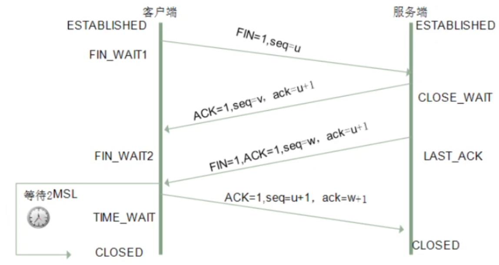

# 1.HTTP

`HTTP` (HyperText Transfer Protocol)，即`超文本运输协议`，是实现网络通信的一种规范

明文传输数据

特点如下：

- 支持客户/服务器模式
- 简单快速：客户向服务器请求服务时，只需传送请求方法和路径。由于HTTP协议简单，使得HTTP服务器的程序规模小，因而通信速度很快
- 灵活：HTTP允许传输任意类型的数据对象。正在传输的类型由Content-Type加以标记
- 无连接：无连接的含义是限制每次连接只处理一个请求。服务器处理完客户的请求，并收到客户的应答后，即断开连接。采用这种方式可以节省传输时间
- 无状态：HTTP协议无法根据之前的状态进行本次的请求处理

# 2.HTTPS

目的：解决HTTP不安全的特点

HTTPS = HTTP + SSL/TLS

为了保证这些隐私数据能加密传输，让`HTTP`运行安全的`SSL/TLS`协议上，通过 `SSL`证书来验证服务器的身份，并为浏览器和服务器之间的通信进行加密

`SSL` 协议位于`TCP/IP` 协议与各种应用层协议之间

# 3.区别

- HTTPS是HTTP协议的安全版本，HTTP协议的数据传输是明文的，是不安全的，HTTPS使用了SSL/TLS协议进行了加密处理，相对更安全
- HTTP 和 HTTPS 使用连接方式不同，默认端口也不一样，HTTP是80，HTTPS是443
- HTTPS 由于需要设计加密以及多次握手，性能方面不如 HTTP
- HTTPS需要SSL，SSL 证书需要钱，功能越强大的证书费用越高

# 4.HTTPS如何实现安全性

`SSL`的实现这些功能主要依赖于三种手段：

- 对称加密：采用协商的密钥对数据加密 --相同的密钥
- 非对称加密：实现身份认证和密钥协商 -- 分公钥和私钥
- 摘要算法：验证信息的完整性
- 数字签名：身份验证

# 5.如何理解OSI七层模型?

开放式通信系统互连参考模型

分七层：

- 应用层

  通过应用程序间的交互来完成特定的网络应用

- 表示层

  使通信的应用程序能够解释交换数据的含义，向上提供服务，向下接收服务

- 会话层

  负责建立、管理和终止表示层实体之间的通信会话

- 传输层

  为两台主机进程之间的通信提供服务，处理数据包错误、数据包次序，以及其他一些关键传输问题

  关键：主要的传输层协议是`TCP`和`UDP`

- 网络层

  选择合适的网间路由和交换节点，确保数据按时成功传送

- 数据链路层

- 物理层

# 6.GET 和 POST 的区别

## 定义

`GET`和`POST`，两者是`HTTP`协议中发送请求的方法

### GET

`GET`方法请求一个指定资源的表示形式，使用GET的请求应该只被用于获取数据

### POST

`POST`方法用于将实体提交到指定的资源，通常导致在服务器上的状态变化或**副作用**

本质上都是`TCP`链接，并无差别

## 区别

从`w3schools`得到的标准答案的区别如下：

- GET在浏览器回退时是无害的，而POST会再次提交请求。
- GET产生的URL地址可以被Bookmark，而POST不可以。
- GET请求会被浏览器主动cache，而POST不会，除非手动设置。
- GET请求只能进行url编码，而POST支持多种编码方式。
- GET请求参数会被完整保留在浏览器历史记录里，而POST中的参数不会被保留。
- GET请求在URL中传送的参数是有长度限制的，而POST没有。
- 对参数的数据类型，GET只接受ASCII字符，而POST没有限制。
- GET比POST更不安全，因为参数直接暴露在URL上，所以不能用来传递敏感信息。
- GET参数通过URL传递，POST放在Request body中

区别总结：

1. 参数位置

   `GET`请求是放在`url`中

   `POST`则放在`body`中

   当然，也可以post请求url中写参数，或get请求中body带参数

2. 参数长度

   IE：GET请求中数据长度最多为2083字节（2k+35）

   对于其他浏览器，如Netscape、FireFox等，理论上没有长度限制，其限制取决于操作系统的支持

3. 安全

   post比get请求安全一点，数据在地址栏上不可见

   但严格来说两者皆不安全，`HTTP` 在网络上是明文传输的，只要在网络节点上捉包，就能完整地获取数据报文	

   `HTTPS`才能加密安全

4. 数据包

   对于`GET`方式的请求，浏览器会把`http header`和`data`一并发送出去，服务器响应200（返回数据）

   对于`POST`，浏览器先发送`header`，服务器响应100 `continue`，浏览器再发送`data`，服务器响应200 ok

   并不是所有浏览器都会在`POST`中发送两次包，`Firefox`就只发送一次

# 7.地址栏输入 URL 敲下回车后发生了什么

## 简单分析

- URL解析

  解析url的结构

- DNS 查询

  查询url的ip地址，这里分迭代查询和递归查询

- TCP 连接

  确定ip后进行三次握手建立TCP链接

- HTTP 请求

  浏览器发送 `http` 请求到目标服务器

- 响应请求

  当服务器接收到浏览器的请求之后，就会进行逻辑操作，处理完成之后返回一个`HTTP`响应消息

- 页面渲染

  当浏览器接收到服务器响应的资源后，首先会对资源进行解析

  - 查看响应头的信息，根据不同的指示做对应处理，比如重定向，存储cookie，解压gzip，缓存资源等等
  - 查看响应头的 Content-Type的值，根据不同的资源类型采用不同的解析方式

## 页面的渲染

- 解析HTML，构建 DOM 树
- 解析 CSS ，生成 CSS 规则树
- 合并 DOM 树和 CSS 规则，生成 render 树
- 布局 render 树（ Layout / reflow ），负责各元素尺寸、位置的计算
- 绘制 render 树（ paint ），绘制页面像素信息
- 浏览器会将各层的信息发送给 GPU，GPU 会将各层合成（ composite ），显示在屏幕上

# 8.TCP的三次握手和四次挥手

## 三次握手

三次握手 （Three-way Handshake）---指建立一个TCP连接时，需要客户端和服务器总共发送3个包

作用--为了确认双方的接收能力和发送能力是否正常、指定自己的初始化序列号为后面的可靠性传送做准备

过程：

- 第一次握手：客户端给服务端发一个 SYN 报文，并指明客户端的初始化序列号 ISN(c)，此时客户端处于 SYN_SENT 状态
- 第二次握手：服务器收到客户端的 SYN 报文之后，会以自己的 SYN 报文作为应答，为了确认客户端的 SYN，将客户端的 ISN+1作为ACK的值，此时服务器处于 SYN_RCVD 的状态
- 第三次握手：客户端收到 SYN 报文之后，会发送一个 ACK 报文，值为服务器的ISN+1。此时客户端处于 ESTABLISHED 状态。服务器收到 ACK 报文之后，也处于 ESTABLISHED 状态，此时，双方已建立起了连接

每一次握手的作用：

- 第一次握手：客户端发送网络包，服务端收到了 这样服务端就能得出结论：客户端的发送能力、服务端的接收能力是正常的。
- 第二次握手：服务端发包，客户端收到了 这样客户端就能得出结论：服务端的接收、发送能力，客户端的接收、发送能力是正常的。不过此时服务器并不能确认客户端的接收能力是否正常
- 第三次握手：客户端发包，服务端收到了。 这样服务端就能得出结论：客户端的接收、发送能力正常，服务器自己的发送、接收能力也正常

## 四次挥手

过程如下：

- 第一次挥手：客户端发送一个 FIN 报文，报文中会指定一个序列号。此时客户端处于 FIN_WAIT1 状态，停止发送数据，等待服务端的确认
- 第二次挥手：服务端收到 FIN 之后，会发送 ACK 报文，且把客户端的序列号值 +1 作为 ACK 报文的序列号值，表明已经收到客户端的报文了，此时服务端处于 CLOSE_WAIT状态
- 第三次挥手：如果服务端也想断开连接了，和客户端的第一次挥手一样，发给 FIN 报文，且指定一个序列号。此时服务端处于 `LAST_ACK` 的状态
- 第四次挥手：客户端收到 FIN 之后，一样发送一个 ACK 报文作为应答，且把服务端的序列号值 +1 作为自己 ACK 报文的序列号值，此时客户端处于 TIME_WAIT状态。需要过一阵子以确保服务端收到自己的 ACK 报文之后才会进入 CLOSED 状态，服务端收到 ACK 报文之后，就处于关闭连接了，处于 CLOSED 状态

### 四次挥手原因

服务端在收到客户端断开连接`Fin`报文后，并不会立即关闭连接，而是先发送一个`ACK`包先告诉客户端收到关闭连接的请求，只有当服务器的所有报文发送完毕之后，才发送`FIN`报文断开连接，因此需要四次挥手

