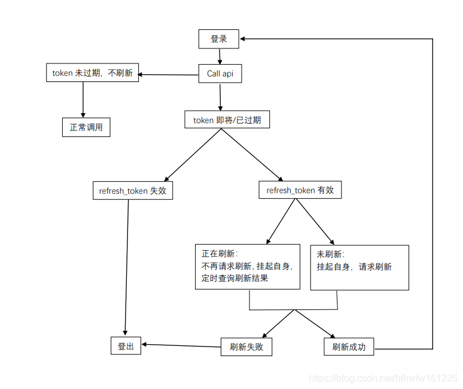
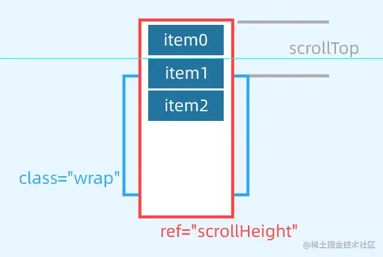
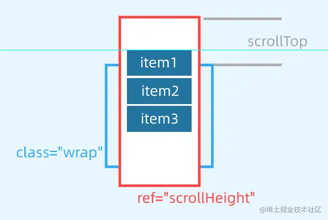

#  Css篇

## 	了解盒模型吗

CSS盒模型本质上是一个盒子，封装周围的HTML元素，它包括：`外边距（margin）`、`边框（border）`、`内边距（padding）`、`实际内容（content）`四个属性。 CSS盒模型：**标准模型 + IE模型**

标准盒子模型：宽度=内容的宽度（content）+ border + padding

低版本IE盒子模型：宽度=内容宽度（content+border+padding），如何设置成 IE 盒子模型:

```css
box-sizing: border-box;
```


## 清除浮动有哪些方法？

不清除浮动会发生高度塌陷：浮动元素父元素高度自适应（父元素不写高度时，子元素写了浮动后，父元素会发生高度塌陷）

- clear清除浮动（添加空div法）在浮动元素下方添加空div,并给该元素写css样式： {clear:both;height:0;overflow:hidden;}
- 给浮动元素父级设置高度
- 父级同时浮动（需要给父级同级元素添加浮动）
- 父级设置成inline-block，其margin: 0 auto居中方式失效
- 给父级添加overflow:hidden 清除浮动方法
- 万能清除法 after伪类 清浮动（现在主流方法，推荐使用）

```css
.float_div:after{
  content:".";
  clear:both;
  display:block;
  height:0;
  overflow:hidden;
  visibility:hidden;
}
.float_div{
  zoom:1
}
```

## CSS浮动怎么理解的

浮动的意义：设置了浮动属性的元素会脱离普通标准流的控制，移动到其父元素中指定的位置的过程，将块级元素放在一行，浮动会脱离标准流，不占位置，会影响标准流，浮动只有左右浮动，不会出现上下浮动

### **特性：**

**1、浮动的元素脱离了标准文档流，摆脱块级元素和行内元素的限制**

**2、浮动的元素存在相互贴靠的效果，当宽度不够的时候，会出现自动换行**

**3、浮动的元素虽然脱离了标准文档流，但是没有脱离文本流，出现被字包围的效果**

**4、浮动之后的元素会存在收缩的效果，当一个块级元素没有设置宽度的时，当块级元素浮动之后，就会失去高度**

**5、当父元素不设置高度的时候，多个子元素的高度和撑起了父元素的高度；当设置浮动后，子元素最高的高度撑起了父元素的高度。**


### **弊端：**

**1、高度塌陷**

**当子元素同时设置浮动后，父元素失去支撑，父元素的高度消失，缩成一条线。**

解决办法：在父元素失去高度，发生塌陷之后，可以给父元素添加高度或者设置overflow:hidden的方法进行解决高度塌陷的问题。

**2、页面结构的不稳定性，子元素浮动，导致标准文档流出现空白区域。**

解决办法：clear:both; 去进行解决，这也是称之为隔墙法。


## 绝对定位相对定位怎么理解

### 绝对定位 --absolute

脱离了标准文档流的

参照物：父元素，假如父元素没有就一直往上找，知道body

### 相对定位 --relative

没有脱离标准文档流

参照物：自身


## 块元素和行内元素什么区别

1.排布上

​	行内元素能能多个在一行显示

​	块元素独占一行

2.内容上

​	行内元素：文本或者其它行内元素 --无法包含块级元素

​	块级元素：包含行内元素和块级元素

3.属性上 -- 盒模型属性

​	行内元素设置width无效，height无效(可以设置line-height)，margin上下无效，padding上下无效


inline-block -- 行内块级元素

​	既具有 block 元素可以设置宽高的特性，同时又具有 inline 元素默认不换行的特性


## Css如何实现盒子水平垂直居中

- 利用定位+margin:auto
- 利用定位+margin:负值
- 利用定位+transform
- table布局 -- 不建议使用
- flex布局
- grid布局


## css中，有哪些方式可以隐藏页面元素？区别?

- display:none

  特点：元素不可见，不占据空间，无法响应点击事件

- visibility:hidden

  特点：元素不可见，占据页面空间，无法响应点击事件

- opacity:0

  特点：改变元素透明度，元素不可见，占据页面空间，可以响应点击事件

- 设置height、width模型属性为0

  特点：元素不可见，不占据页面空间，无法响应点击事件

- position:absolute

  特点：元素不可见，不影响页面布局

- clip-path

  特点：元素不可见，占据页面空间，无法响应点击事件

|                        | display: none | visibility: hidden | opacity: 0 |
| ---------------------- | ------------- | ------------------ | ---------- |
| 页面中                 | 不存在        | 存在               | 存在       |
| 重排                   | 会            | 不会               | 不会       |
| 重绘                   | 会            | 会                 | 不一定     |
| 自身绑定事件           | 不触发        | 不触发             | 可触发     |
| transition             | 不支持        | 支持               | 支持       |
| 子元素可复原           | 不能          | 能                 | 不能       |
| 被遮挡的元素可触发事件 | 能            | 能                 | 不能       |

## Css3动画有哪些

1. transition 实现渐变动画

2. transform 转变动画

   translate：位移

   scale：缩放

   rotate：旋转

   skew：倾斜

   配合`transition`过度使用

   transform`不支持`inline`元素，使用前把它变成`block

3. animation 实现自定义动画

   通过@keyframes定义关键帧

   ```css
   @keyframes rotate{
       0%{
           transform: rotate(0deg);
       }
       50%{
           transform: rotate(180deg);
       }
       100%{
           transform: rotate(360deg);
       }
   }
   animation: rotate 2s;
   ```

   

## CSS预处理器

sass、less、stylus

特性：

- 变量

  ```css
  sass
  $mainColor: #0982c1;
  
  less
  @mainColor: #0982c1;
  
  Stylus
  Stylus对变量名没有任何限定但不能用@开头
  mainColor = #0982c1
  siteWidth = 1024px
  $borderStyle = dotted
  ```

- 作用域	

- 混合(Mixins)

  ```css
  sass
  @mixin error($borderWidth:2px){
    border:$borderWidth solid #f00;
    color: #f00;
  }
  /*调用error Mixins*/
  .generic-error {
    @include error();/*直接调用error mixins*/
  }
  
  less
  /*声明一个Mixin叫作“error”*/
  .error(@borderWidth:2px){
    border:@borderWidth solid #f00;
    color: #f00;
  }
  /*调用error Mixins*/
  .generic-error {
    .error();/*直接调用error mixins*/
  }
  
  Stylus
  /*声明一个Mixin叫作“error”*/
  error(borderWidth=2px){
    border:borderWidth solid #f00;
    color: #f00;
  }
  /*调用error Mixins*/
  .generic-error {
    error();/*直接调用error mixins*/
  }
  ```

- 嵌套（Nesting）


通过import导入文件

```css
@import "reset.css";
```


## CSS优化、提高性能的方法有哪些？

- 合并css文件，减少css文件数量
- 减少嵌套，最好不要大于三层
- 不在ID选择器钱进行嵌套，浪费性能
- 建立公共样式类，比如flex、清除浮动等
- 减少通配符*或者类似[hidden="true"]这类选择器的使用
- 灵活运用css的继承机制
- 拆分出公共css文件
- 不用css表达式
- 减少css的重置
- 图片使用雪碧图、精灵图等
- css压缩
- GZIP压缩

## 让Chrome支持小于12px的文字

针对chrome浏览器,加webkit前缀，用transform:scale()这个属性进行放缩.

```css
span{
    font-size: 12px;
    display: inline-block;
    -webkit-transform:scale(0.8);
}
```

或者通过加入 CSS 属性 -webkit-text-size-adjust: none; 解决。（该方案依旧再实验中，低版本不支持）

**`text-size-adjust`** :CSS控制将一些手机或平板设备上使用的文本溢出算法（text inflation algorithm）

## CSS3有哪些新特性

新增选择器 p:nth-child（n）{color: rgba（255, 0, 0, 0.75）}

弹性盒模型 display: flex;

多列布局 column-count: 5;

媒体查询 @media （max-width: 480px） {.box: {column-count: 1;}}

个性化字体 @font-face{font-family:BorderWeb;src:url（BORDERW0.eot）；}

颜色透明度 color: rgba（255, 0, 0, 0.75）；

圆角 border-radius: 5px;

渐变 background:linear-gradient（red, green, blue）；

阴影 box-shadow:3px 3px 3px rgba（0, 64, 128, 0.3）；

倒影 box-reflect: below 2px;

文字装饰 text-stroke-color: red;

文字溢出 text-overflow:ellipsis;

背景效果 background-size: 100px 100px;

边框效果 border-image:url（bt_blue.png） 0 10;

旋转 transform: rotate（20deg）；

倾斜 transform: skew（150deg, -10deg）；

位移 transform:translate（20px, 20px）；

缩放 transform: scale（。5）；

平滑过渡 transition: all .3s ease-in .1s;

动画 @keyframes anim-1 {50% {border-radius: 50%;}} animation: anim-1 1s;

## ::before和:after中双冒号和单冒号有什么区别

单冒号(:)用于CSS3伪类，双冒号(::)用于CSS3伪元素。

伪类是选择器的一种，它用于选择处于特定状态的元素

伪元素像往标记文本中加入全新的HTML元素一样


## 响应式布局

响应式布局（Responsive design），意在实现不同屏幕分辨率的终端上浏览网页的不同展示方式。

### 步骤

#### 1. 设置 Meta 标签

```
<meta name="viewport" content="width=device-width, initial-scale=1, maximum-scale=1, user-scalable=no">
```

#### 2. 通过媒介查询来设置样式 Media Queries

```css
@media screen and (max-width: 980px) {
  #head { … }
  #content { … }
  #footer { … }
}
```

#### 3. 设置多种视图宽度

```css
/** iPad **/
@media only screen and (min-width: 768px) and (max-width: 1024px) {}
/** iPhone **/
@media only screen and (min-width: 320px) and (max-width: 767px) {}
```


## 各种兼容性的处理方法

### **不同浏览器的标签默认的样式**

```css
*{ margin: 0; padding: 0; }
```

### **IE6 双倍边距的问题**

设置 ie6 中设置浮动，同时又设置 margin，会出现双倍边距的问题

```css
display: inline;
```

### **解决 IE9 以下浏览器不能使用 opacity**

```css
opacity: 0.5;
filter: alpha(opacity = 50);
filter: progid:DXImageTransform.Microsoft.Alpha(style = 0, opacity = 50);
```

### **图片默认有间距**

使用float属性为img布局

###  **li之间有间距**

解决方法：li 设置vertical-align:middle;

### 超链接访问过后hover样式就不出现

解决方法是改变CSS属性的排列顺序:L-V-H-A ( love hate ):

```css
 a:link {}
 a:visited {}
 a:hover {}
 a:active {}
```


## link和@import的区别

1. link是XHTML标签，除了加载CSS外，还可以定义RSS等其他事务；@import属于CSS范畴，只能加载CSS。
2. link引用CSS时，在页面载入时同时加载；@import需要页面网页完全载入以后加载。
3. link是XHTML标签，无兼容问题；@import是在CSS2.1提出的，低版本的浏览器不支持。
4. link支持使用Javascript控制DOM去改变样式；而@import不支持。


## css选择器有哪些？优先级？哪些属性可以继承？

###选择器

常用：

- id选择器（#box），选择id为box的元素
- 类选择器（.one），选择类名为one的所有元素
- 标签选择器（div），选择标签为div的所有元素
- 后代选择器（#box div），选择id为box元素内部所有的div元素
- 子选择器（.one>one_1），选择父元素为.one的所有.one_1的元素
- 相邻同胞选择器（.one+.two），选择紧接在.one之后的所有.two元素
- 群组选择器（div,p），选择div、p的所有元素

不常用：

- 伪类选择器
- 伪元素选择器
- 属性选择器

### 优先级

内联 > ID选择器 > 类选择器 > 标签选择器

### 继承属性

- 字体系列属性
- 文本系列属性
- 元素可见性
- 表格布局属性
- 列表属性
- 引用
- 光标属性

继承中比较特殊的几点：

- a 标签的字体颜色不能被继承
- h1-h6标签字体的大下也是不能被继承的

### 无继承的属性

- display
- 文本属性：vertical-align、text-decoration
- 盒子模型的属性：宽度、高度、内外边距、边框等
- 背景属性：背景图片、颜色、位置等
- 定位属性：浮动、清除浮动、定位position等
- 生成内容属性：content、counter-reset、counter-increment
- 轮廓样式属性：outline-style、outline-width、outline-color、outline
- 页面样式属性：size、page-break-before、page-break-after


## CSS提高性能

- 内联首屏关键CSS

  通过内联`css`关键代码能够使浏览器在下载完`html`后就能立刻渲染,起到缩短首屏加载时间的作用

- 异步加载CSS

  在`CSS`文件请求、下载、解析完成之前，`CSS`会阻塞渲染，浏览器将不会渲染任何已处理的内容，将优先级低的css通过最后渲染，不阻塞浏览器渲染

- 资源压缩

- 合理使用选择器

- 减少使用昂贵的属性

  在页面发生重绘的时候，昂贵属性如`box-shadow`/`border-radius`/`filter`/透明度/`:nth-child`等，会降低浏览器的渲染性能

- 不要使用`@import`

  `@import`会影响浏览器的并行下载，使得页面在加载时增加额外的延迟，增添了额外的往返耗时

### 其他

- 减少重排操作，以及减少不必要的重绘
- 了解哪些属性可以继承而来，避免对这些属性重复编写
- cssSprite，合成所有icon图片，用宽高加上backgroud-position的背景图方式显现出我们要的icon图，减少了http请求
- 把小的icon图片转成base64编码
- CSS3动画或者过渡尽量使用transform和opacity来实现动画，不要使用left和top属性

## 如何实现单行／多行文本溢出的省略样式？

### 单行文本溢出省略

现方式也很简单，涉及的`css`属性有：

- text-overflow：规定当文本溢出时，显示省略符号来代表被修剪的文本
- white-space：设置文字在一行显示，不能换行
- overflow：文字长度超出限定宽度，则隐藏超出的内容

关键代码：

```css
overflow: hidden;
text-overflow: ellipsis;
white-space: nowrap;
```

### 多行文本溢出省略

分为两种情况：

- 基于高度截断
- 基于行数截断

#### 基于高度截断

##### 伪元素 + 定位

核心的`css`代码结构如下：

- position: relative：为伪元素绝对定位
- overflow: hidden：文本溢出限定的宽度就隐藏内容）
- position: absolute：给省略号绝对定位
- line-height: 20px：结合元素高度,高度固定的情况下,设定行高, 控制显示行数
- height: 40px：设定当前元素高度
- ::after {} ：设置省略号样式

关键代码：

```html
<style>
    .demo {
        position: relative;
        line-height: 20px;
        height: 40px;
        overflow: hidden;
    }
    .demo::after {
        content: "...";
        position: absolute;
        bottom: 0;
        right: 0;
        padding: 0 20px 0 10px;
    }
</style>

<body>
    <div class='demo'>这是一段很长的文本</div>
</body>
```


#### 基于行数截断

核心的`css`代码如下：

- -webkit-line-clamp: 2：用来限制在一个块元素显示的文本的行数，为了实现该效果，它需要组合其他的WebKit属性）
- display: -webkit-box：和1结合使用，将对象作为弹性伸缩盒子模型显示
- -webkit-box-orient: vertical：和1结合使用 ，设置或检索伸缩盒对象的子元素的排列方式
- overflow: hidden：文本溢出限定的宽度就隐藏内容
- text-overflow: ellipsis：多行文本的情况下，用省略号“…”隐藏溢出范围的文本

核心代码：

```css
width: 400px;
-webkit-line-clamp: 2;
display: -webkit-box;
-webkit-box-orient: vertical;
overflow: hidden;
text-overflow: ellipsis;
```


## src和href的区别

**href**标识超文本引用，用在**link**和**a**等元素上，**href**是引用和页面关联，是在当前元素和引用资源之间建立联系

**src**表示引用资源，表示替换当前元素，用在**img**，**script**，**iframe**上，src是页面内容不可缺少的一部分。

# 浏览器

## 常见的浏览器内核和前缀有哪些？微信的浏览器内核是什么

**谷歌**--以前是Webkit内核，现在是Blink内核。

**IE**--Trident内核

**火狐**--Gecko内核

**Safari** --Webkit内核

**Opera** -- 最初Presto内核，后来是Webkit，现在是Blink内核;

微信浏览器内核：X5 Blink内核

前缀：

WebKit内核   -webkit-

Gecko内核     -moz-

Trident内核     -ms-

Presto内核      -o-


## html5有哪些新特性、移除了那些元素？如何处理HTML5新标签的浏览器兼容问题？如何区分HTML和HTML5？ 

### 新特性

- 拖拽释放(Drag and drop) API 
- 语义化更好的内容标签（header,nav,footer,aside,article,section）
- 音频、视频API(audio,video)
- 画布(Canvas) API
- 地理(Geolocation) API
- 本地离线存储 localStorage 长期存储数据，浏览器关闭后数据不丢失；
- sessionStorage 的数据在浏览器关闭后自动删除
- 表单控件，calendar、date、time、email、url、search 
- 新的技术webworker, websocket, Geolocation

### 移除元素

纯表现的元素：basefont，big，center，font, s，strike，tt，u；

对可用性产生负面影响的元素：frame，frameset，noframes；

### 如何处理

支持HTML5新标签：
IE8/IE7/IE6支持通过document.createElement方法产生的标签，
可以利用这一特性让这些浏览器支持HTML5新标签，
浏览器支持新标签后，还需要添加标签默认的样式；

当然最好的方式是直接使用成熟的框架、使用最多的是html5shim框架

```html
   <!--[if lt IE 9]> 
   <script> src="http://html5shim.googlecode.com/svn/trunk/html5.js"</script> 
   <![endif]--> 
```

### 如何区分

DOCTYPE声明\新增的结构元素\功能元素

## 语义化标签、作用

语义化标签--简单明了地知道该标签的作用

作用：

1. 有利于SEO，搜索引擎根据标签来确定上下文和各个关键字的权重
2. 有利于开发和维护，语义化更具可读性，代码更好维护，与CSS3关系更和谐。
3. 易于用户阅读，样式丢失的时候能让页面呈现清晰的结构。
4. 兼容性更好，支持更多的网络设备


# JavaScript篇

## JavaScript中的数据类型

### （1）基本类型

- Number

  数值分整数类型和浮点数类型

  整数类型为十进制，也可以设置为八进制、十六进制

  浮点类型必须喊小数，可用科学计数法表示

  特殊数值：`NaN` -- 表示不是数值

- String

  字符串可用使用双引号（"）、单引号（'）或反引号（`）标示

  不可改变---若修改，只能先销毁再创建

- Boolean

  布尔值类型--只有两个值  `true`和`false`

- Undefined

  唯一值`undefined`

  声明变量未赋值时相当于给变量赋予`undefined`

- Null

  唯一值--`null`

  理论上代表空对象指针

- Symbol

  Symbol （符号）是原始值，且符号实例是唯一、不可变的。符号的用途是确保对象属性使用唯一标识符，不会发生属性冲突的危险


### （2）引用类型

复杂类型统称为`Object`，主要讲述下面三种：

- Object

  创建`object`常用方式为对象字面量表示法，属性名可以是字符串或数值

- Array

  `JavaScript`数组是一组有序的数据，但跟其他语言不同的是，数组中每个槽位可以存储任意类型的数据。并且，数组也是动态大小的，会随着数据添加而自动增长

- Function

  函数实际上是对象，每个函数都是 `Function`类型的实例，而 `Function`也有属性和方法，跟其他引用类型一样

  三种常见的表达方式：

  - 函数声明

    ```js
    // 函数声明
    function sum (num1, num2) {
        return num1 + num2;
    }
    ```

  - 函数表达式

    ```js
    let sum = function(num1, num2) {
        return num1 + num2;
    };
    ```

  - 箭头函数

    ```js
    let sum = (num1, num2) => {
        return num1 + num2;
    };
    ```


### （3）存储区别

- 基本数据类型存储在栈中
- 引用类型的对象存储于堆中

#### 小结：

- 声明变量时不同的内存地址分配：
  - 简单类型的值存放在栈中，在栈中存放的是对应的值
  - 引用类型对应的值存储在堆中，在栈中存放的是指向堆内存的地址
- 不同的类型数据导致赋值变量时的不同：
  - 简单类型赋值，是生成相同的值，两个对象对应不同的地址
  - 复杂类型赋值，是将保存对象的内存地址赋值给另一个变量。也就是两个变量指向堆内存中同一个对象

## ajax原理是什么？如何实现？

`Ajax`的原理简单来说通过`XmlHttpRequest`对象来向服务器发异步请求，从服务器获得数据，然后用`JavaScript`来操作`DOM`而更新页面

步骤：

- 创建 `Ajax `的核心对象 `XMLHttpRequest `对象
- 通过 `XMLHttpRequest` 对象的 `open()` 方法与服务端建立连接
- 构建请求所需的数据内容，并通过` XMLHttpRequest` 对象的 `send()` 方法发送给服务器端
- 通过 `XMLHttpRequest` 对象提供的 `onreadystatechange` 事件监听服务器端你的通信状态
- 接受并处理服务端向客户端响应的数据结果
- 将处理结果更新到 `HTML `页面中

##  Ajax同步和异步怎么理解的

### 区别：

ajax异步请求：异步请求就当发出请求的同时，浏览器可以继续做任何事，Ajax发送请求并不会影响页面的加载与用户的操作，相当于是在两条线上，各走各的，互不影响。

ajax同步请求：同步请求即是当前发出请求后，浏览器什么都不能做，必须得等到请求完成返回数据之后，才会执行后续的代码。

### 同步与异步适用的场景

看需要的请求的数据是否是程序继续执行必须依赖的数据

## JS面向对象编程思想

### 什么是对象

> Everything is object （万物皆对象）

1. 对象是单个事物的抽象。
2. 对象是一个容器，封装了属性（property）和方法（method）。

### 什么是面向对象

> 面向对象不是新的东西，它只是过程式代码的一种高度封装，目的在于提高代码的开发效率和可维 护性

面向对象与面向过程：

- 面向过程就是亲力亲为，事无巨细，面面俱到，步步紧跟，有条不紊
- 面向对象就是找一个对象，指挥得结果
- 面向对象将执行者转变成指挥者
- 面向对象不是面向过程的替代，而是面向过程的封装

### 特性：

- 封装性
- 继承性
- [多态性]抽象


### 设计思想：

- 抽象出 Class(构造函数)
- 根据 Class(构造函数) 创建 Instance
- 指挥 Instance 得结果


### 创建对象：

#### 简单方式

直接通过 `new Object()` 创建：

```js
var person = new Object()
person.name = 'Jack'
person.age = 18

person.sayName = function () {
  console.log(this.name)
}
```

缺点：代码太过冗余，复用性低

#### 工厂函数

```js
function createPerson (name, age) {
  return {
    name: name,
    age: age,
    sayName: function () {
      console.log(this.name)
    }
  }
}
```

生成实例对象：

```js
var p1 = createPerson('Jack', 18)
var p2 = createPerson('Mike', 18)
```

缺点：却没有解决对象识别的问题

#### 构造函数

```js
function Person (name, age) {
  this.name = name
  this.age = age
  this.sayName = function () {
    console.log(this.name)
  }
}

var p1 = new Person('Jack', 18)
p1.sayName() // => Jack

var p2 = new Person('Mike', 23)
p2.sayName() // => Mike
```

缺点：耗内存

优化： 原型 ,**把所有对象实例需要共享的属性和方法**直接定义在 `prototype` 对象上


```js
function Person (name, age) {
  this.name = name
  this.age = age
}

console.log(Person.prototype)

Person.prototype.type = 'human'

Person.prototype.sayName = function () {
  console.log(this.name)
}

var p1 = new Person(...)
var p2 = new Person(...)

console.log(p1.sayName === p2.sayName) // => true

```

## apply和call的区别 

### 定义：

**重新定义函数的执行环境**，也就是`this`的指向

### 语法：

#### call()

调用一个对象的方法，**用另一个对象替换当前对象**，可以继承另外一个对象的属性

```js
Function.call(obj[, param1[, param2[, [,...paramN]]]]);
```

- `obj`：这个对象将代替`Function`类里`this`对象
- `params`：一串参数列表

#### apply()

```js
Function.apply(obj[, argArray]);
```

- `obj`：这个对象将代替`Function`类里`this`对象
- `argArray`：这个是数组，它将作为参数传给`Function`

### 不同点

**接收参数的方式不同**：

- **apply()方法**接收两个参数，一个是函数运行的作用域（`this`），另一个是参数数组。
- **call()方法**不一定接受两个参数，第一个参数也是函数运行的作用域（`this`），但是传递给函数的参数必须列举出来。


## 跨域请求是怎么理解的

同源策略是浏览器的一个安全限制，从一个源加载的文档或者脚本默认不能访问另一个源的资源。

协议(http/https)，端口(8080/8090)或者域名

解决方案：

- CORS
- jsonp跨域
- 代理服务器


## 内存泄露情况

### 垃圾回收机制

原理：垃圾收集器会定期（周期性）找出那些不在继续使用的变量，然后释放其内存

- 标记清除

  垃圾回收程序运行的时候，会标记内存中存储的所有变量。然后，它会将所有在上下文中的变量，以及被在上下文中的变量引用的变量的标记去掉

- 引用计数

  语言引擎有一张"引用表"，保存了内存里面所有的资源（通常是各种值）的引用次数。次数是`0`，就表示这个值不再用到了

### 内存泄露情况

- 全局变量
- 定时器
- 闭包
- 没有清理对`DOM`元素的引用 -- 事件监听


## 一次完整的HTTP事务是怎样的一个过程

### 简单分析

从输入 `URL`到回车后发生的行为如下：

- URL解析
- DNS 查询
- TCP 连接
- HTTP 请求
- 响应请求
- 页面渲染

### 详细分析

#### URL解析

判断你输入的是一个合法的`URL` 还是一个待搜索的关键词，并且根据你输入的内容进行对应操作

####  DNS查询


获取到了域名对应的目标服务器`IP`地址

#### TCP连接

在确定目标服务器服务器的`IP`地址后，则经历三次握手建立`TCP`连接

#### 发送 http 请求

当建立`tcp`连接之后，就可以在这基础上进行通信，浏览器发送 `http` 请求到目标服务器

请求的内容包括：

- 请求行
- 请求头
- 请求主体

#### 响应请求

当服务器接收到浏览器的请求之后，就会进行逻辑操作，处理完成之后返回一个`HTTP`响应消息，包括：

- 状态行
- 响应头
- 响应正文

#### 页面渲染

当浏览器接收到服务器响应的资源后，首先会对资源进行解析：

- 查看响应头的信息，根据不同的指示做对应处理，比如重定向，存储cookie，解压gzip，缓存资源等等
- 查看响应头的 Content-Type的值，根据不同的资源类型采用不同的解析方式

关于页面的渲染过程如下：

- 解析HTML，构建 DOM 树
- 解析 CSS ，生成 CSS 规则树
- 合并 DOM 树和 CSS 规则，生成 render 树
- 布局 render 树（ Layout / reflow ），负责各元素尺寸、位置的计算
- 绘制 render 树（ paint ），绘制页面像素信息
- 浏览器会将各层的信息发送给 GPU，GPU 会将各层合成（ composite ），显示在屏幕上


## 如何阻止事件冒泡和默认事件

### **阻止事件冒泡**

stopPropagation()

```js
md.onclick = function() {
    alert("我是中间的盒子md");
    event.stopPropagation();
};
```

IE8一下，有一个cancelBubble属性

```js
var e = window.event || event;
if(document.all) {
    e.cancelBubble = true;
}else {
    e.stopPropagation();
}
```

### **阻止默认事件**

preventDefault()方法

IE事件对象有一个属性returnValue，默认是true，当将其设置为false时，则可以取消事件默认行为

```js
function cancelHandler(event) {
    var e = window.event || event;
    if(document.all) {
        e.returnValue = false;
    }
    else {
        e.preventDefault();
    }
}

```


## 解释jsonp的原理，以及为什么不是真正的ajax

### **原理**

**动态创建script标签，回调函数**

### **为什么不是ajax**

ajax的核心是通过XmlHttpRequest获取非本页内容

jsonp的核心则是动态添加<script>标签来调用服务器提供的js脚本


## js创建对象的几种方式

1. `{}`
2. `new Ｏbject()`
3. 使用字面量
4. 工厂模式
5. 构造函数模式（constructor）
6. 原型模式（prototype）
7. 构造函数+原型模式

参照：[创建对象的多种方式以及优缺点](E:\随手笔记\前端基本知识点\深入专题\创建对象的多种方式以及优缺点.md)


## jQuery的优势

1. **轻量级；**

    jQuery非常轻巧，采用`UglifyJS`压缩后，大小保持在30kb左右；

2. **强大的选择器；**

   允许开发者使用从CSS1到CSS3 几乎所有的选择器，以及jQuery独创的高级而复杂的选择器。

3. **出色的DOM操作的封装；**

4. **可靠的事件处理机制；**

5. **完善的Ajax；**

   jQuery将所有的Ajax操作封装到一个函数 $.ajax() 里,无需关心复杂的浏览器兼容性和XMLHttpRequest对象的创建和使用的问题；

6. **不污染顶级变量**

    jQuery只建立一个名为jQuery的对象，其所有的函数方法都在这个对象之下。其别名$也可以随时交出控制权，绝对不会污染其他的对象。

7. **出色的浏览器兼容性；** 

   jQuery能够在IE 6.0+、FF 3.6+、Safari 5.0+、Opera 和 Chrome等浏览器下正常运行

8. **链式操作方式；** 

9. **隐式迭代；**

   jQuery里的方法都被设计成自动操作对象集合，而不是单独的对象，这使得大量的循环结构变得不再必要，从而大幅减少了代码量

10. **行为层与结构层的分离；**

11. **丰富的插件支持；**

12. **完善的文档；**

13. **开源；** 


## defer和async的区别

当浏览器碰到 `script` 脚本的时候：

1. <script src="script.js"></script>

   没有 `defer` 或 `async`，浏览器会立即加载并执行指定的脚本，“立即”指的是在渲染该 `script` 标签之下的文档元素之前，也就是说不等待后续载入的文档元素，读到就加载并执行。

2. <script async src="script.js"></script>

   有 `async`，加载和渲染后续文档元素的过程将和 `script.js` 的加载与执行并行进行（异步）

3. <script defer src="myscript.js"></script>

   有 `defer`，加载后续文档元素的过程将和 `script.js` 的加载并行进行（异步），但是 `script.js` 的执行要在所有元素解析完成之后，`DOMContentLoaded` 事件触发之前完成。

然后从实用角度来说呢，首先把所有脚本都丢到 `</body>` 之前是最佳实践，因为对于旧浏览器来说这是唯一的优化选择，此法可保证非脚本的其他一切元素能够以最快的速度得到加载和解析。

相同点：都是异步加载

不同点：执行时间不同，async加载完立马直接，defer加载完后等在页面加载完后才执行

# 原理篇：

## 怎么看待Web App 、hybrid App、Native App？

### **app的分类**

大致可以分为这3种：

- native app（原生app）
- web app
- hybrid app（混合app）

### **优缺点**

#### **native app**

 **优点：**

- 提供最佳用户体验，最优质的用户界面，流畅的交互
- 可以访问本地资源
- 可以调用移动硬件设备，比如摄像头、麦克风等

**缺点：**

- 开发成本高。每种移动操作系统都需要独立的开发项目，针对不同平台提供不同体验；
- 发布新版本慢。下载是用户控制的，很多用户不愿意下载更新（比如说，版本发布到了3.0，但还是有很多1.0的用户，你可能就得继续维护1.0版本的API）
- 应用商店发布审核周期长。安卓平台大概要1~3天，而iOS平台需要的时间更长


#### **web app**

**优点：**

- 不需要安装包，节约手机空间
- 整体量级轻，开发成本低
- 不需要用户进行手动更新，由应用开发者直接在后台更新，推送到用户面前的都是全新版本，更便于业务的开展
- 基于浏览器，可以跨平台使用

**缺点：**

- 页面跳转费力，不稳定感更强。在网速受到限制时，很多时候出现卡顿或者卡死现象，交互效果受到限制
- 安全性相对较低，数据容易泄露或者被劫持。


#### **Hybrid app**

集合了两种App各自的优势

1. 在实现更多功能的前提下，使得App安装包不至于过大。
2. 在应用内部打开Web网页，省去了跳转浏览器的麻烦。
3. 主要功能区相对稳定下，增加的功能区采用Web形式，使得迭代更加方便。
4. Web页面在用户设置不同的网络制式时会以不同的形式呈现。。


## 模块化开发如何理解的

其实就是封装细节，提供使用接口，彼此之间互不影响，每个模块都是实现某一特定的功能，同时也需要避免全局变量的污染，最初通过函数实现模块，实际上是利用了函数的局部作用域来形成模块。

### 模块化规范

#### CommonJS

根据这个规范，每个文件就是一个模块，有自己的作用域。在一个文件里面定义的变量、函数、类，都是私有的，对其他文件不可见。`CommonJS`规范规定，每个模块内部，`module`变量代表当前模块。这个变量是一个对象，它的`exports`属性是对外的接口。

`CommonJS`规范通过`require`导入，`module.exports`与`exports`进行导出。

简单概括：

- 一个文件就是一个模块
- 每个模块都有单独的作用域
- 通过 module.exports 导出成员
- 通过 require 函数载入模块

#### AMD

`CommonJS`规范引入模块是同步加载的，这对服务端不是问题，因为其模块都存储在硬盘上，可以等待同步加载完成，但在浏览器中模块是通过网络加载的，若是同步阻塞等待模块加载完成，则可能会出现浏览器页面假死的情况

`AMD`采用异步方式加载模块，模块的加载不影响它后面语句的运行

RequireJS是一个工具库，主要用于客户端的模块管理。的模块管理遵守AMD规范，基本思想是，通过define方法，将代码定义为模块；通过require方法，实现代码的模块加载。

- 特点：非同步加载模块，允许指定回调函数，浏览器一般采用AMD规范
- 代表作：require.js

```js
// 定义模块  myModule.js
define(['moduleA', 'moduleB', 'moduleC'], function (moduleA, moduleB, moduleC){
    // do something
    // return {};
    var name = 'Byron';
    function printName(){
        console.log(name);
    }

    return {
        printName: printName
    };
});

// 加载模块
require(['myModule'], function (my){
　 my.printName();
})
```

#### CMD

`CMD`通用模块定义，是`SeaJS`在推广过程中对模块定义的规范化产出，也是浏览器端的模块化异步解决方案

- 特点：专门用于浏览器端，模块的加载是异步的，模块使用时才会加载执行
- 代表作：Sea.js

```js
 //定义有依赖的模块  定义模块  myModule.js
 define(function(require, exports, module){
    //引入依赖模块(同步)
    var module2 = require('./module2')
    //引入依赖模块(异步)
    require.async('./module3', function (m3) {})
    //暴露模块
    exports.xxx = value
})

// 加载模块
seajs.use(['myModule.js'], function(my){

});
```


### AMD与CMD区别

最明显的区别就是在模块定义时对依赖的处理不同

- AMD推崇依赖前置，在定义模块的时候就要声明其依赖的模块
- CMD推崇就近依赖，只有在用到某个模块的时候再去require


## 对Vue的理解 

Vue.js 是一套构建用户界面的渐进式框架。与其他重量级框架不同的是，Vue 采用自底向上增量开发的设计。

渐进式 -- 阶梯式向前，vue是轻量级的，它有很多独立的功能或库，能根据不同的需求使用不同的功能

渐进式表现：声明式渲染——组件系统——客户端路由——-大数据状态管理——-构建工具

### 核心点:

- 响应式数据绑定
- 组合的视图组件


## Vuejs特点

1. 轻量级的框架

2. 双向数据绑定

3. 指令系统

4. 组件化

5. 客户端路由

6. 状态管理

## vue、angular有什么区别？

### Vue和React的区别

#### 共同点

- 数据驱动视图
- 组件化
- 都使用 `Virtual DOM`

#### 不同点

1. 核心思想不同

   vue：`灵活易用的渐进式框架，进行数据拦截/代理，它对侦测数据的变化更敏感、更精确`。

   React推崇函数式编程（纯组件），数据不可变以及单向数据流

2. 组件写法差异

   React推荐的做法是`JSX + inline style`, 也就是把 HTML 和 CSS 全都写进 JavaScript 中

   Vue 推荐的做法是 template 的单文件组件格式

3. diff算法不同

   两者流程思路上是类似的：

   - 不同的组件产生不同的 DOM 结构。当type不相同时，对应DOM操作就是直接销毁老的DOM，创建新的DOM。
   - 同一层次的一组子节点，可以通过唯一的 key 区分

4. 响应式原理不同

   Vue

   ​	Vue依赖收集，自动优化，数据可变。

   ​	Vue递归监听data的所有属性,直接修改。

   ​	当数据改变时，自动找到引用组件重新渲染。

   React

   ​	React基于状态机，手动优化，数据不可变，需要setState驱动新的state替换老的state。当数据改变时，以组件为根目录，默认全部重新渲染, 所以 React 中会需要 shouldComponentUpdate 这个生命周期函数方法来进行控制


## MVVM MVC MVP 之前的区别

### MVC 编程模式

MVC 是一种使用 MVC（Model View Controller 模型-视图-控制器）设计创建 Web 应用程序的模式

#### 组成部分

- Model（模型）表示应用程序核心（如数据库）。
- View（视图）显示效果（HTML页面）。
- Controller（控制器）处理输入（业务逻辑）。

MVC 模式同时提供了对 HTML、CSS 和 JavaScript 的完全控制。

**Model（模型）**是应用程序中用于处理应用程序数据逻辑的部分。
 　通常模型对象负责在数据库中存取数据。

**View（视图）**是应用程序中处理数据显示的部分。
 　通常视图是依据模型数据创建的。

**Controller（控制器）**是应用程序中处理用户交互的部分。
 　通常控制器负责从视图读取数据，控制用户输入，并向模型发送数据。

#### 优点

1. **耦合性低**
2. **重用性高**
3. **生命周期成本低**
4. **部署快**
5. **可维护性高**
6. **有利软件工程化管理**

#### 缺点

1. **没有明确的定义**
2. **不适合小型，中等规模的应用程序**
3. **增加系统结构和实现的复杂性**
4. **视图与控制器间的过于紧密的连接**
5. **视图对模型数据的低效率访问**
6. **一般高级的界面工具或构造器不支持模式**

### MVP模式

MVP 是从经典的模式MVC演变而来，它们的基本思想有相通的地方Controller/Presenter负责逻辑的处理，Model提供数据，View负责显示。

#### 优点

1、模型与视图完全分离，我们可以修改视图而不影响模型

2、可以更高效地使用模型，因为所有的交互都发生在一个地方——Presenter内部

3、我们可以将一个Presenter用于多个视图，而不需要改变Presenter的逻辑。这个特性非常的有用，因为视图的变化总是比模型的变化频繁。

4、如果我们把逻辑放在Presenter中，那么我们就可以脱离用户接口来测试这些逻辑（单元测试）

#### 缺点

由于对视图的渲染放在了Presenter中，所以视图和Presenter的交互会过于频繁。还有一点需要明白，如果Presenter过多地渲染了视图，往往会使得它与特定的视图的联系过于紧密。一旦视图需要变更，那么Presenter也需要变更了。比如说，原本用来呈现Html的Presenter现在也需要用于呈现Pdf了，那么视图很有可能也需要变更。

### MVVM框架

它本质上就是MVC 的改进版。MVVM 就是将其中的View 的状态和行为抽象化，让我们将视图 UI 和业务逻辑分开。

#### 组成部分

- Model：模型层，负责处理业务逻辑以及和服务器端进行交互--服务器请求
- View：视图层，负责将数据模型转化为UI展示出来，可以简单的理解为HTML页面 --视图
- ViewModel：视图模型层，用来连接Model和View，是Model和View之间的通信桥梁 -- JS、数据，对数据进行二次封装


**Model（模型）**是指代表真实状态内容的领域模型（面向对象），或指代表内容的数据访问层（以数据为中心）。

**View（视图）**就像在MVC和MVP模式中一样，视图是用户在屏幕上看到的结构、布局和外观（UI）

**ViewModel（*视图模型*）**是暴露公共属性和命令的视图的抽象。MVVM没有MVC模式的控制器，也没有MVP模式的presenter，有的是一个*绑定器*。在视图模型中，绑定器在视图和数据绑定器之间进行通信。

#### 优点

**1. 低耦合**。视图（View）可以独立于Model变化和修改，一个ViewModel可以绑定到不同的"View"上，当View变化的时候Model可以不变，当Model变化的时候View也可以不变。

**2. 可重用性**。你可以把一些视图逻辑放在一个ViewModel里面，让很多view重用这段视图逻辑。

**3. 独立开发**。开发人员可以专注于业务逻辑和数据的开发（ViewModel），设计人员可以专注于页面设计，使用Expression Blend可以很容易设计界面并生成xaml代码。

**4. 可测试**。界面素来是比较难于测试的，而现在测试可以针对ViewModel来写


## vue是如何实现响应式数据的呢？（响应式数据原理）

### VUE 2.0

通过`Object.defineProperty`重新定义data中所有的属性，简单来说就是通过遍历所有data的数据，并设置其setting和geting属性来实现监听数据的变化

但是这种方式具有极大的局限性，由于 JavaScript 的限制，Vue **不能检测**数组和对象的变化。

- 对于对象 无法监听对象的删除和添加
- 对于数组 利用索引直接设置一个数组项以及修改数组的长度时无法检测到数组的变化

不止如此，Object.defineProperty通过遍历所有的属性，当数据量一大起来，加载速度就无比的慢。

还有，由于Object.defineProperty是监听所有属性的变化，那么如果数据量巨大的话，所占的内存也会无比的多

### VUE 3.0

**Proxy** 对象用于创建一个对象的代理，从而实现基本操作的拦截和自定义（如属性查找、赋值、枚举、函数调用等）。

也就是无论访问对象的什么属性，之前定义的或是新增的属性，都会走到拦截中进行处理。这就解决了之前所无法监听的问题


Vue2.0 主要通过以下 4 个步骤来实现数据双向绑定的：

- 实现一个监听器 Observer：对数据对象进行遍历，包括子属性对象的属性，利用 Object.defineProperty() 对属性都加上 setter 和 getter。这样的话，给这个对象的某个值赋值，就会触发 setter，那么就能监听到了数据变化。
- 实现一个解析器 Compile：解析 Vue 模板指令，将模板中的变量都替换成数据，然后初始化渲染页面视图，并将每个指令对应的节点绑定更新函数，添加监听数据的订阅者，一旦数据有变动，收到通知，调用更新函数进行数据更新。
- 实现一个订阅者 Watcher：Watcher 订阅者是 Observer 和 Compile 之间通信的桥梁 ，主要的任务是订阅 Observer 中的属性值变化的消息，当收到属性值变化的消息时，触发解析器 Compile 中对应的更新函数。
- 实现一个订阅器 Dep：订阅器采用 发布-订阅 设计模式，用来收集订阅者 Watcher，对监听器 Observer 和 订阅者 Watcher 进行统一管理。


## Vue的生命周期

### **什么时候被调用**

- beforeCreate ：实例初始化之后，数据观测之前调用
- created：实例创建完之后调用。实例完成：数据观测、属性和方法的运算、` watch/event` 事件回调。无` $el` .
- beforeMount：挂在开始之前被调用，相关的render函数首次被调用（虚拟DOM），实例已完成以下的配置： 编译模板，把data里面的数据和模板生成html，完成了el和data 初始化，注意此时还没有挂在html到页面上
- mounted：挂在完成，也就是模板中的HTML渲染到HTML页面中，此时一般可以做一些ajax操作，mounted只会执行一次。。
- beforeUpdate：数据更新前调用，发生在虚拟DOM重新渲染和打补丁，在这之后会调用改钩子。
- updated：由于数据更改导致的虚拟DOM重新渲染和打补丁，在这之后会调用改钩子。
- beforeDestroy：实例销毁前调用，实例仍然可用。
- destroyed：实例销毁之后调用，调用后，Vue实例指示的所有东西都会解绑，所有事件监听器和所有子实例都会被移除


**使用场景分析**

| 生命周期      | 描述                                                         |
| :------------ | :----------------------------------------------------------- |
| beforeCreate  | 执行时组件实例还未创建，通常用于插件开发中执行一些初始化任务 |
| created       | 组件初始化完毕，各种数据可以使用，常用于异步数据获取         |
| beforeMount   | 未执行渲染、更新，dom未创建                                  |
| mounted       | 初始化结束，dom已创建，可用于获取访问数据和dom元素           |
| beforeUpdate  | 更新前，可用于获取更新前各种状态                             |
| updated       | 更新后，所有状态已是最新                                     |
| beforeDestroy | 销毁前，可用于一些定时器或订阅的取消                         |
| destroyed     | 组件已销毁，作用同上                                         |

### keep-alive 用法及生命周期

keep-alive：主要是用于保留组件状态和避免重新渲染

其是一个抽象组件（或称为功能性组件），实际上**不会被渲染在DOM树中**。它的作用是在内存中缓存组件（不让组件销毁），等到下次在渲染的时候，还会保持其中的所有状态，并且会触发 activated钩子函数

属性：

- `include` 字符串或者正则表达式，只有名称匹配的组件会被缓存
- `exclude` 字符串或者正则表达式，任何名臣匹配的组件都不会被缓存
- `max` 数字，最多可以缓多少组件实例

生命周期： 

- `activated`

  在组件被激活时调用，在组件第一次渲染时也会被调用，之后每次 keep-alive激活时被调用

- `deactivated`

  在组件被停用时调用。

原理：渲染的时候首先会找到keep-alive第一个子组件对象以及他的name，然后检查：是否满足`不在include或者在exclude中`（也就是检查是否满足不需要缓存组件），如果满足的话直接返回vnode，不满足的话（需要缓存）根据tag和ID生成缓存key，检查是否已经被缓存过，如果已经缓存过那就取出缓存并且更新key在keys中的位置，以便达到max时做资源置换，如果没缓存过，那就缓存到cache中，然后检测已缓存的实例对象是否达到max，已经达到的话按照LRU置换策略舍弃掉最近最不常用的那个（index===0的那个），keep-alive设置为true。


**每个生命周期内部可以做什么？**

- created：实例已经创建完成，因为他是最早触发的，所以可以进行一些数据、资源的请求。
- mounted：实例已经挂载完成，可以进行一些DOM操作。
- beforeUpdate：可以在这个钩子中进一步的更改状态，不会触发重渲染。
- updated：可以执行依赖于DOM的操作，但是要避免更改状态，可能会导致更新无线循环。
- destroyed：可以执行一些优化操作，清空计时器，解除绑定事件。

### **ajax放在哪个生命周期？**

一般放在` mounted` 中，保证逻辑统一性，因为生命周期是同步执行的，` ajax` 是异步执行的。单数服务端渲染 ` ssr` 同一放在` created` 中，因为服务端渲染不支持` mounted` 方法。

###  **什么时候使用beforeDestroy？**

当前页面使用` $on` ，需要解绑事件。清楚定时器。解除事件绑定，` scroll mousemove` 。


## v-model中的实现原理及如何自定义v-model

### v-model原理

```html
<input v-model="sth" />
//  等同于
<input :value="sth" @input="sth = $event.target.value" />
```

也就是说， v-model="sth" 是 :value="sth" @input="sth = $event.target.value" 的缩写。

`v-model` 在内部为不同的输入元素使用不同的属性并抛出不同的事件：

- text 和 textarea 元素使用 `value` 属性和 `input` 事件；
- checkbox 和 radio 使用 `checked` 属性和 `change` 事件；
- select 字段将 `value` 作为 prop 并将 `change` 作为事件

#### 实现原理

- v-model只不过是一个语法糖而已,真正的实现靠的还是
  - v-bind:绑定响应式数据
  - 触发oninput 事件并传递数据

### 自定义组件实现v-model

**大部分情况下**

```html
<my-component v-model="price"></my-component>
//  拆解如下
<my-component :value="price" @input="price = $event.target.value"></my-component>

//  根据这个我们可以在子组件中，进行拼凑value属性，input方法。
Vue.component('my-component', {
  template: `
    <span>
      <input
        type="text"
        :value="value"
        @input="$emit('input', $event.target.value)"
      >
    </span>
  `,
  props: ['value'],
})
```

例外：

 `vue2.0`给组件提供了 `model` 属性，可以让用户自定义**传值的prop名**和**更新值的事件名**

#### model属性

##### 默认值

```javascript
model: {
  prop: 'value',
  event: 'change'
}

// 等价于`:value="foo"`加上`@input="foo = $event"`。
```

##### 如何使用

```javascript
export default {  //model修改默认绑定属性和方法
  model: {    prop: "checked",    event: "hahaha"  },
  //对应model.prop绑定的属性  props: {    checked: Boolean  },
  //对应model.event绑定的方法，this.$emit方式执行该方法
  methods: {    clickFirstClass() {      this.$emit("hahaha", true);    }  }
}
```


## Vue组件通信

### 1.prop/$emit

父组件：通过`prop`的方式向子组件传递数据

子组件：通过`$emit`可以向父组件通信。

优点：

​	传值取值方便简洁明了

缺点：

1. 由于数据是单向传递，如果子组件需要改变父组件的props值每次需要给子组件绑定对应的监听事件。
2. 如果父组件需要给孙组件传值，需要子组件进行转发，较为不便。


### 2.$parent/$children

在子组件中通过`$parent`调用了父组件的函数，并在父组件通过`$children`获取子组件实例的数组

### 3.provide/inject

父组件中通过provide来提供变量, 然后再子组件中通过inject来注入变量。这里inject注入的变量不像`$attrs`，只能向下一层；inject不论子组件嵌套有多深，都能获取到。

### 4.$attrs/$listeners

跨一级传输数据

### 5.vuex

vuex实现了单向的数据流，在全局定义了一个State对象用来存储数据，当组件要修改State中的数据时，必须通过Mutation进行操作。

### 6.$refs

用在子组件上，获取的就是组件的实例对象。获取组件实例，调用组件的属性、方法

###  7.Event Bus

跨组件通信` Event Bus` （Vue.prototype.bus = new Vue）其实基于*b**u**s*=*n**e**w**V**u**e*）其实基于on与$emit

```js
// main.js
Vue.prototype.$EventBus = new Vue()

//A.vue  ---发送事件
sendMsg() {
      EventBus.$emit("aMsg", '来自A页面的消息');
}

//B.vue -- 接收事件
  mounted() {
    EventBus.$on("aMsg", (msg) => {
      // A发送来的消息
      this.msg = msg;
    });
  }
```


### 常见使用场景分为以下三类:

- 父子组件通信: props; $parent/$children; provide/inject; $ref; $attrs/$listeners
- 兄弟组件通信: EventBus; Vuex
- 跨级通信: EventBus; Vuex; provide/inject; $attrs/$listeners

## vue中如何编写可复用的组件？

在编写组件的时候，时刻考虑组件是否可复用是有好处的。一次性组件跟其他组件紧密耦合没关系，但是可复用组件一定要定义一个清晰的公开接口。

Vue.js组件 API 来自 三部分：prop、事件、slot：

- prop 允许外部环境传递数据给组件，在vue-cli工程中也可以使用vuex等传递数据。
- 事件允许组件触发外部环境的 action
- slot 允许外部环境将内容插入到组件的视图结构内。


## diff算法

`diff` 算法是一种通过同层的树节点进行比较的高效算法

特点：

- 比较只会在同层级进行, 不会跨层级比较
- 在diff比较的过程中，循环从两边向中间比较

`diff` 算法的在很多场景下都有应用，在 `vue` 中，作用于虚拟 `dom` 渲染成真实 `dom` 的新旧 `VNode` 节点比较

### 比较方式：

1. 当数据发生改变时，订阅者`watcher`就会调用`patch`给真实的`DOM`打补丁

1. 通过`isSameVnode`进行判断，相同则调用`patchVnode`方法

1. ```
   patchVnode
   ```

   做了以下操作：

   - 找到对应的真实`dom`，称为`el`
   - 如果都有都有文本节点且不相等，将`el`文本节点设置为`Vnode`的文本节点
   - 如果`oldVnode`有子节点而`VNode`没有，则删除`el`子节点
   - 如果`oldVnode`没有子节点而`VNode`有，则将`VNode`的子节点真实化后添加到`el`
   - 如果两者都有子节点，则执行`updateChildren`函数比较子节点

1. ```
   updateChildren
   ```

   主要做了以下操作：

   - 设置新旧`VNode`的头尾指针
   - 新旧头尾指针进行比较，循环向中间靠拢，根据情况调用`patchVnode`进行`patch`重复流程、调用`createElem`创建一个新节点，从哈希表寻找 `key`一致的`VNode` 节点再分情况操作


## vue-router有哪几种导航钩子？

### **全局导航钩子**

- **router.beforeEach(to, from, next): 路由改变前的钩子**

- **router.beforeResolve : 在导航被确认之前，同时在所有组件内守卫和异步路由组件被解析之后，该钩子函数就被调用**

- **router.afterEach : 路由改变后的钩子**


### **路由独享钩子**

```js
cont router = new Router({
   routes: [
       {
           path: '/file',
           component: File,
           beforeEnter: (to, from ,next) => {
               // do someting
           }
       }
   ]
});
```

### **组件内的导航钩子**

**beforeRouteEnter 在进入当前组件对应的路由前调用** --不能获取组件实例 this

**beforeRouteUpdate 在当前路由改变，但是该组件被复用时调用** -- 正常获取组件实例 this

**beforeRouteLeave 在离开当前组件对应的路由前调用** -- 正常获取组件实例 this


## 自定义指令directive， 它有哪些钩子函数?

### 如何实现

全局注册注册主要是用过`Vue.directive`方法进行注册

`Vue.directive`第一个参数是指令的名字（不需要写上`v-`前缀），第二个参数可以是对象数据，也可以是一个指令函数

```js
// 注册一个全局自定义指令 `v-focus`
Vue.directive('focus', {
  // 当被绑定的元素插入到 DOM 中时……
  inserted: function (el) {
    // 聚焦元素
    el.focus()  // 页面加载完成之后自动让输入框获取到焦点的小功能
  }
})
```

```js
directives: {
  focus: {
    // 指令的定义
    inserted: function (el) {
      el.focus() // 页面加载完成之后自动让输入框获取到焦点的小功能
    }
  }
}
```

### 钩子函数：

- `bind`：只调用一次，指令第一次绑定到元素时调用。在这里可以进行一次性的初始化设置
- `inserted`：被绑定元素插入父节点时调用 (仅保证父节点存在，但不一定已被插入文档中)
- `update`：所在组件的 `VNode` 更新时调用，但是可能发生在其子 `VNode` 更新之前。指令的值可能发生了改变，也可能没有。但是你可以通过比较更新前后的值来忽略不必要的模板更新
- `componentUpdated`：指令所在组件的 `VNode` 及其子 `VNode` 全部更新后调用
- `unbind`：只调用一次，指令与元素解绑时调用

#### 参数

- `el`：指令所绑定的元素，可以用来直接操作 `DOM`
- `binding`：一个对象，包含以下`property`：
  - `name`：指令名，不包括 `v-` 前缀。
  - `value`：指令的绑定值，例如：`v-my-directive="1 + 1"` 中，绑定值为 `2`。
  - `oldValue`：指令绑定的前一个值，仅在 `update` 和 `componentUpdated` 钩子中可用。无论值是否改变都可用。
  - `expression`：字符串形式的指令表达式。例如 `v-my-directive="1 + 1"` 中，表达式为 `"1 + 1"`。
  - `arg`：传给指令的参数，可选。例如 `v-my-directive:foo` 中，参数为 `"foo"`。
  - `modifiers`：一个包含修饰符的对象。例如：`v-my-directive.foo.bar` 中，修饰符对象为 `{ foo: true, bar: true }`
- `vnode`：`Vue` 编译生成的虚拟节点
- `oldVnode`：上一个虚拟节点，仅在 `update` 和 `componentUpdated` 钩子中可用


## 如何解决非工程化项目，网速慢时初始化页面闪动问题？

使用 v-cloak指令，v-cloak不需要表达式，它会在Vue实例结束编译时从绑定的HTML元素上移除，经常和CSS的display:none配合使用。作用是当数据未加载完全时，该节点处于隐藏状态直到数据加载完成。

```html
<div id="app" v-cloak>
    {{message}}
</div>
<script>
var app = new Vue({
    el:"#app",
    data:{
        message:"这是一段文本"
    }
})
</script>
<style>
[v-cloak]{
    display:none;
}
</style>

```

在一般情况下，v-cloak是一个解决初始化慢导致页面闪动的最佳实践，对于简单的项目很实用。

## Vue中重置data的数据为初始状态

###**使用Object.assign()**

vue中：

- `this.$data` 获取当前状态下的data

- `this.$options.data()` 获取该组件初始状态下的data

将初始状态的data复制到当前状态的data，实现重置效果：
`Object.assign(this.$data, this.$options.data())`

只想重置data中的某一个对象或者属性：
`this.form = this.$options.data().form`


## v-on可以监听多个方法吗？

可以 -- 注意是不同事件类型，同一个事件类型绑定多个方法会报错

示例：

```html
<!--1.  普通绑定方法 -->
<button v-on:click="onClick"></button>

<!--2.  内联语句，传参 -->
<button v-on:click="onClick('hello', $event)"></button>

<!-- 3.  缩写 -->
<button @click="onClick"></button>

<!--4.  对象语法 (2.4.0+) -->
<button v-on="{ click: onClick, focus: onFocus, blur: onBlur }"></button>
```


## Vue中key是用来做什么的？为什么不推介使用index作为key？

- key的作用主要是为了高效的更新虚拟DOM（使用key，它会基于key的变化重新排列元素顺序，并且会移除key不存在的元素）
- 当以数组的下标index作为index值时，其中一个元素（如增删改查）发生了变化就有可能导致所有元素的key值发生变化

一句话来讲

> key是给每一个vnode的唯一id，也是diff的一种优化策略，可以根据key，更准确， 更快的找到对应的vnode节点

## vue3新特性

1. 支持碎片Fragments，模板可以有多个根元素
2. 提供了composition api，更好的逻辑复用与代码组织
3. 响应式数据声明方式改变
4. 生命周期的改变
5. 父子组件传参不同
6. vue3 Teleport瞬移组件(类似于react的Portals传送门)
7. vue3中v-for与v-if,只会把当前v-if当做v-for中的一个判断语句，不会相互冲突
8. vue3中移除keyCode作为v-on的修饰符，当然也不支持config.keyCodes
9. vue3中移除过滤器filter
10. computed和watch变成组合式的
11. 数据响应重新实现（ES6的proxy代替Es5的Object.defineProperty）
12. 源码使用ts重写，更好的类型推导
13. 虚拟DOM新算法（更快，更小）

## 对于 Vue 是一套构建用户界面的渐进式框架的理解

**渐进式代表的含义是：没有多做职责之外的事。**

Vue的核心的功能，是一个**视图模板引擎**，但这不是说Vue就不能成为一个框架。

在声明式渲染（视图模板引擎）的基础上，我们可以通过添加组件系统、客户端 路由、大规模状态管理来构建一个完整的框架。更重要的是，这些功能相互独立，你可以在核心功能的基础上任意选用其他的部件，不一定要全部整合在一起。可以看到，所说的“渐进式”，其实就是Vue的使用方式，同时也体现了Vue的设计的理念


## VueX

定义：状态管理器，统一管理和维护各个vue组件的可变化状态

五个核心概念，`state`, `getters`, `mutations`, `actions`, `modules`。

- state 存放状态

- mutations state成员操作

  `mutations`是操作`state`数据的方法的集合，比如对该数据的修改、增加、删除等等。

  ```js
   state:{
          name:'helloVueX'
      },
      mutations:{
          //es6语法，等同edit:funcion(){...}
          edit(state，payload){
              state.name = payload
          }
      }
  ```

  使用：

  ```js
  this.$store.commit('edit',"666")
  ```

- getters 加工state成员给外界

  Getters中的方法有两个默认参数

  - state 当前VueX对象中的状态对象
  - getters 当前getters对象，用于将getters下的其他getter拿来用

  ```js
  getters:{
      nameInfo(state){
          return "姓名:"+state.name
      },
      fullInfo(state,getters){
          return getters.nameInfo+'年龄:'+state.age
      }  
  }
  ```

  ```js
  this.$store.getters.fullInfo
  ```

- actions 异步操作

  两个默认参数

  - `context` 上下文(相当于箭头函数中的this)对象
  - `payload` 挂载参数

  ```js
  actions:{
      aEdit(context,payload){
          setTimeout(()=>{
              context.commit('edit',payload)
          },2000)
      }
  }
  ```

  ```js
  this.$store.dispatch('aEdit',{age:15})
  ```

- modules 模块化状态管理


### **vuex的State特性是？**

1. Vuex就是一个仓库，仓库里面放了很多对象。其中state就是数据源存放地，对应于与一般Vue对象里面的data
2. state里面存放的数据是响应式的，Vue组件从store中读取数据，若是store中的数据发生改变，依赖这个数据的组件也会发生更新
3. 它通过mapState把全局的 state 和 getters 映射到当前组件的 computed 计算属性中


### **vuex的Getter特性是？**

1. getters 可以对State进行计算操作，它就是Store的计算属
2. 虽然在组件内也可以做计算属性，但是getters 可以在多组件之间复用
3. 如果一个状态只在一个组件内使用，是可以不用getters


### **vuex的Action 特性是?**

Action 类似于 mutation，不同在于：

- Action 提交的是 mutation，而不是直接变更状态。
- Action 可以包含任意异步操作


### **Vue.js中ajax请求代码应该写在组件的methods中还是vuex的actions中**

如果请求来的数据是不是要被其他组件公用，仅仅在请求的组件内使用，就不需要放入vuex 的state里。

如果被其他地方复用，这个很大几率上是需要的，如果需要，请将请求放入action里，方便复用，并包装成promise返回，在调用处用async await处理返回的数据。如果不要复用这个请求，那么直接写在vue文件里很方便。


### **不用Vuex会带来什么问题？**

1. 可维护性会下降，你要想修改数据，你得维护三个地方
2. 可读性会下降，因为一个组件里的数据，你根本就看不出来是从哪来的
3. 增加耦合，大量的上传派发，会让耦合性大大的增加，本来Vue用Component就是为了减少耦合，现在这么用，和组件化的初衷相背。

但兄弟组件有大量通信的，建议一定要用，不管大项目和小项目，因为这样会省很多事


### 使用Vuex只需执行 `Vue.use(Vuex)`，并在Vue的配置中传入一个store对象的示例，store是如何实现注入的

`Vue.use(Vuex)` 方法执行的是install方法，它实现了Vue实例对象的init方法封装和注入，使传入的store对象被设置到Vue上下文环境的$store中。因此在Vue Component任意地方都能够通过`this.$store`访问到该store。


### state内部支持模块配置和模块嵌套，如何实现的？

在store构造方法中有makeLocalContext方法，所有module都会有一个local context，根据配置时的path进行匹配。所以执行如`dispatch('submitOrder', payload)`这类action时，默认的拿到都是module的local state，如果要访问最外层或者是其他module的state，只能从rootState按照path路径逐步进行访问。


### 在执行dispatch触发action(commit同理)的时候，只需传入(type, payload)，action执行函数中第一个参数store从哪里获取的？

store初始化时，所有配置的action和mutation以及getters均被封装过。在执行如`dispatch('submitOrder', payload)`的时候，actions中type为submitOrder的所有处理方法都是被封装后的，其第一个参数为当前的store对象，所以能够获取到 `{ dispatch, commit, state, rootState }` 等数据。


### Vuex如何区分state是外部直接修改，还是通过mutation方法修改的？

Vuex中修改state的唯一渠道就是执行 `commit('xx', payload)` 方法，其底层通过执行 `this._withCommit(fn)` 设置_committing标志变量为true，然后才能修改state，修改完毕还需要还原_committing变量。外部修改虽然能够直接修改state，但是并没有修改_committing标志位，所以只要watch一下state，state change时判断是否_committing值为true，即可判断修改的合法性。


## 请说出 Vue-cli 项目中 src 目录每个文件夹和文件的用法？

1. assets 文件夹是放静态资源


2. components 文件夹是放全局组件的

3. router 文件夹是定义路由相关的配置

4. store 文件夹是管理 vuex管理数据的位置 模块化开发 全局getters

5. views 视图 所有页面 路由级别的组件

6. App.vue 入口页面 根组件

7. main.js 入口文件 加载组件 初始化等

## 如何实现表格固定表头功能（最顶部与最左侧）

主要使用了二个css属性

- table-layout: fixed
- posotion: sticky

### table-layout

为了让表格呈现滚动效果，必须设定table-layout: fixed，并且给与表格宽度


```css
table {
 table-layout: fixed;
 width: 100%;
}
```

### position

固定表格的行列需要使用到`posotion: sticky`设定
 sticky的表现类似于relative和fixed的合体，在超过目标区域时，他会固定于目标位置

**注意:** `posotion: sticky`应用于table时，只能作用于`<th>`和`<td>`，并且必须定义目标位置left / right / top / bottom来实现固定效果

```css
thead tr th {
 position:sticky;
 top:0;
}
```

大致代码：

```css
table {
    border-collapse:separate;
    table-layout: fixed;
    width: 100%; /* 固定寬度 */

}

td:first-child, th:first-child {

    position:sticky;

    left:0; /* 首行在左 */

    z-index:1;

    background-color:lightpink;

}

thead tr th {

    position:sticky;

    top:0; /* 第一列最上 */

}
```

## Javascript本地存储的方式有哪些？区别及应用场景？

### 方式

- cookie
- sessionStorage
- localStorage
- indexedDB

#### cookie

类型为「小型文本文件」，指某些网站为了辨别用户身份而储存在用户本地终端上的数据。是为了解决 `HTTP`无状态导致的问题

`cookie`在每次请求中都会被发送，如果不使用 `HTTPS`并对其加密，其保存的信息很容易被窃取，导致安全风险。

##### 属性

`cookie`常用的属性如下：

- Expires 用于设置 Cookie 的过期时间

```js
Expires=Wed, 21 Oct 2015 07:28:00 GMT
```

- Max-Age 用于设置在 Cookie 失效之前需要经过的秒数（优先级比`Expires`高）

```js
Max-Age=604800
```

- `Domain`指定了 `Cookie` 可以送达的主机名
- `Path`指定了一个 `URL`路径，这个路径必须出现在要请求的资源的路径中才可以发送 `Cookie` 首部

```js
Path=/docs   # /docs/Web/ 下的资源会带 Cookie 首部
```

- 标记为 `Secure`的 `Cookie`只应通过被`HTTPS`协议加密过的请求发送给服务端


#### localStorage

`HTML5`新方法，IE8及以上浏览器都兼容

##### 特点

- 生命周期：持久化的本地存储，除非主动删除数据，否则数据是永远不会过期的
- 存储的信息在同一域中是共享的
- 当本页操作（新增、修改、删除）了`localStorage`的时候，本页面不会触发`storage`事件,但是别的页面会触发`storage`事件。
- 大小：5M（跟浏览器厂商有关系）
- `localStorage`本质上是对字符串的读取，如果存储内容多的话会消耗内存空间，会导致页面变卡
- 受同源策略的限制

##### 使用

设置

```js
localStorage.setItem('username','cfangxu');
```

获取

```js
localStorage.getItem('username')
```

获取键名

```js
localStorage.key(0) //获取第一个键名
```

删除

```js
localStorage.removeItem('username')
```

一次性清除所有存储

```js
localStorage.clear()
```

##### 缺点

- 无法像`Cookie`一样设置过期时间
- 只能存入字符串，无法直接存对象


#### sessionStorage

`sessionStorage`和 `localStorage`使用方法基本一致，唯一不同的是生命周期，一旦页面（会话）关闭，`sessionStorage` 将会删除数据


#### indexedDB

`indexedDB`是一种低级API，用于客户端存储大量结构化数据(包括, 文件/ blobs)。该API使用索引来实现对该数据的高性能搜索

虽然 `Web Storage`对于存储较少量的数据很有用，但对于存储更大量的结构化数据来说，这种方法不太有用。`IndexedDB`提供了一个解决方案

##### 优点：

- 储存量理论上没有上限
- 所有操作都是异步的，相比 `LocalStorage` 同步操作性能更高，尤其是数据量较大时
- 原生支持储存`JS`的对象
- 是个正经的数据库，意味着数据库能干的事它都能干

##### 缺点：

- 操作非常繁琐
- 本身有一定门槛

关于`indexedDB`的使用基本使用步骤如下：

- 打开数据库并且开始一个事务
- 创建一个 `object store`
- 构建一个请求来执行一些数据库操作，像增加或提取数据等。
- 通过监听正确类型的 `DOM` 事件以等待操作完成。
- 在操作结果上进行一些操作（可以在 `request`对象中找到）

关于使用`indexdb`的使用会比较繁琐，大家可以通过使用`Godb.js`库进行缓存，最大化的降低操作难度


### 区别

关于`cookie`、`sessionStorage`、`localStorage`三者的区别主要如下：

- 存储大小：`cookie`数据大小不能超过`4k`，`sessionStorage`和`localStorage`虽然也有存储大小的限制，但比`cookie`大得多，可以达到5M或更大
- 有效时间：`localStorage`存储持久数据，浏览器关闭后数据不丢失除非主动删除数据； `sessionStorage`数据在当前浏览器窗口关闭后自动删除；`cookie`设置的`cookie`过期时间之前一直有效，即使窗口或浏览器关闭
- 数据与服务器之间的交互方式，`cookie`的数据会自动的传递到服务器，服务器端也可以写`cookie`到客户端； `sessionStorage`和`localStorage`不会自动把数据发给服务器，仅在本地保存

### 应用场景

在了解了上述的前端的缓存方式后，我们可以看看针对不对场景的使用选择：

- 标记用户与跟踪用户行为的情况，推荐使用`cookie`
- 适合长期保存在本地的数据（令牌），推荐使用`localStorage`
- 敏感账号一次性登录，推荐使用`sessionStorage`
- 存储大量数据的情况、在线文档（富文本编辑器）保存编辑历史的情况，推荐使用`indexedDB`

 

## 深拷贝浅拷贝的区别？如何实现一个深拷贝？

### 数据类型存储

`JavaScript`中存在两大数据类型：

- 基本类型
- 引用类型

基本类型数据保存在在栈内存中

引用类型数据保存在堆内存中，引用数据类型的变量是一个指向堆内存中实际对象的引用，存在栈中

### 浅拷贝

浅拷贝，指的是创建新的数据，这个数据有着原始数据属性值的一份精确拷贝

如果属性是基本类型，拷贝的就是基本类型的值。如果属性是引用类型，拷贝的就是内存地址

```js
function shallowClone(obj) {
    const newObj = {};
    for(let prop in obj) {
        if(obj.hasOwnProperty(prop)){
            newObj[prop] = obj[prop];
        }
    }
    return newObj;
}
```

在`JavaScript`中，存在浅拷贝的现象有：

- `Object.assign`

  ```js
  var obj = {
      age: 18,
      nature: ['smart', 'good'],
      names: {
          name1: 'fx',
          name2: 'xka'
      },
      love: function () {
          console.log('fx is a great girl')
      }
  }
  var newObj = Object.assign({}, fxObj);
  ```

- `Array.prototype.slice()`, `Array.prototype.concat()`

   比如数组中含有对象

  ```js
  const fxArr = ["One", "Two", "Three"]
  const fxArrs = fxArr.slice(0)
  fxArrs[1] = "love";
  console.log(fxArr) // ["One", "Two", "Three"]
  console.log(fxArrs) // ["One", "love", "Three"]
  ```

  ```js
  const fxArr = ["One", "Two", "Three"]
  const fxArrs = fxArr.concat()
  fxArrs[1] = "love";
  console.log(fxArr) // ["One", "Two", "Three"]
  console.log(fxArrs) // ["One", "love", "Three"]
  ```

- 使用拓展运算符实现的复制

  ```js
  const fxArr = ["One", "Two", "Three"]
  const fxArrs = [...fxArr]
  fxArrs[1] = "love";
  console.log(fxArr) // ["One", "Two", "Three"]
  console.log(fxArrs) // ["One", "love", "Three"]
  ```

### 深拷贝

深拷贝开辟一个新的栈，两个对象属完成相同，但是对应两个不同的地址，修改一个对象的属性，不会改变另一个对象的属性

常见的深拷贝方式有：

- _.cloneDeep()

```js
const _ = require('lodash');
const obj1 = {
    a: 1,
    b: { f: { g: 1 } },
    c: [1, 2, 3]
};
const obj2 = _.cloneDeep(obj1);
console.log(obj1.b.f === obj2.b.f);// false
```

- jQuery.extend()

```js
const $ = require('jquery');
const obj1 = {
    a: 1,
    b: { f: { g: 1 } },
    c: [1, 2, 3]
};
const obj2 = $.extend(true, {}, obj1);
console.log(obj1.b.f === obj2.b.f); // false
```

- JSON.stringify()

```js
const obj2=JSON.parse(JSON.stringify(obj1));
```

这种方式存在弊端，会忽略`undefined`、`symbol`和`函数`

```js
const obj = {
    name: 'A',
    name1: undefined,
    name3: function() {},
    name4:  Symbol('A')
}
const obj2 = JSON.parse(JSON.stringify(obj));
console.log(obj2); // {name: "A"}
```

- 手写循环递归

```js
function deepClone(obj, hash = new WeakMap()) {
  if (obj === null) return obj; // 如果是null或者undefined我就不进行拷贝操作
  if (obj instanceof Date) return new Date(obj);
  if (obj instanceof RegExp) return new RegExp(obj);
  // 可能是对象或者普通的值  如果是函数的话是不需要深拷贝
  if (typeof obj !== "object") return obj;
  // 是对象的话就要进行深拷贝
  if (hash.get(obj)) return hash.get(obj);
  let cloneObj = new obj.constructor();
  // 找到的是所属类原型上的constructor,而原型上的 constructor指向的是当前类本身
  hash.set(obj, cloneObj);
  for (let key in obj) {
    if (obj.hasOwnProperty(key)) {
      // 实现一个递归拷贝
      cloneObj[key] = deepClone(obj[key], hash);
    }
  }
  return cloneObj;
}
```

### 总结

前提为拷贝类型为引用类型的情况下：

- 浅拷贝是拷贝一层，属性为对象时，浅拷贝是复制，两个对象指向同一个地址
- 深拷贝是递归拷贝深层次，属性为对象时，深拷贝是新开栈，两个对象指向不同的地址

## 解决vuex页面刷新数据丢失问题

- 将vuex中的数据直接保存到浏览器缓存中（sessionStorage、localStorage、cookie）
- 在页面刷新的时候再次请求远程数据，使之动态更新vuex数据
- 在父页面向后台请求远程数据，并且在页面刷新前将vuex的数据先保存至sessionStorage（以防请求数据量过大页面加载时拿不到返回的数据）

```
if (sessionStorage.getItem('store')) {
  this.$store.replaceState(Object.assign({},this.$store.state,JSON.parse(sessionStorage.getItem("store"))))
  }
window.addEventListener("beforeunload", () => {
  sessionStorage.setItem('store', JSON.stringify(this.$store.state))
})
}
```


## for in和for of 的区别和原理

for in是获取属性名，for of获取属性值

### for in的特点

for in 循环返回的值都是数据结构的**键名**。

遍历对象返回的是对象的key值，遍历数组返回的是数组的下标。

还会遍历原型上的值和手动添加的值

总的来说：for in适合遍历对象。

### for of的特点

for of 循环获取一对键值中的**键值**。

`for...of` 允许你遍历 Arrays（数组）, Strings（字符串）, Maps（映射）, Sets（集合）等可迭代的数据结构等

`一个数据结构只要部署了Symbol.iterator属性`，就被视为具有iterator接口，可以使用for of。

对象不能直接使用`for of`,必须要有**Iterator** 接口,或者通过`Object.keys()`来获取对象属性名，然后遍历。

for of不同于forEach，for of是可以break，continue，return配合使用，for of 循环可以随时退出循环。

总的来说：for of遍历所有数据结构的统一接口。


## computed和watch的区别

### **性质**

1. **methods** 里面定义的是**函数**，仍然需要去调用它。
2. **computed** 是**计算属性**，事实上和 data 对象里的数据属性是同一类的（使用上）。
3. **watch：**类似于监听机制+事件机制

### watch 和 computed  区别

1. 功能上：computed是计算属性，watch是监听一个值的变化，然后执行对应的回调。
2.  是否调用缓存：computed中的函数所依赖的属性没有发生变化，那么调用当前的函数的时候会从缓存中读取，而watch在每次监听的值发生变化的时候都会执行回调。
3. 是否调用return：computed中的函数必须要用return返回，watch中的函数不是必须要用return
4. watch擅长处理的场景：一个数据影响多个数据 -------搜索框。
5. computed擅长处理的场景：一个数据受多个数据影响 -- 使用场景：当一个值受多个属性影响的时候--------购物车商品结算


## Vue的组件冲突

- css样式冲突

  设置scoped --设置为组件空间私有(避免与其它全局css干扰)

- 组件名称冲突

  把引用的组件作为局部组件，在components中声明为其它你喜欢的名称


## Vue中的过滤器了解吗？过滤器的应用场景有哪些？

### 定义

过滤器（`filter`）是输送介质管道上不可缺少的一种装置

过滤器实质不改变原始数据，只是对数据进行加工处理后返回过滤后的数据再进行调用处理，我们也可以理解其为一个纯函数

ps: `Vue3`中已废弃`filter`

### 如何用

`vue`中的过滤器可以用在两个地方：双花括号插值和 `v-bind` 表达式，过滤器应该被添加在 `JavaScript`表达式的尾部，由“管道”符号指示：

```js
<!-- 在双花括号中 -->
{{ message | capitalize }}

<!-- 在 `v-bind` 中 -->
<div v-bind:id="rawId | formatId"></div>
```

### 定义filter

局部

```js
filters: {
  capitalize: function (value) {
    if (!value) return ''
    value = value.toString()
    return value.charAt(0).toUpperCase() + value.slice(1)
  }
}
```

全局

```js
Vue.filter('capitalize', function (value) {
  if (!value) return ''
  value = value.toString()
  return value.charAt(0).toUpperCase() + value.slice(1)
})
```

优先级：局部>全局

过滤器可以串联：

```text
{{ message | filterA | filterB }}
```

在这个例子中，`filterA` 被定义为接收单个参数的过滤器函数，表达式 `message` 的值将作为参数传入到函数中。然后继续调用同样被定义为接收单个参数的过滤器函数 `filterB`，将 `filterA` 的结果传递到 `filterB` 中。

过滤器是 `JavaScript`函数，因此可以接收参数：

```text
{{ message | filterA('arg1', arg2) }
```

这里，`filterA` 被定义为接收三个参数的过滤器函数。

其中 `message` 的值作为第一个参数，普通字符串 `'arg1'` 作为第二个参数，表达式 `arg2` 的值作为第三个参数

### 小结：

- 部过滤器优先于全局过滤器被调用
- 一个表达式可以使用多个过滤器。过滤器之间需要用管道符“|”隔开。其执行顺序从左往右

### 应用场景

单位转换、数字打点、文本格式化、时间格式化之类的等


## vue动态加载组件

```html
<template>
    <div class="business-container">
        <!-- component 标签已经代表当前这个是一个组件  -->
        <!-- 只需要加载computed里计算出来的组件即可 -->
        <component v-bind:is="currentBizComponent"></component>
    </div>
</template>

<script>
    import BusinessComponentA from './components/BusinessComponentA'
    import BusinessComponentB from './components/BusinessComponentB'
    import BusinessComponentC from './components/BusinessComponentC'

    export default {
        components: { BusinessComponentA, BusinessComponentB, BusinessComponentC },
        data: function () {
            return {
            }
        },
        computed: {
            // 业务类型
            condition:function(){
                // 当前页面数据 bizDoc
                return this.$store.state.bizDoc.type // should return A || B || C
            },
            //  当前应该加载的组件 
            currentBizComponent: function () {
                return 'BusinessComponent' +  this.condition
            }
        }
    }
</script>
```

可配合`keep-alive`

## Vue.observable你有了解过吗

### Observable 是什么

`Observable` 翻译过来我们可以理解成**可观察的**

定义

> `Vue.observable`，让一个对象变成响应式数据。`Vue` 内部会用它来处理 `data` 函数返回的对象

返回的对象可以直接用于渲染函数和计算属性内，并且会在发生变更时触发相应的更新。也可以作为最小化的跨组件状态存储器

```js
Vue.observable({ count : 1})
```

### 使用场景

非父子组件通信时，可以使用通常的`bus`或者使用`vuex`，但是实现的功能不是太复杂，而使用上面两个又有点繁琐。这时，`observable`就是一个很好的选择


## git  发生bug时如何处理

当开发过程中接到一个紧急bug，但是当前开发的分支内容并未写好，不能上传，幸好，Git还提供了一个`stash`功能，可以把当前工作现场“储藏”起来，等以后恢复现场后继续工作

```
$ git stash
Saved working directory and index state WIP on dev: f52c633 add merge
```

现在，用`git status`查看工作区，就是干净的（除非有没有被Git管理的文件），因此可以放心地创建分支来修复bug。

当bug修复后就可以切回去原来的分支进行工作了

```
$ git switch dev
Switched to branch 'dev'

$ git status
On branch dev
nothing to commit, working tree clean
```

用`git stash list`命令看看：

```
$ git stash list
stash@{0}: WIP on dev: f52c633 add merge
```

工作现场还在，Git把stash内容存在某个地方了，但是需要恢复一下，有两个办法：

一是用`git stash apply`恢复，但是恢复后，stash内容并不删除，你需要用`git stash drop`来删除；

另一种方式是用`git stash pop`，恢复的同时把stash内容也删了：

```git
$ git stash pop
On branch dev
Changes to be committed:
  (use "git reset HEAD <file>..." to unstage)

	new file:   hello.py

Changes not staged for commit:
  (use "git add <file>..." to update what will be committed)
  (use "git checkout -- <file>..." to discard changes in working directory)

	modified:   readme.txt

Dropped refs/stash@{0} (5d677e2ee266f39ea296182fb2354265b91b3b2a)
```

### 小结

修复bug时，我们会通过创建新的bug分支进行修复，然后合并，最后删除；

当手头工作没有完成时，先把工作现场`git stash`一下，然后去修复bug，修复后，再`git stash pop`，回到工作现场；

在master分支上修复的bug，想要合并到当前dev分支，可以用`git cherry-pick `命令，把bug提交的修改“复制”到当前分支，避免重复劳动


## axios取消请求

方法一：可以使用 CancelToken.source 工厂方法创建 cancel token

```js
const CancelToken = axios.CancelToken;
const source = CancelToken.source();

axios.get('/user/12345', {
  cancelToken: source.token
}).catch(function(thrown) {
  if (axios.isCancel(thrown)) {
    console.log('Request canceled', thrown.message);
  } else {
     // 处理错误
  }
});

axios.post('/user/12345', {
  name: 'new name'
}, {
  cancelToken: source.token
})

// 取消请求（message 参数是可选的）
source.cancel('Operation canceled by the user.');
```

方法二： 通过传递一个 executor 函数到 CancelToken 的构造函数来创建 cancel token

```js
const CancelToken = axios.CancelToken;
let cancel;

axios.get('/user/12345', {
  cancelToken: new CancelToken(function executor(c) {
    // executor 函数接收一个 cancel 函数作为参数
    cancel = c;
  })
});

// cancel the request
cancel();
```


方法一有个问题，axios的cancel方法会把即将要发出的请求取消掉


## 假如有两个请求接口，不同请求格式如何去做？

一般的做法是创建两个axios实例

```jsx
const instance1 = axios.create({
      baseurl:'http://localhost:8080',
      timeout:'1000'
})

const instance2 = axios.create({
      baseurl:'http://localhost:9090',
      timeout:'3000'
})

//instance1这里用到的参数有 baseurl,timeout,method,url
instance1.get('/userinfo').then(res=>{
  console.log(res)
})

//instance2这里用到的参数有 baseurl,timeout,method,url，params,并且对timeout进行了修改
instance1.get('/orderlist',{
    timeout:'5000'
    params:{}
}).then(res=>{
  console.log(res)
})
```


## http 状态码

### *类别*：

| 状态码 | 类别                             | 原因短语                   |
| ------ | -------------------------------- | -------------------------- |
| 1XX    | Informational（信息性状态码）    | 接受的请求正在处理         |
| 2XX    | Success（成功状态码）            | 请求正常处理完毕           |
| 3XX    | Redirection（重定向状态码）      | 需要进行附加操作以完成请求 |
| 4XX    | Client Error（客户端错误状态码） | 服务器无法处理请求         |
| 5XX    | Server Error（服务器错误状态码） | 服务器处理请求出错         |

### 2XX

表明请求被正常处理了

#### 200 -- ok

OK：请求已正常处理。

#### 204 -- 请求成功，没资源

 No Content：请求处理成功，但没有任何资源可以返回给客户端，一般在只需要从客户端往服务器发送信息，而对客户端不需要发送新信息内容的情况下使用。

#### 206 --服务器成功处理了部分GET请求

Partial Content：是对资源某一部分的请求，该状态码表示客户端进行了范围请求，而服务器成功执行了这部分的GET请求。响应报文中包含由Content-Range指定范围的实体内容。


### ***3XX***

***表明浏览器需要执行某些特殊的处理以正确处理请求***

#### 301 -- 永久移动，指向新地址

 Moved Permanently：资源的uri已更新，你也更新下你的书签引用吧。永久性重定向，请求的资源已经被分配了新的URI，以后应使用资源现在所指的URI。

#### 302 -- 临时性重定向

Found：资源的URI已临时定位到其他位置了，姑且算你已经知道了这个情况了。临时性重定向。和301相似，但302代表的资源不是永久性移动，只是临时性性质的。换句话说，已移动的资源对应的URI将来还有可能发生改变。

#### 303

 See Other：资源的URI已更新，你是否能临时按新的URI访问。该状态码表示由于请求对应的资源存在着另一个URL，应使用GET方法定向获取请求的资源。303状态码和302状态码有着相同的功能，但303状态码明确表示客户端应当采用GET方法获取资源，这点与302状态码有区别。

当301,302,303响应状态码返回时，几乎所有的浏览器都会把POST改成GET，并删除请求报文内的主体，之后请求会自动再次发送。

#### 304

 Not Modified：资源已找到，但未符合条件请求。该状态码表示客户端发送附带条件的请求时（采用GET方法的请求报文中包含If-Match，If-Modified-Since，If-None-Match，If-Range，If-Unmodified-Since中任一首部）服务端允许请求访问资源，但因发生请求未满足条件的情况后，直接返回304.。

#### 307

 Temporary Redirect：临时重定向。与302有相同的含义。


### ***4XX***

***表明客户端是发生错误的原因所在。***

#### 400 

Bad Request：服务器端无法理解客户端发送的请求，请求报文中可能存在语法错误。

#### 401 

Unauthorized：该状态码表示发送的请求需要有通过HTTP认证（BASIC认证，DIGEST认证）的认证信息。

#### 403 -- 没权限

 Forbidden：不允许访问那个资源。该状态码表明对请求资源的访问被服务器拒绝了。（权限，未授权IP等）

#### 404 

Not Found：服务器上没有请求的资源。路径错误等。


### 5XX

服务器本身发生错误

#### 500

 Internal Server Error：貌似内部资源出故障了。该状态码表明服务器端在执行请求时发生了错误。也有可能是web应用存在bug或某些临时故障。

#### 503

Service Unavailable：抱歉，我现在正在忙着。该状态码表明服务器暂时处于超负载或正在停机维护，现在无法处理请求。


## 一个TCP连接可以发多少个 HTTP 请求？HTTP1.0/1.1/2.0 的区别？

### http 1.0 

 一个TCP发一个HTTP请求

`HTTP 1.0` 浏览器与服务器只保持短暂的连接，每次请求都需要与服务器建立一个`TCP`连接

服务器完成请求处理后立即断开`TCP`连接，服务器不跟踪每个客户也不记录过去的请求

### HTTP1.1

在一个TCP连接上可以传送多个`HTTP`请求和响应，减少了建立和关闭连接的消耗和延迟

`HTTP1.1`中，默认支持长连接（`Connection: keep-alive`），建立一次连接，多次请求均由这个连接完成

### HTTP2.0

添加了一个特性：

- 多路复用

  `HTTP/2` 复用`TCP`连接，在一个连接里，客户端和浏览器都可以**同时**发送多个请求或回应，而且不用按照顺序一一对应，这样就避免了”队头堵塞”

- 二进制分帧

  `HTTP/2` 采用二进制格式传输数据，而非 `HTTP 1.x`的文本格式，解析起来更高效

- 首部压缩

  `HTTP/2`在客户端和服务器端使用“首部表”来跟踪和存储之前发送的键值对，对于相同的数据，不再通过每次请求和响应发送

- 服务器推送

  `HTTP2`引入服务器推送，允许服务端推送资源给客户端

  服务器会顺便把一些客户端需要的资源一起推送到客户端，如在响应一个页面请求中，就可以随同页面的其它资源

  免得客户端再次创建连接发送请求到服务器端获取

### 总结

HTTP1.0：

- 浏览器与服务器只保持短暂的连接，浏览器的每次请求都需要与服务器建立一个TCP连接

HTTP1.1：

- 引入了持久连接，即TCP连接默认不关闭，可以被多个请求复用
- 在同一个TCP连接里面，客户端可以同时发送多个请求
- 虽然允许复用TCP连接，但是同一个TCP连接里面，所有的数据通信是按次序进行的，服务器只有处理完一个请求，才会接着处理下一个请求。如果前面的处理特别慢，后面就会有许多请求排队等着
- 新增了一些请求方法
- 新增了一些请求头和响应头

HTTP2.0：

- 采用二进制格式而非文本格式
- 完全多路复用，而非有序并阻塞的、只需一个连接即可实现并行
- 使用报头压缩，降低开销
- 服务器推送

## v-show与v-if的区别

- 控制手段不同
- 编译过程不同
- 编译条件不同

控制手段：`v-show`隐藏则是为该元素添加`css--display:none`，`dom`元素依旧还在。`v-if`显示隐藏是将`dom`元素整个添加或删除

编译过程：`v-if`切换有一个局部编译/卸载的过程，切换过程中合适地销毁和重建内部的事件监听和子组件；`v-show`只是简单的基于css切换

编译条件：`v-if`是真正的条件渲染，它会确保在切换过程中条件块内的事件监听器和子组件适当地被销毁和重建。只有渲染条件为假时，并不做操作，直到为真才渲染

- `v-show` 由`false`变为`true`的时候不会触发组件的生命周期
- `v-if`由`false`变为`true`的时候，触发组件的`beforeCreate`、`create`、`beforeMount`、`mounted`钩子，由`true`变为`false`的时候触发组件的`beforeDestory`、`destoryed`方法

性能消耗：`v-if`有更高的切换消耗；`v-show`有更高的初始渲染消耗；


## NextTick是什么

官方对其的定义

> 在下次 DOM 更新循环结束之后执行延迟回调。在修改数据之后立即使用这个方法，获取更新后的 DOM

想要在修改数据后立刻得到更新后的`DOM`结构，可以使用`Vue.nextTick()`

```js
// 修改数据
vm.message = '修改后的值'
// DOM 还没有更新
console.log(vm.$el.textContent) // 原始的值
Vue.nextTick(function () {
  // DOM 更新了
  console.log(vm.$el.textContent) // 修改后的值
})
```

简单回答：因为Vue的异步更新队列，$nextTick是用来知道什么时候DOM更新完成的。

异步更新队列：指的是当状态发生变化时，Vue异步执行DOM更新。

## created和mounted的区别

主要区别在于DOM节点获取问题

| 生命周期     | 是否获取dom节点 | 是否可以获取data | 是否获取methods |
| ------------ | --------------- | ---------------- | --------------- |
| beforeCreate | 否              | 否               | 否              |
| created      | 否              | 是               | 是              |
| beforeMount  | 否              | 是               | 是              |
| mounted      | 是              | 是               | 是              |

以我的个人理解，**vue生命周期**实际上和**浏览器渲染过程**是挂钩的，

在beforecreate阶段，对浏览器来说，整个渲染流程尚未开始或者说准备开始，对vue来说，实例尚未被初始化，data observer和 event/watcher也还未被调用，在此阶段，对data、

或文档节点的调用现在无法得到正确的数据。

在created阶段，对浏览器来说，渲染整个HTML文档时,dom节点、css规则树与js文件被解析后，但是没有进入被浏览器render过程，上述资源是尚未挂载在页面上，也就是在vue生命周期中对应的created阶段，实例已经被初始化，但是还没有挂载至**$el**上，所以我们无法获取到对应的节点，但是此时我们是可以获取到vue中data与methods中的数据的

在beforeMount阶段，实际上与created阶段类似，节点尚未挂载，但是依旧可以获取到data与methods中的数据。

在mounted阶段，对浏览器来说，已经完成了dom与css规则树的render，并完成对render tree进行了布局，而浏览器收到这一指令，调用渲染器的paint（）在屏幕上显示，而对于vue来说，在mounted阶段，vue的**template成功挂载在$el中**，此时一个完整的页面已经能够显示在浏览器中，所以在这个阶段，即可以调用节点了（关于这一点，在笔者测试中，在mounted方法中打断点然后run，依旧能够在浏览器中看到整体的页面）。

### 题外话：数据请求在created和mouted的区别

`created`是在组件实例一旦创建完成的时候立刻调用，这时候页面`dom`节点并未生成`mounted`是在页面`dom`节点渲染完毕之后就立刻执行的触发时机上`created`是比`mounted`要更早的两者相同点：都能拿到实例对象的属性和方法讨论这个问题本质就是触发的时机，放在`mounted`请求有可能导致页面闪动（页面`dom`结构已经生成），但如果在页面加载前完成则不会出现此情况建议：放在`create`生命周期当中


## JavaScript原型，原型链 ? 有什么特点？

例如：

```js
function Person(name) {
    this.name = name;
    this.age = 18;
    this.sayName = function() {
        console.log(this.name);
    }
}
// 第二步 创建实例
var person = new Person('person')
```

`__proto__`作为不同对象之间的桥梁，用来指向创建它的构造函数的原型对象的


每个对象的`__proto__`都是指向它的构造函数的原型对象`prototype`的

```js
person1.__proto__ === Person.prototype
```

构造函数是一个函数对象，是通过 `Function`构造器产生的

```js
Person.__proto__ === Function.prototype
```

原型对象本身是一个普通对象，而普通对象的构造函数都是`Object`

```js
Person.prototype.__proto__ === Object.prototype
```

刚刚上面说了，所有的构造器都是函数对象，函数对象都是 `Function`构造产生的

```js
Object.__proto__ === Function.prototype
```

`Object`的原型对象也有`__proto__`属性指向`null`，`null`是原型链的顶端

```js
Object.prototype.__proto__ === null
```

下面作出总结：

- 一切对象都是继承自`Object`对象，`Object` 对象直接继承根源对象`null`
- 一切的函数对象（包括 `Object` 对象），都是继承自 `Function` 对象
- `Object` 对象直接继承自 `Function` 对象
- `Function`对象的`__proto__`会指向自己的原型对象，最终还是继承自`Object`对象


## typeof 与 instanceof 区别

### （1）typeof

`typeof` 操作符返回一个字符串，表示未经计算的操作数的类型

无法判别null和引用类型（除`function`）

### （2）instanceof

`instanceof` 运算符用于检测构造函数的 `prototype` 属性是否出现在某个实例对象的原型链上

```js
/ 定义构建函数
let Car = function() {}
let benz = new Car()
benz instanceof Car // true
let car = new String('xxx')
car instanceof String // true
let str = 'xxx'
str instanceof String // false
```

### （3）区别

`typeof`与`instanceof`都是判断数据类型的方法，区别如下：

- `typeof`会返回一个变量的基本类型，`instanceof`返回的是一个布尔值
- `instanceof` 可以准确地判断复杂引用数据类型，但是不能正确判断基础数据类型
- 而`typeof` 也存在弊端，它虽然可以判断基础数据类型（`null` 除外），但是引用数据类型中，除了`function` 类型以外，其他的也无法判断

> 通用检测数据类型，可以采用`Object.prototype.toString`，调用该方法，统一返回格式`“[object Xxx]”`的字符串

```js
Object.prototype.toString.call({})  
Object.prototype.toString.call(1)    // "[object Number]"
Object.prototype.toString.call('1')  // "[object String]"
Object.prototype.toString.call(true)  // "[object Boolean]"
Object.prototype.toString.call(function(){})  // "[object Function]"
```

```js
function getType(obj){
  let type  = typeof obj;
  if (type !== "object") {    // 先进行typeof判断，如果是基础数据类型，直接返回
    return type;
  }
  // 对于typeof返回结果是object的，再进行如下的判断，正则返回结果
  return Object.prototype.toString.call(obj).replace(/^\[object (\S+)\]$/, '$1'); 
}
```


## Set、Map两种数据结构

`Set`是一种叫做集合的数据结构，`Map`是一种叫做字典的数据结构

- 集合
  是由一堆无序的、相关联的，且不重复的内存结构【数学中称为元素】组成的组合
- 字典
  是一些元素的集合。每个元素有一个称作key 的域，不同元素的key 各不相同

区别？

- 共同点：集合、字典都可以存储不重复的值
- 不同点：集合是以[值，值]的形式存储元素，字典是以[键，值]的形式存储

### Set

`Set`是`es6`新增的数据结构，类似于数组，但是成员的值都是唯一的，没有重复的值

```js
const s = new Set();
```

#### 增删改查

- add()

  添加某个值，返回 `Set` 结构本身

  ```js
  s.add(1).add(2).add(2); // 2只被添加了一次
  ```

- delete()

  删除某个值，返回一个布尔值，表示删除是否成功

  ```js
  s.delete(1)
  ```

- has()

  返回一个布尔值，判断该值是否为`Set`的成员

- clear()

  清除所有成员，没有返回值

#### 遍历

- keys()：返回键名的遍历器
- values()：返回键值的遍历器
- entries()：返回键值对的遍历器
- forEach()：使用回调函数遍历每个成员

### Map

`Map`类型是键值对的有序列表，而键和值都可以是任意类型

#### 增删改查

- size 属性

  `size`属性返回 Map 结构的成员总数。

- set()

  设置键名`key`对应的键值为`value`，然后返回整个 Map 结构

  如果`key`已经有值，则键值会被更新，否则就新生成该键

  同时返回的是当前`Map`对象，可采用链式写法

  ```javascript
  const m = new Map();
  
  m.set('edition', 6)        // 键是字符串
  m.set(262, 'standard')     // 键是数值
  m.set(undefined, 'nah')    // 键是 undefined
  m.set(1, 'a').set(2, 'b').set(3, 'c') // 链式操作
  ```

- get()

  `get`方法读取`key`对应的键值，如果找不到`key`，返回`undefined`

- has()

  `has`方法返回一个布尔值，表示某个键是否在当前 Map 对象之中

- delete()

  `delete`方法删除某个键，返回`true`。如果删除失败，返回`false`

- clear()

  `clear`方法清除所有成员，没有返回值

#### 遍历

- keys()：返回键名的遍历器
- values()：返回键值的遍历器
- entries()：返回所有成员的遍历器
- forEach()：遍历 Map 的所有成员

## webpack与gulp的区别

webpack -- 模块化加载器兼打包工具

其实webpack只是具有前端构建的功能而已，其实本质来说webpack是一种模块化的解决方案类似require.js一样，只不过通过插件实现了构建工具的一些功能，例如通过less－loader可以编译less为css并作为模块可以被调用。gulp是通过一系列插件将原本复杂繁琐的任务自动化，是一个纯粹的工具，并不能将你的css等非js资源模块化，但是webpack可以做到这些。总的来说，gulp是一个自动化任务的工具，所以你可以通过gulp来配置webpack的文件。

　webpack的优点如下：

1. webpack 遵循commonJS 的形式，但对 AMD/CMD 的支持也很全面，方便旧项目进行代码迁移。
2. 能被模块化的不仅仅是 JS ，所有的静态资源，例如css，图片等都能模块化，即以require的方式引入。
3. 开发便捷，能替代部分 grunt/gulp 的工作，比如打包、压缩混淆、图片转base64等。 

## webpack的构建流程

三大步骤：

- 初始化流程：从配置文件和 `Shell` 语句中读取与合并参数，并初始化需要使用的插件和配置插件等执行环境所需要的参数
- 编译构建流程：从 Entry 发出，针对每个 Module 串行调用对应的 Loader 去翻译文件内容，再找到该 Module 依赖的 Module，递归地进行编译处理
- 输出流程：对编译后的 Module 组合成 Chunk，把 Chunk 转换成文件，输出到文件系统

## webpack中常见的Loader

`loader` 用于对模块的"源代码"进行转换，在 `import` 或"加载"模块时预处理文件

在`webpack`内部中，任何文件都是模块，不仅仅只是`js`文件

默认情况下，在遇到`import`或者`load`加载模块的时候，`webpack`只支持对`js`文件打包

像`css`、`sass`、`png`等这些类型的文件的时候，`webpack`则无能为力，这时候就需要配置对应的`loader`进行文件内容的解析

### 常见的loader

- style-loader: 将css添加到DOM的内联样式标签style里
- css-loader :允许将css文件通过require的方式引入，并返回css代码
- less-loader: 处理less
- sass-loader: 处理sass
- postcss-loader: 用postcss来处理CSS
- autoprefixer-loader: 处理CSS3属性前缀，已被弃用，建议直接使用postcss
- file-loader: 分发文件到output目录并返回相对路径
- url-loader: 和file-loader类似，但是当文件小于设定的limit时可以返回一个Data Url
- html-minify-loader: 压缩HTML
- babel-loader :用babel来转换ES6文件到ES

代码示例：

```js
module.exports = {
  module: {
    rules: [
      {
        test: /\.css$/,
        use: [
          { loader: 'style-loader' },
          {
            loader: 'css-loader',
            options: {
              modules: true
            }
          },
          { loader: 'sass-loader' }
        ]
      }
    ]
  }
};
```

### 特性

- `loader `支持链式调用
- loader 可以是同步的，也可以是异步的
- loader 运行在 Node.js 中，并且能够执行任何操作
- 除了常见的通过 `package.json` 的 `main` 来将一个 npm 模块导出为 loader，还可以在 module.rules 中使用 `loader` 字段直接引用一个模块
- 插件(plugin)可以为 loader 带来更多特性
- loader 能够产生额外的任意文件

## webpack中常见的Plugin

`Plugin`（Plug-in）是一种计算机应用程序，它和主应用程序互相交互，以提供特定的功能

`plugin`赋予其各种灵活的功能，例如打包优化、资源管理、环境变量注入等，它们会运行在 `webpack` 的不同阶段（钩子 / 生命周期），贯穿了`webpack`整个编译周期

### 配置方式

```js
const HtmlWebpackPlugin = require('html-webpack-plugin'); // 通过 npm 安装
const webpack = require('webpack'); // 访问内置的插件
module.exports = {
  ...
  plugins: [
    new webpack.ProgressPlugin(),
    new HtmlWebpackPlugin({ template: './src/index.html' }),
  ],
};
```

###常见的Plugin

- HtmlWebpackPlugin

  在打包结束后，⾃动生成⼀个 `html` ⽂文件，并把打包生成的` js` 模块引⼊到该 `html` 中

- clean-webpack-plugin

  删除（清理）构建目录

- mini-css-extract-plugin

  提取 `CSS` 到一个单独的文件中

- DefinePlugin

  允许在编译时创建配置的全局对象，是一个`webpack`内置的插件，不需要安装

  ```js
  const { DefinePlugun } = require('webpack')
  module.exports = {
    ...
    plugins:[
      new DefinePlugin({BASE_URL:'"./"'})
    ]
  }
  ```

- copy-webpack-plugin

  复制文件或目录到执行区域，如`vue`的打包过程中，如果将一些文件放到`public`的目录下，那么这个目录会被复制到`dist`文件夹中

## 说说Loader和Plugin的区别？

###区别：

概念上：

- loader 是文件加载器，能够加载资源文件，并对这些文件进行一些处理，诸如编译、压缩等，最终一起打包到指定的文件中
- plugin 赋予了 webpack 各种灵活的功能，例如打包优化、资源管理、环境变量注入等，目的是解决 loader 无法实现的其他事

运行时机上：

- loader 运行在打包文件之前
- plugins 在整个编译周期都起作用

在` Webpack` 运行的生命周期中会广播出许多事件，`Plugin` 可以监听这些事件，在合适的时机通过`Webpack`提供的 `API `改变输出结果

对于`loader`，实质是一个转换器，将A文件进行编译形成B文件，操作的是文件，比如将`A.scss`或`A.less`转变为`B.css`，单纯的文件转换过程

## 说说webpack的热更新是如何做到的？原理是什么？

`HMR `全称 `Hot Module Replacement`，可以理解为模块热替换，指在应用程序运行过程中，替换、添加、删除模块，而无需重新刷新整个应用

配置开启热模块代码：

```js
const webpack = require('webpack')
module.exports = {
  // ...
  devServer: {
    // 开启 HMR 特性
    hot: true
    // hotOnly: true
  }
}
```

原理：

- 通过`webpack-dev-server`创建两个服务器：提供静态资源的服务（express）和Socket服务
- express server 负责直接提供静态资源的服务（打包后的资源直接被浏览器请求和解析）
- socket server 是一个 websocket 的长连接，双方可以通信
- 当 socket server 监听到对应的模块发生变化时，会生成两个文件.json（manifest文件）和.js文件（update chunk）
- 通过长连接，socket server 可以直接将这两个文件主动发送给客户端（浏览器）
- 浏览器拿到两个新的文件后，通过HMR runtime机制，加载这两个文件，并且针对修改的模块进行更新


## 说说webpack proxy工作原理？

`webpack proxy`，即`webpack`提供的代理服务

基本行为就是接收客户端发送的请求后转发给其他服务器

其目的是为了便于开发者在开发模式下解决跨域问题（浏览器安全策略限制） -- **只适用在开发阶段**

代码：

```js
/ ./webpack.config.js
const path = require('path')

module.exports = {
    // ...
    devServer: {
        contentBase: path.join(__dirname, 'dist'),
        compress: true,
        port: 9000,
        proxy: {
            '/api': {
                // 目标地址
                target: 'https://api.github.com'
            }
        }
        // ...
    }
}
```

###原理：

  `proxy`工作原理实质上是利用`http-proxy-middleware` 这个`http`代理中间件，实现请求转发给其他服务器

###`proxy`如何解决跨域

在开发阶段， `webpack-dev-server` 会启动一个本地开发服务器，通过设置`webpack proxy`实现代理请求后，相当于浏览器与服务端中添加一个代理者,当本地发送请求的时候，代理服务器响应该请求，并将请求转发到目标服务器，目标服务器响应数据后再将数据返回给代理服务器，最终再由代理服务器将数据响应给本地

总结：**服务器与服务器之间请求数据并不会存在跨域行为，跨域行为是浏览器安全策略限制**


## 提高webpack的构建速度

- 优化 loader 配置

  在使用`loader`时，可以通过配置`include`、`exclude`、`test`属性来匹配文件，接触`include`、`exclude`规定哪些匹配应用`loader`

- 合理使用 resolve.extensions

  在开发中我们会有各种各样的模块依赖，这些模块可能来自于自己编写的代码，也可能来自第三方库， `resolve`可以帮助`webpack`从每个 `require/import` 语句中，找到需要引入到合适的模块代码

  通过`resolve.extensions`是解析到文件时自动添加拓展名，默认情况如下：

  ```js
  module.exports = {
      ...
      extensions:[".warm",".mjs",".js",".json"]
  }
  ```

  当我们引入文件的时候，若没有文件后缀名，则会根据数组内的值依次查找

  当我们配置的时候，则不要随便把所有后缀都写在里面，这会调用多次文件的查找，这样就会减慢打包速度

- 优化 resolve.modules

  `resolve.modules` 用于配置 `webpack` 去哪些目录下寻找第三方模块。默认值为`['node_modules']`，所以默认会从`node_modules`中查找文件 当安装的第三方模块都放在项目根目录下的 `./node_modules`目录下时，所以可以指明存放第三方模块的绝对路径，以减少寻找

  ```text
  module.exports = {
    resolve: {
      // 使用绝对路径指明第三方模块存放的位置，以减少搜索步骤
      // 其中 __dirname 表示当前工作目录，也就是项目根目录
      modules: [path.resolve(__dirname, 'node_modules')]
    },
  };
  ```

- 优化 resolve.alias

  `alias`给一些常用的路径起一个别名，特别当我们的项目目录结构比较深的时候，一个文件的路径可能是`./../../`的形式

  ```js
  module.exports = {
      ...
      resolve:{
          alias:{
              "@":path.resolve(__dirname,'./src')
          }
      }
  }
  ```

- 使用 DLLPlugin 插件

  DLLPlugin 就是将包含大量复用模块且不会频繁更新的库进行编译，只需要编译一次，编译完成后存在指定的文件（这里可以称为动态链接库）中。在之后的构建过程中不会再对这些模块进行编译，而是直接使用 DllReferencePlugin 来引用动态链接库的代码。

- 使用 cache-loader

  在一些性能开销较大的 `loader`之前添加 `cache-loader`，以将结果缓存到磁盘里，显著提升二次构建速度

  保存和读取这些缓存文件会有一些时间开销，所以请只对性能开销较大的 `loader` 使用此`loader`

- terser 启动多线程

  使用多进程并行运行来提高构建速度

  ```js
  module.exports = {
    optimization: {
      minimizer: [
        new TerserPlugin({
          parallel: true,
        }),
      ],
    },
  };
  ```

- 合理使用 sourceMap

优化`webpack`构建的方式有很多，主要可以从优化搜索时间、缩小文件搜索范围、减少不必要的编译等方面入手

## webpack优缺点

### 优点

- 代码拆分 — 形成项目依赖树，每个依赖都可拆分成一个模块，进行按需加载

- Loader – webpack核心模块之一，主要处理各类型文件编译转换webpack处理模块，babel语法转换

- 智能解析 – 对CommonJS,AMD，CMD等支持性很好

- Plugin(插件系统) – 强大的插件系统，可实现对代码压缩，分包chunk，模块热替换等，自定义模块，图片base64等，文档非常全面，自动化工作都有直接的解决方案

- 快速高效 – 开发配置可以选择不同环境的配置模式，可选择的打包文件，使用异步 I/O 和多级缓存提高运行效率

- 功能全面 — 最主流的前端模块打包工具，社区全面

### 缺点

- 配置复杂
- 不分包bundele.js体积庞大
- 只能用于采用模块化开发的项目
- 打包慢
- ES模块除Module外全用babel转换，但是一部分ES2015 语法的 firefox 与 chrome 浏览器中能直接跑的代码，无法用 webpack 编译


## px rem em 的区别

**px**：绝对单位，页面按精确像素展示

**em**：相对单位，基准点为父节点字体的大小，如果自身定义了`font-size`按自身来计算，整个页面内`1em`不是一个固定的值

**rem**：相对单位，可理解为`root em`, 相对根节点`html`的字体大小来计算

**vh、vw**：主要用于页面视口大小布局，在页面布局上更加方便简单

##  说说设备像素、css像素、设备独立像素、dpr、ppi 之间的区别？

### CSS像素

CSS像素（css pixel, px）: 适用于web编程，在 CSS 中以 px 为后缀，是一个长度单位

px是一个相对单位，相对的是设备像素（device pixel）,一般情况，页面缩放比为1，1个CSS像素等于1个设备独立像素

`CSS`像素具有两个方面的相对性：

- 在同一个设备上，每1个 CSS 像素所代表的设备像素是可以变化的（比如调整屏幕的分辨率）
- 在不同的设备之间，每1个 CSS 像素所代表的设备像素是可以变化的（比如两个不同型号的手机）

px会受到下面的因素的影响而变化：

- 每英寸像素（PPI）
- 设备像素比（DPR）

### 设备像素

设备像素（device pixels），又称为物理像素，指设备能控制显示的最小物理单位

从屏幕在工厂生产出的那天起，它上面设备像素点就固定不变了，单位为`pt`

### 设备独立像素

设备独立像素（Device Independent Pixel）：与设备无关的逻辑像素，代表可以通过程序控制使用的虚拟像素，是一个总体概念，包括了CSS像素。 --- 分辨率

在`javaScript`中可以通过`window.screen.width/ window.screen.height` 查看。 

### dpr

dpr（device pixel ratio），设备像素比，代表设备独立像素到设备像素的转换关系，在`JavaScript`中可以通过 `window.devicePixelRatio` 获取

```
DPR = 设备像素 / 设备独立像素
```

当设备像素比为1:1时，使用1（1×1）个设备像素显示1个CSS像素

当设备像素比为2:1时，使用4（2×2）个设备像素显示1个CSS像素

当设备像素比为3:1时，使用9（3×3）个设备像素显示1个CSS像素

### ppi

ppi （pixel per inch），每英寸像素，表示每英寸所包含的像素点数目，更确切的说法应该是像素密度。数值越高，说明屏幕能以更高密度显示图像

计算公式：


### 总结

无缩放情况下，1个CSS像素等于1个设备独立像素

设备像素由屏幕生产之后就不发生改变，而设备独立像素是一个虚拟单位会发生改变

PC端中，1个设备独立像素 = 1个设备像素 （在100%，未缩放的情况下）

在移动端中，标准屏幕（160ppi）下 1个设备独立像素 = 1个设备像素

设备像素比（dpr） = 设备像素 / 设备独立像素

每英寸像素（ppi），值越大，图像越清晰

## Javascript如何实现继承

### 方式:

- 原型链继承

  ```js
  function Parent() {
      this.name = 'parent1';
      this.play = [1, 2, 3]
    }
    function Child() {
      this.type = 'child2';
    }
    Child1.prototype = new Parent();
    console.log(new Child())
  ```

  缺点：使用的是同一个原型对象，内存空间是共享的

- 构造函数继承（借助 call）

  ```js
  function Parent(){
      this.name = 'parent1';
  }
  
  Parent.prototype.getName = function () {
      return this.name;
  }
  
  function Child(){
      Parent1.call(this);
      this.type = 'child'
  }
  
  let child = new Child();
  console.log(child);  // 没问题
  console.log(child.getName());  // 会报错
  ```

  缺点：只能继承父类的实例属性和方法，不能继承原型属性或者方法

- 组合继承

  ```js
  function Parent3 () {
      this.name = 'parent3';
      this.play = [1, 2, 3];
  }
  
  Parent3.prototype.getName = function () {
      return this.name;
  }
  function Child3() {
      // 第二次调用 Parent3()
      Parent3.call(this);
      this.type = 'child3';
  }
  
  // 第一次调用 Parent3()
  Child3.prototype = new Parent3();
  // 手动挂上构造器，指向自己的构造函数
  Child3.prototype.constructor = Child3;
  var s3 = new Child3();
  var s4 = new Child3();
  s3.play.push(4);
  console.log(s3.play, s4.play);  // 不互相影响
  console.log(s3.getName()); // 正常输出'parent3'
  console.log(s4.getName()); // 正常输出'parent3'
  ```

  缺点：`Parent3` 执行了两次，造成了多构造一次的性能开销

- 原型式继承

  ```js
  let parent4 = {
      name: "parent4",
      friends: ["p1", "p2", "p3"],
      getName: function() {
        return this.name;
      }
    };
  
    let person4 = Object.create(parent4);
    person4.name = "tom";
    person4.friends.push("jerry");
  
    let person5 = Object.create(parent4);
    person5.friends.push("lucy");
  
    console.log(person4.name); // tom
    console.log(person4.name === person4.getName()); // true
    console.log(person5.name); // parent4
    console.log(person4.friends); // ["p1", "p2", "p3","jerry","lucy"]
    console.log(person5.friends); // ["p1", "p2", "p3","jerry","lucy"]
  ```

  缺点：因为`Object.create`方法实现的是浅拷贝，多个实例的引用类型属性指向相同的内存，存在篡改的可能

- 寄生式继承

  ```js
  let parent5 = {
      name: "parent5",
      friends: ["p1", "p2", "p3"],
      getName: function() {
          return this.name;
      }
  };
  
  function clone(original) {
      let clone = Object.create(original);
      clone.getFriends = function() {
          return this.friends;
      };
      return clone;
  }
  
  let person5 = clone(parent5);
  
  console.log(person5.getName()); // parent5
  console.log(person5.getFriends()); // ["p1", "p2", "p3"]
  ```

- 寄生组合式继承

  ```js
  function clone (parent, child) {
      // 这里改用 Object.create 就可以减少组合继承中多进行一次构造的过程
      child.prototype = Object.create(parent.prototype);
      child.prototype.constructor = child;
  }
  
  function Parent6() {
      this.name = 'parent6';
      this.play = [1, 2, 3];
  }
  Parent6.prototype.getName = function () {
      return this.name;
  }
  function Child6() {
      Parent6.call(this);
      this.friends = 'child5';
  }
  
  clone(Parent6, Child6);
  
  Child6.prototype.getFriends = function () {
      return this.friends;
  }
  
  let person6 = new Child6(); 
  console.log(person6); //{friends:"child5",name:"child5",play:[1,2,3],__proto__:Parent6}
  console.log(person6.getName()); // parent6
  console.log(person6.getFriends()); // child5
  ```


## 如何画0.5px的边框线

**在移动端**，1px 的直线在物理屏幕上通常会显示成 2px（甚至更粗）。这是因为**手机屏幕的物理分辨率**（硬件支持的）**通常是其逻辑分辨率**（软件支持的）**的数倍**。 

因为css中的1px并不等于移动设备的1px，这些由于不同的手机有不同的像素密度。在window对象中有一个devicePixelRatio属性，他可以反应css像素与设备像素比：devicePixelRatio = 物理像素 / 独立像素。

以 iPhone 6 为例，其逻辑分辨率为 667×375 ，物理分辨率为 1334x750 。这意味着物理屏幕使用 2x2 个像素点显示 1 像素的内容。换言之，如果我们希望在物理屏幕上显示 1 像素的边框，就必须在逻辑上实现 0.5 像素的边框。 除了 iPhone（iOS8以上），目前绝大多数的移动设备并不支持直接渲染 0.5px 的边框，都会把0.5识别为0，即无边框状态。

### 解决方案一

原理：**利用 css 的 伪元素`::after` + `transfrom` 进行缩放**

```html
<div class="cell border-1px"> cell <div>

<style>
.cell {
    width: 100px;
    height: 100px;
}
<!--全部边框-->
.border-1px:after {
    content: '';
    position: absolute;
    box-sizing: border-box;
    top: 0;
    left: 0;
    width: 200%;
    height: 200%;
    border: 1px solid #000;
    border-radius: 4px;
    -webkit-transform: scale(0.5);
    transform: scale(0.5);
    -webkit-transform-origin: top left;
}

<!--单边框，以上边框为例-->
.border-1px-top:before {
    content: "";
    position: absolute;
    top: 0;
    left: 0;
    right: 0;
    border-top: 1px solid red;
    transform: scaleY(.5);
    transform-origin: left top;
}
</style>

```

###解决方案二（升级方案一）

使用 less 对公共代码（方案一）封装，同时增加媒体查询分别对不同 DPR 的设备，进行不同的缩放

```less
.border(
    @borderWidth: 1px; 
    @borderStyle: solid; 
    @borderColor: @lignt-gray-color; 
    @borderRadius: 0) {
    position: relative;
    &:before {
        content: '';
        position: absolute;
        width: 98%;
        height: 98%;
        top: 0;
        left: 0;
        transform-origin: left top;
        -webkit-transform-origin: left top;
        box-sizing: border-box;
        pointer-events: none;
    }
    @media (-webkit-min-device-pixel-ratio: 2) {
        &:before {
            width: 200%;
            height: 200%;
            -webkit-transform: scale(.5);
        }
    }
    @media (-webkit-min-device-pixel-ratio: 2.5) {
        &:before {
            width: 250%;
            height: 250%;
            -webkit-transform: scale(.4);
        }
    }
    @media (-webkit-min-device-pixel-ratio: 2.75) {
        &:before {
            width: 275%;
            height: 275%;
            -webkit-transform: scale(1 / 2.75);
        }
    }
    @media (-webkit-min-device-pixel-ratio: 3) {
        &:before {
            width: 300%;
            height: 300%;
            transform: scale(1 / 3);
            -webkit-transform: scale(1 / 3);
        }
    }
    .border-radius(@borderRadius);
    &:before {
        border-width: @borderWidth;
        border-style: @borderStyle;
        border-color: @borderColor;
    }
}

.border-all(
	@borderWidth: 1px; 
	@borderStyle: solid; 
	@borderColor: @lignt-gray-color; 
	@borderRadius: 0) {
    .border(@borderWidth; @borderStyle; @borderColor; @borderRadius);
}
```


## 箭头函数能否作为构造函数

不能

原因： 

1. 箭头函数表达式没有自己的this,arguments,super或new.target。
2. 更简短的函数并且不绑定this

根据箭头函数的特点，箭头函数本身内部不绑定 this ，也没有this指向，这样一来没有办法 创建给参数赋值也没有办法return出去，所以this不能作为构造函数。

其次，非箭头函数内部有两个方法，即 `call` 和 `constructor` 方法，但我们调用构造函数的时候，即会调用函数内部的  `constructor`方法，然而箭头函数内部不存在 `constructor`方法，所以这也是箭头函数不能作为构造函数的重要原因之一.


##前端如何自动刷新token

应用场景：在一个管理系统中，当用户登录进来后，我们期望用户在操作时，不会因为token过期而被迫登出。但token是有时效的，这时候我们就需要一个刷新token的操作来保障用户的登录状态；而当用户长时间未操作，则可以被登出。

### 原理

1. 登录，从后台获取到`token`（鉴权令牌），`refresh_token`（刷新`token`的令牌），`expire_time`（token的时效）。将这三个以及登录的时间点（`loginTime`）存储下来，以备使用。

2. 用户操作中，向后台发送请求，每次请求时，将当前请求时间（`currentTime`）与`loginTime`和`expire_time`对比，即（`currentTime-loginTime`）得到的时间段即将接近或超出`expire_time`时，使用`refresh_token`去重新获取`token`。
   注：此处需要知道的是，refresh_token与token一样，都是有时效的。但refresh_token的时效必定长于token，这样token即便过期了，也不会影响refresh_token。因此只要用户在refresh_token的有效期内向后台发送请求，token就可以一直得到刷新。而用户长时间未操作，refresh_token也过期了，这时候就可以被正常登出。
3. 使用refresh_token去重新获取token的操作实际上就是再次进行了一次登录操作，只不过这次的参数并非账密，而是refresh_token，并且这个操作用户是不知情的。每次登录获取到的鉴权信息都会覆盖上一次存储的鉴权信息，这样就会确保token和refresh_token一直都是最新的。

### 思路图



### 核心代码

request.ts

```js
import axios, { AxiosInstance } from 'axios'
import router from '@/router'
import store from '@/store'
import { message } from 'ant-design-vue'
import { getToken } from '@/utils/auth'
import { refreshToken } from '@/utils/refreshToken'
 
// create an axios instance
const service = axios.create({
  baseURL: '/api',
  timeout: 30000
})
 
// 请求拦截器
service.interceptors.request.use(
  (config: any) => {
    // 判断是否存在token
    if (store.getters.token) {
      config.headers['Authorization'] = getToken()
    }
    // 登录,不校验token
    if (config.url.indexOf('/login') > -1) {
      return config
    } else {
      let interval = null
      let retry = new Promise((resolve, reject) => {
        const refreshFun = () => refreshToken().then(res => {
          // 判断是否刷新token,且成功了
          if (res === 'success') {
            console.log('刷新token！！！')
            config.headers['Blade-Auth'] = `Bearer ${getToken()}`
            // 挂起请求
            resolve(config)
          } else if (res === 'pending') {
            console.log('等待刷新token！！！')
            interval = setInterval(() => {
              refreshFun()
            }, 500)
          } else { // 不需要刷新token或刷新失败
            // 等待刷新成功后就不需要再刷新，此时需重新赋值新token
            if (interval) {
              console.log('等待成功！')
              config.headers['Blade-Auth'] = `Bearer ${getToken()}`
              clearInterval(interval)
            }
            // 挂起请求
            resolve(config)
          }
 
        })
 
        refreshFun()
      })
      return retry
    }
  },
  error => {
    return Promise.reject(error)
  }
)
 
// 返回拦截器
service.interceptors.response.use(
  response => {
    if (response.data.success) {
      // 若为登录接口，记录登录返回的时间
      if (response.config.url.indexOf('/login') > -1) {
        const time = String(new Date().getTime())
        localStorage.setItem('loginTime', time)
      }
      return Promise.resolve(response.data)
    }
    response.data.msg && message.error(response.data.msg)
    return Promise.reject(response.data.msg)
  },
  error => {
    if (error.response.status && error.response.status === 401) {
      store.dispatch('user/logout')
      router.push('/login')
    }
    error.response.data.msg && message.error(error.response.data.msg)
    return Promise.reject(error)
  }
)
 
export default service as AxiosInstance
```

refreshToken.ts

```js
import store from '@/store'
 
export async function refreshToken() {
  // 当前时间
  const currentTime = new Date().getTime()
  // 登录时间
  const loginTime = Number(localStorage.getItem('loginTime'))
  // 用户个人信息
  const userInfo = localStorage.getItem('USER_INFO')
 
  if (loginTime && userInfo) {
    // 获取token过期时间expires_in  以及refresh_token
    const { expires_in, refresh_token } = JSON.parse(localStorage.getItem('USER_INFO'))
    const splitTime = expires_in - (currentTime - loginTime) / 1000
    if (splitTime < 60) { // token过期时间小于1分钟时获取新token
      let params = {
        type: 'refresh_token',
        refresh_token: refresh_token,
      }
      // 获取重新请求状态
      const refreshTokenStatus = localStorage.getItem('refreshTokenStatus')
      // 确保同一时间段内只执行一次
      if (!refreshTokenStatus) {
        localStorage.setItem('refreshTokenStatus', 'true')
        // 重新登录
        await store.dispatch('user/login', params).catch(function(err) {
          return '' // 请求失败
        })
        // 请求成功，清除状态值
        localStorage.removeItem('refreshTokenStatus')
        return 'success'
      } else { // 正在获取token，不再重复请求
        return 'pending'
      }
    } else { // 未到过期时间，不请求
      return ''
    }
  }
}
```

### 注意点

1. 登录成功，在登录接口的返回拦截器里记录登录时间

2. 登出时清除以上所有存储的鉴权信息
3. 多接口并发请求，且此时token已经过期。只需要在第一个接口里去请求刷新token，后面的接口先挂起，等到拿到最新的token后,更新请求头，发送请求。
   做法：定义一个状态值，用来确保相近的时间段内不会重复请求刷新token
4. 长时间未操作，refresh_token过期，用户登出
  

## 数组去重

### 普通数组去重

#### 1.利用ES6 的Set

```js
function unique (arr) {
  return [...new Set(arr)]
}
```

#### 2.利用filter

```js
function unique(arr) {
  return arr.filter(function(item, index, arr) {
    //当前元素，在原始数组中的第一个索引==当前索引值，否则返回当前元素
    return arr.indexOf(item, 0) === index;
  });
}
```

#### 3.利用Map数据结构去重

```js
function unique(arr) {
  let map = new Map();
  let array = new Array();  // 数组用于返回结果
  for (let i = 0; i < arr.length; i++) {
    if(map.has(arr[i])) {  // 如果有该key值
      map.set(arr[i], true); 
    } else { 
      map.set(arr[i], false);   // 如果没有该key值
      array.push(arr[i]);
    }
  }
  return array ;
}
```

### 对象数组去重

```js
function objSort(obj){
    let newObj = {}
    //遍历对象，并将key进行排序
    Object.keys(obj).sort().map(key => {
        newObj[key] = obj[key]
    })
    //将排序好的数组转成字符串
    return JSON.stringify(newObj)
}
function unique(arr){
    let set = new Set();
    for(let i=0;i<arr.length;i++){
        let str = objSort(arr[i])
        set.add(str)
    }
    //将数组中的字符串转回对象
    arr = [...set].map(item => {
        return JSON.parse(item)
    })
    return arr
}
```


##  超长列表渲染性能优化实战 (长列表优化)

长列表的优化策略主要有两种：

- 分片渲染（通过浏览器事件环机制，也就是 EventLoop，分割渲染时间）
- 虚拟列表（只渲染可视区域）

### 分片渲染

原理： 每次渲染一定数量数据，起到快速渲染的作用

缺点：会导致页面的 dom 元素过多，依旧容易造成卡顿

示例：

```js
let index = 0, id = 0
function load() {
  index += 50
  if (index < 10000) {
    requestAnimationFrame(() => { // 用 requestAnimationFrame（也是宏任务）代替了 setTimeout，性能更好点
      const fragment = document.createDocumentFragment() // IE 浏览器需要使用文档碎片，一般可不用
      for (let i = 0; i < 50; i++) {
        const li = document.createElement('li')
        li.innerText = id++
        fragment.appendChild(li)
      }
      list.appendChild(fragment)
    })
    load()
  }
}
load()
```

相同原理： 懒加载，每次滚到底部再加载数据


### 虚拟列表（关键点）

原理：只渲染视图中展示的数据，通过人为的方式实现列表滚动。

例如：

用到长列表的父组件

```javascript
// App.vue
<template>
  <div id="app">
    <virtual-list :size="40" :keeps="8" :arrayData="list">
      <template #default="{ item }">
        <div style="height: 40px; border: 1px solid cadetblue;">
          {{ item.value }}
        </div>
      </template>
    </virtual-list>
  </div>
</template>

<script>
import VirtualList from './components/VirtualList.vue'
const list = []
for (let i = 0; i < 1000; i++) {
  list.push({
    id: i,
    value: i
  })
}
export default {
  name: 'App',
  components: {
    VirtualList
  },
  data() {
    return { list }
  }
}
</script>

<style lang="less">
* {
  margin: 0;
  padding: 0;
  box-sizing: border-box;
}
</style>
```

VirtualList.vue

```javascript
// VirtualList.vue
<template>
  <!-- 展示区域 -->
  <div class="wrap" ref="wrap" @scroll="handleScroll">
    <!-- 为了显示滚动条 -->
    <div ref="scrollHeight"></div>
    <!-- 展示的内容 -->
    <div class="visible-wrap" ref="visibleWrap" :style="{transform: `translateY(${offset}px)`}">
      <div v-for="item in visibleData" :key="item.id" :id="item.id">
        <slot :item="item"></slot>
      </div>
    </div>
  </div>
</template>

<script>
export default {
  name: 'VirtualList',
  props: {
    size: Number,
    keeps: Number,
    arrayData: Array
  },
  data() {
    return {
      start: 0,
      end: this.keeps,
      offset: 0 // 列表内容的偏移量
    }
  },
  computed: {
    visibleData() {
      return this.arrayData.slice(this.start, this.end)
    }
  },
  mounted() {
    this.$refs.scrollHeight.style.height = this.arrayData.length * this.size + 'px'
    this.$refs.wrap.style.height = this.keeps * this.size + 'px'
  },
  methods: {
    handleScroll() {
      const scrollTop = this.$refs.wrap.scrollTop
      // 计算从下标为几的一项开始渲染，减 1 是因为渲染的数据是从第 0 项开始的
      this.start = Math.ceil(scrollTop / this.size) - 1 >= 0 ? Math.ceil(scrollTop / this.size) - 1 : 0
      this.end = this.start + this.keeps
      // 当列表向上（下）滚动时，为了让渲染的列表一直处于可视范围内，就要把列表向下（上）挪
      this.offset = this.start * this.size
    }
  }
}
</script>


<style scoped lang="less">
.wrap {
  position: relative;
  overflow-y: scroll;
}

.visible-wrap {
  position: absolute;
  left: 0;
  top: 0;
  width: 100%;
}
</style>
```

分析：

**VirtualList 组件里得有 3 个部分**：

- 最外层容器区域`wrap`。高度固定，超出区域出现滚动条，高度为传入的 `size` 乘上 `keeps`；
- 列表本应该有的高度区域`scrollHeight`，也就是列表如果全部渲染的总高度。因为只渲染 `keeps` 指定的条数的数据，就会导致没有滚动条或滚动条无法起到预告总的列表长度的功能，所以要用一个高度为列表总长度的 div 让滚动条正确显示；只用来实现滚动，并无数据渲染
- 要展示的内容`visibleWrap`。展示的数据应该是总数据 `arrayData` 的某一部分。展示的数据 `item` 还得传给父组件，在父组件进行使用，这里就用到了插槽。

**当滚动列表时（`handleScroll` 触发），我们要及时的根据滚动的距离更新应该显示的数据**

- `onscroll` 处理的是对象内部内容区的滚动事件，所以是对最外部固定高度的 wrap 容器进行监听。
- 如下图所示：蓝色矩形为可视区域，假设传入的 `keeps` 为 3 ，当滚动列表（红色矩形）时，渲染的列表区域，也就是 3 个 `item`（深蓝绿色矩形） 占据的区域也会跟着滚动，如果仅仅改变渲染的内容，也就是根据滚动距离从 item1 开始渲染，那么此时这个 item1 就会替换下图的 item0 ，位于可视区域之外，无法被看见。



所以需要根据已经滚动出可视区域的 `item` 的个数和每一项 `item` 的高度的乘积（`offset`）进行反向的移动，移动的距离为 `this.start * this.size`。注意： `offset` 的值在多数情况下不会等于 `scrollTop` 的值。



解决滚动时，如果刚好渲染的第一项只显示了部分，那么可视区域的最底下就会出现相应高度的空白的问题

优化方案：在原先的渲染项数基础上，再多向前和后渲染若干项，那么决定渲染哪些数据的 `visibleData` 的计算就会发生变化，原先是定义了 `start` 和 `end` 用于标记到底切割哪一部分，代码如下：

```javascript
visibleData() {
  return this.arrayData.slice(this.start, this.end)
}
```

现在则是新定义了 `prevCount`、`renderStart`、`nextCount` 和 `renderEnd` 4 个参数，另外 `offset` 也需要改变为 `(this.start - this.prevCount) * this.size`，因为假设原本渲染 8 项，往上滚动了 1 项的距离，那么渲染的 8 项由 0 ~ 7 变为 1 ~ 8，0 项被删除，这时需要把 `class="visible-wrap"` 的这个 div 往下移动 1 项，才能刚好在可视区域的顶部看到第 1 项；现在则是往上移动 1 项时，`class="visible-wrap"` 这个 div 里渲染的项数就会变为1+8+8=17 项，0 项不会被删除，不需要再往下移动 1 项，所以会有 `this.start - this.prevCount`


## vue-router 中常用的 hash 和 history 路由模式实现原理吗

### hash 模式

实现原理: 很简单， location.hash 的值就是URL中 # 后面的内容

hash 路由模式的实现主要是基于下面几个特点：

- URL 中的 hash 值只是客户端的一种状态，向服务端发送请求的时候，hash 部分不会被发送
- hash 值得改变会在浏览器的历史记增加访问记录，所以可以通过浏览器的回退、前进控制 hash 值的改变
- 可以通过 a 标签设置 href 值或者通过 js 给location.hash 赋值来改变 hash 值
- 可以通过hashchang 事件来监听 hash 值的变化，从而对页面进行跳转（渲染）

### history 模式

HTML5提供了 history API 来实现 URL 的变化

最主要的 API :

- history.pushState()
- history.replaceState()

这两个API 可以在不刷新的情况下操作浏览器的历史记录，不同的是，前者是新增一个历史记录，后者是直接替换当前的历史记录

history 路由模式的实现主要是基于下面几个特点：

- 通过 pushState 和 replaceState 两个API 来操作实现 URL 的变化

- 可以通过 popstate 事假来监听 URL 的变化，从而对页面进行跳转（渲染）
- history.pushState() 或 history.replaceState() 不会触发 popstate 事件，需要手动触发页面跳转

history模式需要后端支持

vue-router默认使用hash模式


### vue-router与location.href的用法区别

1. vue-router使用pushState进行路由更新，静态跳转，页面不会重新加载；location.href会触发浏览器，页面重新加载一次

2. vue-router使用diff算法，实现按需加载，减少dom操作

3. vue-router是路由跳转或同一个页面跳转；location.href是不同页面间跳转；

4. vue-router是异步加载this.$nextTick(()=>{获取url})；location.href是同步加载
  

###history模式刷新会404， 那为什么hash模式不会出现这个问题呢?

  因为`hash`虽然可以改变URL，但不会被包括在`HTTP`请求中。它被用来指导浏览器动作，并不影响服务器端，因此，改变`hash`并没有改变url，所以页面路径还是之前的路径，`nginx`不会拦截。


## params 和 query 的区别

### params

- params是路由的一部分，因此使用params传参，路由上必须写对应的参数；
- 进行路由跳转的时候要传值，否则会跳转页面失败；
- params只能使用name来传参；
- params相当于post请求，参数对用来说是不可见的

```js
使用：
  this.$router.push {
      name: "home",
      params: {
          id: 8,
          name: "zhangsan"
      }
  }
  
  接收参数：
  this.id = this.$route.params.id
  this.name = this.$route.params.id
  
  路由：
  {
      path: "/home/:id/:name";
      name: "home"
      component: () => import("@/home") 
  
  }
```

### Query

- query传参可以使用path,也可以使用name;
- query相当于get请求，参数拼接在路由的后面；
- query是拼接在路由后面的，因此有没有没关系；

```js
使用：
   this.$router.push {
        name: "home",
        query: {
            id: 12,
            name: "lisi"
        }
   }
   
   接收参数：
   this.id = this.$route.query.id;
   this.name = this.$route.query.name
   
   路由：
   {
     path: '/',
     name: "home",
     component: () => import("@/home")
   }
```

注意点：

  query刷新不会丢失query里面的数据，params刷新会丢失params里面的数据

## 为什么利用多个域名来存储网站资源会更有效

- `CDN` 缓存更方便

  多个域名可以更快速的给客户端分配最优下载服务器，传输数据更快。

- 突破浏览器并发限制 

  现阶段各大浏览器的`同一域名`最大的并发请求数量在6个或以上，低版本的IE6、7是2个。

- 节约`cookie`带宽

  在访问服务器时，cookie也会占用一定的带宽，使用多个域名进行分流。

- 节约主域名的连接数，优化页面响应速度

  每个域名所响应的客户端请求越少，反应时间也就越短，客户端页面可以更快下载数据

- 防止不必要的安全问题


## `div.ab`和`.ab div`哪个性能高

这问题主要是问css选择器的问题

`div.ab`是交集选择器，翻译过来是：类名为 .ab  的 div标签。

`.ab div`是后代选择器，翻译过来是：类型为 .ab 下的div子标签 

css查询顺序是从右向左的，`div.ab`会先查询所有类名为`ab`的元素，然后在从中筛选出标签为`div`的元素。`.ab div`会先查询所有`div`标签，然后再判断标签是否为`ab`的子元素，查询数据比较庞大。

`div.ab`要找的`.ab`这个类，`.ab div`找的是`.ab`类下的子标签

因此`div.ab`性能更高


## ECMAScript 是什么？

ECMAScript 是编写脚本语言的标准，这意味着JavaScript遵循ECMAScript标准中的规范变化，因为它是JavaScript的蓝图。

简单来说ECMAScript 是JavaScript的约束条件


## 如何实现浏览器多标签页之间通信的？

- localStorage实现通信

  - 同域共享存储空间 -- 跨域不共享
  - 持久化将数据存储来浏览器
  - 提供事件监听localStorage变化

- websocket

  - 保持连接状态，HTTP协议是无状态连接，即请求完毕后就会关闭连接。
  - 全双工通信，客户端和服务端平等对待，可以互相通信。
  - 建立在TCP协议之上
  - 没有同源共享策略，即可实现跨域共享

  实现原理页比较简单，假如我们pageA和pageB都与服务器建立了websocket连接，那么连个页面都可以实时接收服务端发来的消息，也可以实时向服务端发送消息。

- SharedWorker

  - 跨域不共享，即多个标签页不能跨域
  - 使用port发送和接收消息
  - 如果url相同，且是同一个js，那么只会创建一个sharedWorker，多个页面共享这个sharedWorker

  和webSocket实现多页面通讯的原理很类似，都是发送数据和接收数据这样的步骤，shardWorker类似于webSocket服务器。

- cookie + setInterval

  - 跨域不共享
  - 具有存储空间限制
  - 请求会自动携带cookie

| 实现方式     | 优点                                                   | 缺点                                         |
| ------------ | ------------------------------------------------------ | -------------------------------------------- |
| localStorage | 操作简单，易于理解。（**总体来说较为推荐**）           | 存储大小限制只能监听非己页面跨域不共享       |
| websocket    | 理论上可是实现任何数据共享跨域共享  （**总体不推荐**） | 需要服务端配合增加服务器压力上手不易         |
| sharedWorker | 理论上可以实现任何数据共享性能较好（**总体推荐一般**） | 跨域不共享调试不方便兼容性不好               |
| cookie       | 兼容性好易于上手和理解 （**总体不推荐**）              | 有存储大小限制轮询消耗性能发请求会携带cookie |

## 页面访问cookie限制

- 跨域问题

  cookie规范上说，一个cookie只能用于一个域名，不能够发给其它的域名。

- 设置了HTTP only

  在cookie中设置了"HttpOnly"属性，那么通过程序(JS脚本、Applet等)将无法读取到cookie信息，这样能有效的防止XSS攻击。


## 页面可见性（Page Visibility API） 可以有哪些用途

页面可见性： 就是对于用户来说，页面是显示还是隐藏, 所谓显示的页面，就是当前正在浏览的页面；隐藏的页面，就是没有看的页面。

API:

- document.hidden

  只读，返回值：true/fase。true为可见，false为隐藏

- document.visibilityState

  只读，表示页面所处的状态。取值：visible, hidden，prerender

不同页面之间来回切换，触发visibilitychange事件，可通过监听该函数判断页面状态

```js
document.addEventListener("visibilitychange", function(){
    if(document.hidden){
        document.title ="hidden";
    }else {
        document.title = "visibile";
    }
})
```

作用：动画，视频，音频都可以在页面显示时打开，在页面隐藏时关闭。


## 渐进增强 VS 优雅降级

**进增强（Progressive Enhancement）**：一开始就针对低版本浏览器进行构建页面，完成基本的功能，然后再针对高级浏览器进行效果、交互、追加功能达到更好的体验。-- **向上兼容**

**优雅降级（Graceful Degradation）**：一开始就构建站点的完整功能，然后针对浏览器测试和修复。比如一开始使用 CSS3 的特性构建了一个应用，然后逐步针对各大浏览器进行 hack 使其可以在低版本浏览器上正常浏览。-- **向下兼容**


## web前端性能优化

### 浏览器

- 减少HTTP请求
- 使用HTTP2.0
- 设置浏览器缓存策略
- 白屏时间做加载动画

### 资源

- 静态资源cdn
- 静态资源单独域名 -- 多域名存储网站资源的应用
- gzip压缩
- 做服务端渲染（SSR）
- 将CSS放在文件头部，JavaScript文件放在底部

### 图片

- 字体图标代替图片图标
- 精灵图
- 图片懒加载
- 图片预加载
- 使用png格式的图片
- 小于10k的图片可以打包为base64格式

### 代码

- 慎用全局变量
- 缓存全局变量
- 减少重绘回流
- 减少重绘回流
- 少用闭包、减少内存泄漏
- 减少数据读取次数
- 文档碎片优化节点添加
- 减少判断层级
- 字面量与构造式


## web开发会话跟踪方法有哪些？

### 什么是会话 ？

客户端打开与服务器的连接发出请求到服务器响应客户端请求的全过程称之为会话

### 什么是会话跟踪？ 

对同一个用户对服务器的连续的请求和接受响应的监视称之为会话跟踪

### 为什么需要会话跟踪？

浏览器与服务器之间的通信是通过HTTP协议进行通信的，而HTTP协议是”无状态”的协议，它不能保存客户的信息，即一次响应完成之后连接就断开了，下一次的请求需要重新连接，这样就需要判断是否是同一个用户，所以才应会话跟踪技术来实现这种要求。

简单来说：就是给予服务器一个标识来判断用户身份，常用方法是请求上带上token或者cookie

###四种会话跟踪技术

- URL传递参数

- 隐藏表单域

  将会话ID添加到HTML表单元素中提交到服务器,此表单元素并不在客户端显示

- 使用Cookie

  一个 web 服务器可以分配一个唯一的会话 ID 作为每个 web 客户端的 cookie，并且对于来自客户端的后续请求，它们可以使用已接收的 cookie 来识别。

  缺点：很多时候浏览器不支持 cookie

- 使用内建session对象。

  servlet 还提供了 HttpSession 接口，该接口提供了一种对网站的跨多个页面请求或访问的方法来识别用户并存储有关用户的信息。

  Servlet 容器使用这个接口来创建在 HTTP 客户端和 HTTP 服务器之间的会话。会话在一个指定的时间段内持续，跨多个连接或来自用户的请求。


## 如果设计中使用了非标准的字体，该如何去实现？

- 用图片代替
- web fonts在线字库
- @font-face  Webfonts(字体服务例如:  Google Webfonts, Typekit等)


## style标签写在body前与写body后有什么区别，会造成什么后果

- 写在body标签前利于浏览器逐步渲染：

  resources downloading->CSSOM+DOM->RenderTree(composite)->Layout->paint

- 写在body标签后：

  由于浏览器以逐行方式对html文档进行解析；

  当解析到写在尾部的样式表（外联或写在style标签）会导致浏览器停止之前的渲染，等待加载且解析样式表完成之后重新渲染；

  在windows的IE下可能会出现FOUC现象（即样式失效导致的页面闪烁问题）；


## mouseover和mouseenter的区别

mouseover：当鼠标移入元素或其子元素都会触发事件，所以有一个重复触发，冒泡过程。对应的移除事件是mouseout

mouseenter:当鼠标移除元素本身（不包含元素的子元素）会触发事件，也就是不会冒泡，对应的移除事件是mouseleave


## vue中template编译原理

简而言之，就是先转化成AST树，再得到的render函数返回VNode（Vue的虚拟DOM节点）

简述过程

- vue template模板编译的过程经过parse()生成ast(抽象语法树),optimize对静态节点优化，generate()生成render字符串
- 之后调用new Watcher()函数，用来监听数据的变化，render 函数就是数据监听的回调所调用的，其结果便是重新生成 vnode。
- 当这个 render 函数字符串在第一次 mount、或者绑定的数据更新的时候，都会被调用，生成 Vnode。
- 如果是数据的更新，那么 Vnode 会与数据改变之前的 Vnode 做 diff，对内容做改动之后，就会更新到 我们真正的 DOM


## vue中transition理解？

Vue 提供了两个内置组件，可以帮助你制作基于状态变化的过渡和动画：

- `<Transition>` 会在一个元素或组件进入和离开 DOM 时应用动画。
- `<TransitionGroup>` 会在一个 `v-for` 列表中的元素或组件被插入，移动，或移除时应用动画。

transition进入/离开的过渡中，主要有 6 个 钩子被触发，并对应6个class 切换


示例：

```
<transition name="slide-fade">
  <p v-if="show"> hello world </p>
</transition>
```

```css
/* 可以设置不同的进入和离开动画 */
/* 设置持续时间和动画函数 */
.slide-fade-enter-active {
  transition: all .3s ease;
}
.slide-fade-leave-active {
  transition: all .8s cubic-bezier(1.0, 0.5, 0.8, 1.0);
}
.slide-fade-enter, .slide-fade-leave-to {
  transform: translateX(10px);
  opacity: 0;
}
```

## JavaScript 原生对象、内置对象、宿主对象的区别

1. **内置（Build-in）对象**：总是在引擎初始化阶段就被创建好的对象，是原生对象的一个子集
2. **原生（Naitve）对象**：除了内置对象，还包括了一些在运行过程中动态创建的对象
3. **宿主对象**：宿主对象不是引擎的原生对象，而是由宿主框架通过某种机制注册到JavaScript引擎中的对象-- 也就是运行环境


## JS中的高阶函数

高阶函数是对其他函数进行操作的函数，操作可以是将它们作为参数，或者是返回它们。 简单来说，高阶函数是一个接收函数作为参数或将函数作为输出返回的函数。如：Array.prototype.map，Array.prototype.filter 和 Array.prototype.reduce


## assets与static的区别

相同点：存放静态资源。文件图片、字体图标、样式文件等都可以存放在这两个文件中

不同点：使用assets下面的资源，在js中使用的话，路径要经过webpack中file-loader编译，路径不能直接写。

assets中的文件会经过webpack打包，重新编译，推荐该方式。而static中的文件，不会经过编译。项目在经过打包后，会生成dist文件夹，static中的文件只是复制一遍而已。简单来说，static中建议放一些外部第三方，自己的放到assets，别人的放到static中。

**注意**：如果把图片放在assets与static中，html页面可以使用；但在动态绑定中，assets路径的图片会加载失败，因为webpack使用的是commenJS规范，必须使用require才可以。 -- 打包后路径不一样


## delete和Vue.delete的区别

delete和Vue.delete都是对对象或者数组进行删除的方法，这两种方法对对象是没有区别的，使用方法会直接删除对象的属性，但对数组这两个方法就有所不同

例如：

```js
let arr = [1,2,3,4,5]
delete arr[2]  //[1,2,empty,4,5]
Vue.delete arr[2]  //[1,2,4,5]
```

delete只是被删除的元素变成了 empty/undefined 其他的元素的键值还是不变。数组长度也不变。（逻辑删）
Vue.delete是直接删除该元素，长度发生变化。（物理删）


## require和import的区别

1. 导入`require` 导出 `exports/module.exports` 是 `CommonJS` 的标准，通常适用范围如 `Node.js`
2. `import/export` 是 `ES6` 的标准，通常适用范围如 `React`
3. `require` 是**赋值过程**并且是**运行时才执行**，也就是*同步加载*
4. `require` 可以理解为一个全局方法，因为它是一个方法所以意味着可以在任何地方执行。
5. `import` 是**解构过程**并且是**编译时执行**，理解为*异步加载*
6. `import` 会提升到整个模块的头部，具有置顶性，但是建议写在文件的顶部。


## 模板字符串

定义：ES6 定义了一种声明字符串的方式

使用 反引号(``) 

特点: 

1. 可以换行书写 
2. 可以直接进行变量的拼接 
3.  模板字符串可以调用函数 
   1. 字符串里面的内容是函数的参数  
   2.  ${} 把字符串切开, 组合成一个数组当作第一个参数
   3.  从左到右开始依次是每一个 ${} 里面的内容作为函数后面的参数

```js
// 1. 换行书写
// let str = `
//   123
//   456
// `

// 2. 拼接变量
// let age = 18
// let str2 = `
//   我今年 ${ age } 岁了
// `
// console.log(str2)


// function fn(a, b, c) {
//   console.log(a)
//   console.log(b)
//   console.log(c)
// }

// var num = 100
// var num2 = 200

// fn`hello ${ num }  world ${ num2 } 你好`
// 1. ${} 切开字符串   ['hello ', ' world ', ' 你好']
// 2. ${ num } 里面得 num 就是函数的第二个参数
// 3. ${ num2 } 里面的 num2 就是函数的第三个参数
```


## js变量提升和函数提升

简单说就是在js代码执行前引擎会先进行预编译，**预编译期间会将变量声明与函数声明提升至其对应作用域的最顶端**。

函数提升**只会提升函数声明**（函数提升是可以直接在**函数声明之前调用**该函数，并能成功执行它），而**不会提升函数表达式**（函数表达式就可以看作成变量提升）。

```js
console.log(foo1); // [Function: foo1]
foo1(); // foo1
console.log(foo2); // undefined
foo2(); // TypeError: foo2 is not a function
function foo1 () {
    console.log("foo1");
};
var foo2 = function () {
    console.log("foo2");
};
```

注意：在进入执行上下文时，**首先会处理函数声明，其次会处理变量声明**，如果如果变量名称跟已经声明的形式参数或函数相同，则变量声明不会干扰已经存在的这类属性。

```js
console.log(foo); // [function:foo]
function foo(){
    console.log("foo");
}

var foo = 1;
```

但如果变量被进行赋值操作，**函数再怎么提升优先级也达不到执行的操作**

```js
var foo = 1;
console.log(foo); // 1
function foo(){
    console.log("foo");
};
```

简单来说：函数声明会覆盖变量声明，但不会覆盖变量赋值

## 堆栈溢出 和 内存溢出

### 堆栈溢出

####定义

  就是不顾堆栈中分配的局部数据块大小，向该数据块写入了过多的数据，导致数据越界，结果覆盖了别的数据。

####原因

  由于过多的函数调用，导致调用堆栈无法容纳这些调用的返回地址，一般在递归中产生。

#### 解决方法

- 使用setTimeout（）来解决
- 使用闭包解决
- 使用尾调用


### 内存溢出

#### 定义

  在计算机科学中，由于疏忽或错误造成程序未能释放已经不再使用的内存

####引起原因

- 意外的全局变量
- 定时器
- 闭包
- 没有清理对`DOM`元素
- 事件监听`addEventListener`监听，不监听的时候没有取消事件监听


## 自执行函数

### 写法

1. 定义一个匿名函数、
2. 马上调用该函数 

```js
(function () {
  // 代码块
}())
```

###作用

  创建一个独立的作用域，目的是封装

###好处

​    防止变量弥散到全局，以避免各种js库冲突。隔离作用域，避免污染，或者截断作用连域链，避免闭包造成引起变量无法释放。利用立即执行个性，返回需要业务函数或对象，避免每次通过条件判断来处理

应用场景：框架、插件等


window.onload 和 DOMContentLoaded 的区别

window.onload事件
当页面的资源（包括图片、视频等）全部加载完才会执行

DOMContentLoaded事件
只要DOM渲染完即可执行，此时图片、视频等可能还没有加载完

因此两者主要是触发时机不同，会先触发DOMContentLoaded，再触发window.onload事件。

## 节点类型

| 节点类型 | 说明                                                    | 值   |
| :------- | :------------------------------------------------------ | :--- |
| 元素节点 | 每一个HTML标签都是一个元素节点，如 <div> 、 <p>、<ul>等 | 1    |
| 属性节点 | 元素节点（HTML标签）的属性，如 id 、class 、name 等。   | 2    |
| 文本节点 | 元素节点或属性节点中的文本内容。                        | 3    |
| 注释节点 | 表示文档注释，形式为<!-- comment text -->。             | 8    |
| 文档节点 | 表示整个文档（DOM 树的根节点，即 document ）            | 9    |

获取节点类型的语法:  nodeObject.nodeType

## JS判断元素是否隐藏或显示的方法

方法一：通过获取元素display属性来实现

一般对display属性值的判断，只判断是否为“none”即可；因为元素分为块级、行内元素，且显示元素的display属性值有多种不确定性。

```js
function isHidden(el) {
    var style = window.getComputedStyle(el);//el即DOM元素
    return (style.display === 'none')
}
```

方法二：判断当前元素的父元素的offsetParent属性

```js
var isHidden = function(element) {
    return (element.offsetParent === null);
};
```

该方法用来判断当前元素是否被隐藏，包括通过设置父元素为display: none以及自己本身为none的情况。

> 注：通过设置visibility: hidden则无法检测出。


## 移动端点击穿透解决方案

**根本原因**：移动端300ms延迟触发。

为了实现浏览器双击缩放效果，浏览器需要鉴别出用户是否点击了屏幕两次。

由于移动端设备没有鼠标。因此用户的点击事件在移动端会被拆分为如下过程`touchstart` -> `touchmove` -> `touchend -> click`  当用户点击屏幕时，浏览器会分别监听这几个事件。

当touched事件触发之后。浏览器会在此做一个300ms延迟触发。这个300ms的延迟被用来鉴别用户是否双击了屏幕。

正是因为这个延迟,导致了移动端的点击穿透

**解决方法**

- 阻止浏览器的默认事件 `e.preventDefault()` 在vue中使用`@click.stop`即可组件默认事件。 但并不是所有的浏览器都支持
- 禁止浏览器进行缩放也可以解决300ms延迟的问题。
- 增加弹框过渡动画
- 使用fastclick

## JS深度拷贝dom节点

```js
var oldDom = document.querySelector('#domId');
var newDom = oldDom.cloneNode(true)
```

